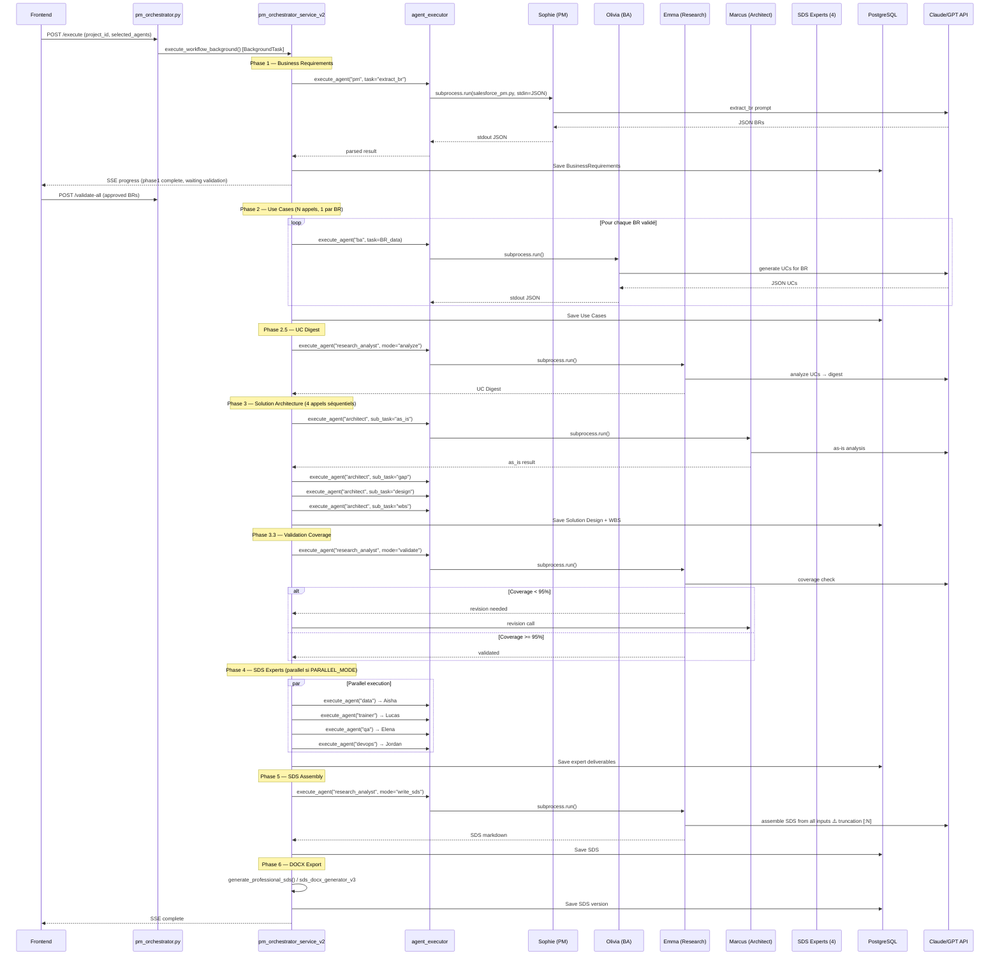
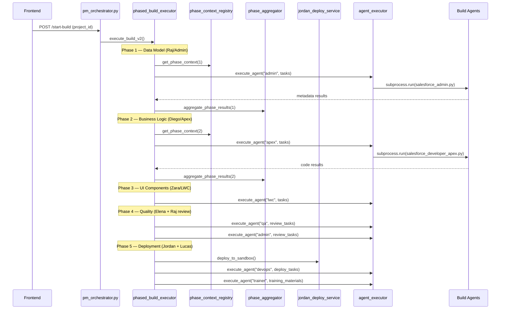

# ARCHITECTURE — Digital Humans

> Généré: 2026-02-07 | Agent: Architect Phase 1
> Source: Analyse des fichiers core (main.py, config.py, database.py, pm_orchestrator*.py, agent_executor.py, agents/*)

---

## 1. Vue d'ensemble

```mermaid
graph TD
    subgraph "Couche Présentation"
        FE["Frontend React/Vite :3000"]
        NGINX["Nginx :80/443"]
    end

    subgraph "Couche HTTP (FastAPI :8002)"
        MAIN["main.py — App Bootstrap"]
        MW["AuditMiddleware"]
        RL["Rate Limiter (SlowAPI)"]
        CORS["CORS Middleware"]
        R_PMO["pm_orchestrator.py — 36 routes"]
        R_PROJ["projects.py — 5 routes"]
        R_WIZ["wizard.py — 10 routes"]
        R_BR["business_requirements.py — 8 routes"]
        R_ART["artifacts.py — 18 routes"]
        R_DEPLOY["deployment.py — 10 routes"]
        R_OTHER["auth, analytics, chat, sds_versions, etc."]
    end

    subgraph "Couche Service"
        S_PMO2["pm_orchestrator_service_v2.py — Orchestration SDS"]
        S_EXEC["agent_executor.py — Lanceur d'agents"]
        S_BUILD["phased_build_executor.py — Orchestration BUILD"]
        S_ENV["environment_service.py"]
        S_SFDX["sfdx_service.py"]
        S_GIT["git_service.py"]
        S_AUDIT["audit_service.py"]
        S_LLM["llm_service.py — LLM V1"]
        S_LLM3["llm_router_service.py — LLM V3"]
        S_RAG["rag_service.py — ChromaDB RAG"]
        S_DOC["document_generator.py — DOCX"]
        S_OTHER["artifact_service, quality_gate_service, etc."]
    end

    subgraph "Couche Agent (11 scripts Python)"
        A_SOPHIE["salesforce_pm.py — Sophie"]
        A_OLIVIA["salesforce_business_analyst.py — Olivia"]
        A_EMMA["salesforce_research_analyst.py — Emma"]
        A_MARCUS["salesforce_solution_architect.py — Marcus"]
        A_EXPERTS["Elena, Jordan, Lucas, Aisha"]
        A_BUILD["Diego, Zara, Raj"]
    end

    subgraph "Couche Données"
        PG["PostgreSQL 16 :5432"]
        CHROMA["ChromaDB — 70K chunks"]
    end

    subgraph "Couche LLM"
        CLAUDE["Anthropic Claude API"]
        GPT["OpenAI GPT API"]
        OLLAMA["Ollama/Mistral :11434"]
    end

    FE -->|HTTP/WS| NGINX --> MAIN
    MAIN --> MW --> RL --> CORS
    MAIN --> R_PMO & R_PROJ & R_WIZ & R_BR & R_ART & R_DEPLOY & R_OTHER

    R_PMO --> S_PMO2
    R_PMO --> S_BUILD
    R_PROJ --> S_ENV
    R_DEPLOY --> S_SFDX & S_GIT

    S_PMO2 -->|subprocess.run| S_EXEC
    S_BUILD --> S_EXEC
    S_EXEC -->|subprocess.run()| A_SOPHIE & A_OLIVIA & A_EMMA & A_MARCUS & A_EXPERTS & A_BUILD

    A_SOPHIE & A_OLIVIA & A_EMMA & A_MARCUS -->|import| S_LLM
    A_SOPHIE & A_OLIVIA & A_EMMA & A_MARCUS -->|import| S_RAG

    S_LLM --> CLAUDE & GPT
    S_LLM3 --> CLAUDE & GPT & OLLAMA
    S_RAG --> CHROMA

    S_PMO2 --> PG
    S_AUDIT --> PG
    S_EXEC --> PG
```

---

## 2. Pipeline SDS (Spécification)

Source: `pm_orchestrator_service_v2.py` — méthode `execute_workflow()` (L119)



### Points critiques SDS
- **Phase 5 truncation (P9)**: Emma reçoit tous les inputs en un seul appel LLM avec `[:N]` char slicing → perte 46-77% du contenu experts
- **subprocess overhead (P3)**: Chaque appel agent = 3-5s overhead. SDS = ~15-20 appels = 45-100s de overhead pur
- **Phase 4 parallel**: Contrôlé par `PARALLEL_MODE["sds_experts"] = True` (L99-101)

---

## 3. Pipeline BUILD

Source: `phased_build_executor.py` (L1) + `pm_orchestrator.py:execute_build_v2` (L2593)



### Phases BUILD (phased_build_executor.py L33-80)
| Phase | Nom | Agent(s) | Task Types |
|-------|-----|----------|------------|
| 1 | Data Model | Raj (Admin) | create_object, create_field, record_type, list_view, validation_rule |
| 2 | Business Logic | Diego (Apex) | apex_class, apex_trigger, apex_test, apex_batch |
| 3 | UI Components | Zara (LWC) | lwc_component, aura_component, flexipage, custom_tab |
| 4 | Automation | Flow/Rules | flow, complex_validation_rule, approval_process |
| 5 | Security & Access | Permissions | permission_set, profile, sharing_rule, page_layout |
| 6 | Data Migration | Aisha (Data) | data_migration, data_load, data_transform |

---

## 4. Couche HTTP

### Bootstrap (main.py)
1. `load_dotenv()` — charge `.env`
2. `Settings()` — Pydantic config
3. `Base.metadata.create_all(bind=engine)` — crée les tables SQL
4. `FastAPI(title, debug, version="2.0.0")` — init app
5. Rate limiter (SlowAPI)
6. CORS middleware (7 origines hardcodées L43-51)
7. AuditMiddleware
8. 16 routers montés avec préfixes

### Montage Routers (main.py L62-99)
| Préfixe | Router | Tags |
|---------|--------|------|
| `/api` | auth | auth |
| `/api/pm-orchestrator` | pm_orchestrator | PM Orchestrator |
| `/api` | projects | projects |
| `/api` (no prefix) | analytics | analytics |
| (no prefix) | artifacts | artifacts |
| `/api` | agent_tester | agent_tester |
| (no prefix) | business_requirements | business_requirements |
| (no prefix) | project_chat | project_chat |
| (no prefix) | sds_versions | sds_versions |
| (no prefix) | change_requests | change_requests |
| `/api` | audit | audit |
| `/api` | deployment | deployment |
| `/api` | quality_dashboard | quality_dashboard |
| `/api` | wizard | wizard |
| `/api/subscription` | subscription | subscription |
| `/api` | leads, blog | leads, blog |

### Auth
- JWT (HS256) via `python-jose` (`utils/auth.py`)
- `get_current_user` dependency (`utils/dependencies.py`)
- Token dans header `Authorization: Bearer <token>` ou query param
- Pas d'OAuth, pas de refresh token

### Problème P0 — async/sync mismatch
- **36 routes** dans `pm_orchestrator.py` sont `async def`
- **~22 routes** font uniquement du sync DB (`db.query()`, `db.add()`, `db.commit()`)
- Cela **bloque l'event loop** uvicorn car SQLAlchemy sync n'est pas thread-safe dans asyncio
- **Fix**: convertir ces ~22 routes en `def` (FastAPI les exécutera dans un threadpool)

---

## 5. Couche Service — Patterns

### Instanciation
| Service | Pattern | Détail |
|---------|---------|--------|
| `PMOrchestratorServiceV2` | Par-requête | `__init__(self, db: Session)` — instancié à chaque workflow |
| `audit_service` | Singleton | Instance globale dans le module |
| `notification_service` | Singleton async | `get_notification_service()` retourne instance unique |
| `artifact_service` | Fonctions | Fonctions libres prenant `db` en paramètre |
| `agent_executor` | Stateless | Fonctions libres |
| `PhasedBuildExecutor` | Par-requête | Instancié pour chaque build |

### Orchestration
- `pm_orchestrator_service_v2.py` contient la classe `PMOrchestratorServiceV2` (L108)
- Méthode principale: `execute_workflow()` (L119) — orchestre les 6 phases SDS
- Fonction libre `execute_workflow_background()` — wrapper pour BackgroundTasks
- `phased_build_executor.py` — orchestre le BUILD par phases

### Communication routes → services
- Direct import + appel de méthode
- `db: Session = Depends(get_db)` injecté dans chaque route
- Pas de message queue, pas d'events (tout synchrone dans le même process)

---

## 6. Couche Executor

Source: `agent_executor.py` (L74-726)

### Mécanisme
```python
# L208 — Core execution
result = subprocess.run(
    ["python3", str(script_path), "--mode", mode, "--input-file", input_file.name],
    capture_output=True, text=True,
    timeout=timeout,
    env=env,
    cwd="/root/workspace/digital-humans-production/backend"
)
```

### Flux d'exécution d'un agent
1. Résolution du script: `AGENTS_PATH / AGENT_CONFIG[agent_id]["script"]`
2. Création fichier temp JSON avec les inputs
3. Construction env vars (PYTHONPATH, OPENAI_API_KEY, ANTHROPIC_API_KEY, etc.)
4. `subprocess.run()` avec capture stdout/stderr
5. Parse JSON depuis stdout
6. Persistence résultat en DB (AgentDeliverable)
7. Cleanup fichier temp

### Problèmes identifiés
- **P3**: 3-5s overhead par subprocess (fork + Python init + import)
- **Hardcoded paths** (P2): `AGENTS_PATH`, `PYTHONPATH`, `cwd` tous hardcodés
- **Duplication AGENT_CONFIG**: Défini dans agent_executor.py ET pm_orchestrator_service_v2.py

---

## 7. Couche Agent — Structure commune

Source: Analyse de `salesforce_trainer.py` (plus simple, 389L)

### Pattern d'un agent
```python
#!/usr/bin/env python3
import os, sys, argparse, json

# 1. sys.path hack pour accéder aux services
sys.path.insert(0, "/app")  # ou "/root/workspace/..."

# 2. Import optionnel des services
try:
    from app.services.llm_service import generate_llm_response, LLMProvider
    LLM_SERVICE_AVAILABLE = True
except ImportError:
    LLM_SERVICE_AVAILABLE = False

try:
    from app.services.rag_service import get_salesforce_context
    RAG_AVAILABLE = True
except ImportError:
    RAG_AVAILABLE = False

# 3. Fonctions de prompt par mode
def get_sds_strategy_prompt(solution_design, use_cases):
    return f"..."

# 4. Fonction principale
def main():
    parser = argparse.ArgumentParser()
    parser.add_argument("--mode", required=True)
    parser.add_argument("--input-file", required=True)
    args = parser.parse_args()

    with open(args.input_file) as f:
        input_data = json.load(f)

    # RAG context
    context = get_salesforce_context(...) if RAG_AVAILABLE else ""

    # LLM call
    response = generate_llm_response(prompt, provider=LLMProvider.ANTHROPIC)

    # Output JSON on stdout
    result = {"success": True, "output": parsed_response}
    print(json.dumps(result))

if __name__ == "__main__":
    main()
```

### I/O
- **Input**: JSON via `--input-file` (temp file créé par agent_executor)
- **Output**: JSON sur stdout (parsé par agent_executor)
- **Logs**: stderr (streamé en temps réel via agent_executor)
- **Modes**: Chaque agent a 1-4 modes (ex: Emma: `analyze`, `validate`, `write_sds`)

---

## 8. Couche LLM

### LLM Service V1 (`llm_service.py` — 562L)
- **Utilisé par**: Tous les 11 agents (via `sys.path` import)
- **Providers**: OpenAI (GPT-4) + Anthropic (Claude)
- **Stratification**:
  - ORCHESTRATOR (Sophie PM): Claude Opus
  - ANALYST (Olivia BA, Marcus Architect): Claude Sonnet
  - WORKER (tous les autres): Claude Haiku
- **Pattern**: Fonction `generate_llm_response(prompt, provider, model, tier)`

### LLM Router V3 (`llm_router_service.py` — 718L)
- **Statut**: Prêt mais sous-utilisé (P6)
- **Features**: Multi-provider routing, cost tracking, auto fallback, YAML config
- **Providers**: Ollama local + Anthropic + OpenAI + Custom
- **Pattern**: Routing par complexité de tâche

### Problème P6
V3 est prêt et plus avancé (coûts, fallback, local), mais les agents utilisent encore V1.
Migration dépend de P3 (quand les agents deviennent importables).

---

## 9. Couche Données

### PostgreSQL 16 (database.py L1-33)
```python
engine = create_engine(settings.DATABASE_URL, pool_pre_ping=True, echo=settings.DEBUG)
SessionLocal = sessionmaker(autocommit=False, autoflush=False, bind=engine)
Base = declarative_base()
```

- **29 modèles SQLAlchemy** (voir MODULE-MAP)
- **Pattern session**: `get_db()` generator → injecté via `Depends(get_db)`
- **Transactions**: Pas de `db.begin()` explicite (P7) — commit manuel après chaque opération
- **Migrations**: Alembic (7 versions)
- **Tables principales**: Project, Execution, ExecutionAgent, AgentDeliverable, BusinessRequirement, TaskExecution, WBSTaskType, AuditLog

### Problème P7 — Transactions
Pattern actuel (dangereux):
```python
db.add(obj)
db.commit()  # Si erreur après, état incohérent
db.add(obj2)
db.commit()
```
Pattern cible:
```python
with db.begin():
    db.add(obj)
    db.add(obj2)
    # commit automatique à la sortie, rollback si exception
```

---

## 10. Couche RAG

Source: `rag_service.py` (L1-330)

### Architecture
- **Base**: ChromaDB (persistent client)
- **Path**: `/opt/digital-humans/rag/chromadb_data` (2.4 GB, 70,251 chunks)
- **5 collections**:
  | Collection | Chunks | Embedding | Usage |
  |-----------|--------|-----------|-------|
  | technical | ~29K | OpenAI text-embedding-3-large | Documentation technique |
  | operations | ~17K | OpenAI text-embedding-3-large | Docs opérations |
  | business | ~16K | OpenAI text-embedding-3-large | Docs business |
  | lwc | ~6K | Nomic nomic-embed-text-v1.5 | Code LWC |
  | apex | ~1.5K | Nomic nomic-embed-text-v1.5 | Code Apex |

### Mapping agent → collections (L56-60)
```python
AGENT_COLLECTIONS = {
    "business_analyst": ["business", "operations"],
    "solution_architect": ["technical", "operations", "business"],
    "apex_developer": ["apex", "technical"],
    "lwc_developer": ["lwc", "technical"],
    ...
}
```

### Reranking
- BGE reranker multilingue (FR/EN cross-lingual)
- Via `sentence-transformers`

---

## 11. Anti-patterns identifiés

| # | Anti-pattern | Localisation | Impact | Problème |
|---|-------------|-------------|--------|----------|
| 1 | **Fat Controller** | `pm_orchestrator.py` (2636L) | Maintenabilité | P4 |
| 2 | **async/sync mismatch** | `pm_orchestrator.py` — 22 routes `async def` font du sync DB | Performance (event loop bloqué) | P0 |
| 3 | **Subprocess architecture** | `agent_executor.py` L208, L574 | Performance (3-5s/appel) | P3 |
| 4 | **sys.path hack** | Tous les agents (`sys.path.insert(0, "/app")`) | Fragilité, non-portable | P3 |
| 5 | **Hardcoded paths** | 37+ occurrences dans 22 fichiers | Non-portable, fragile | P2 |
| 6 | **Duplicated AGENT_CONFIG** | `agent_executor.py` L80 ET `pm_orchestrator_service_v2.py` L76 | Incohérence possible | P3 |
| 7 | **God Service** | `pm_orchestrator_service_v2.py` (2477L) | Maintenabilité | P4 |
| 8 | **No explicit transactions** | Tout le code DB | Data integrity | P7 |
| 9 | **Input truncation** | `pm_orchestrator_service_v2.py` Phase 5 `[:N]` slicing | Perte contenu 46-77% | P9 |
| 10 | **Dead code coexistence** | V1 (pm.py, pm_orchestrator_service.py, incremental_executor.py) | Confusion, dette technique | P1 |
| 11 | **Backup files in repo** | 5 fichiers *_backup_* | Pollution repo | P1 |
| 12 | **No structured logging** | `print()` + `logger` mélangés | Observabilité | P5 |

---

## 12. Patterns positifs observés

| Pattern | Localisation | Description |
|---------|-------------|-------------|
| **Pydantic Settings** | `config.py` | Configuration centralisée avec validation |
| **Dependency Injection** | `utils/dependencies.py` | `Depends(get_db)`, `Depends(get_current_user)` |
| **Graceful imports** | Agents, services | `try/except ImportError` avec feature flags |
| **SSE streaming** | `pm_orchestrator.py` L520+ | Progrès temps réel via Server-Sent Events |
| **WebSocket** | `pm_orchestrator.py` L1172 | Communication bidirectionnelle pour exécutions |
| **Audit trail** | `audit_middleware.py` + `audit_service.py` | Logging complet des actions |
| **Rate limiting** | `rate_limiter.py` | Protection API via SlowAPI |
| **Tiered subscriptions** | `models/subscription.py` | Feature gating par tier |
