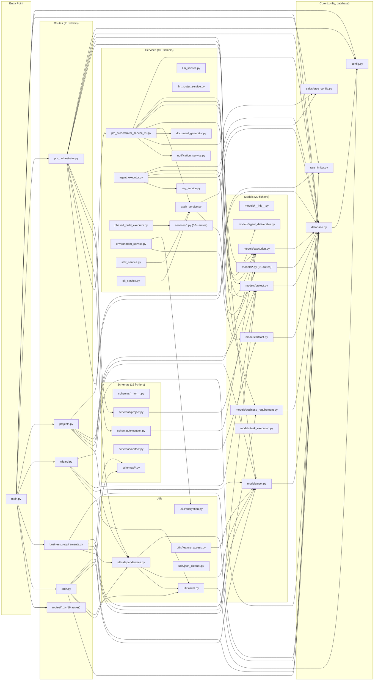

# DEPENDENCY-GRAPH — Digital Humans

> Généré: 2026-02-07 | Agent: Architect Phase 1
> Source: grep exhaustif `from app.` sur 139 fichiers Python

---

## 1. Graphe d'imports — Vue Mermaid



---

## 2. Matrice de dépendances par couche

### Routes → Services

| Route | Services importés |
|-------|------------------|
| `pm_orchestrator.py` | `pm_orchestrator_service_v2`, `incremental_executor` (legacy L1484), `notification_service`, `agent_integration`, `uc_analyzer_service`, `sds_synthesis_service`, `sds_docx_generator_v3`, `phased_build_executor` |
| `projects.py` | `sfdx_auth_service` (lazy), `connection_validator` (lazy) |
| `wizard.py` | `connection_validator` (lazy), `environment_service` (lazy) |
| `agent_tester.py` | `agent_executor`, `llm_service`, `agent_test_logger` |
| `project_chat.py` | `sophie_chat_service` |
| `change_requests.py` | `change_request_service` (lazy) |
| `deployment.py` | `sfdx_service` (lazy) |
| `artifacts.py` | `artifact_service` |
| `quality_gates.py` | `quality_gate_service` |
| `deliverables.py` | `deliverable_service` |
| `sds_versions.py` | (direct DB queries) |
| `analytics.py` | (direct DB queries) |
| `subscription.py` | `feature_access` utils |
| `auth.py` | (direct DB + utils/auth) |
| `blog.py` | `subprocess.run` (script externe) |

### Services → Services (cross-dépendances)

| Service | Dépend de |
|---------|----------|
| `pm_orchestrator_service_v2` | `audit_service`, `document_generator`, `markdown_to_docx`, `notification_service` |
| `phased_build_executor` | `phase_context_registry`, `phase_aggregator`, `jordan_deploy_service` |
| `jordan_deploy_service` | `git_service`, `sfdx_service`, `sf_admin_service`, `encryption` |
| `incremental_executor` | `audit_service`, `sfdx_service`, `agent_executor`, `git_service` |
| `agent_executor` | `rag_service`, `agent_test_logger` |
| `sophie_chat_service` | `llm_service` |
| `change_request_service` | `llm_service`, `pm_orchestrator_service_v2` (lazy) |
| `sds_synthesis_service` | `llm_router_service` |
| `uc_analyzer_service` | `llm_router_service` |
| `sfdx_service` | `audit_service` |
| `git_service` | `audit_service` |
| `environment_service` | `encryption` |
| `agent_integration` | `agent_executor` (indirect) |
| `llm_service` | `json_cleaner` |

### Services → Models (accès DB)

| Service | Models utilisés |
|---------|----------------|
| `pm_orchestrator_service_v2` | Project, Execution, AgentDeliverable, DeliverableItem, BusinessRequirement, SDSVersion, TaskExecution |
| `agent_executor` | Execution, ExecutionArtifact |
| `incremental_executor` | Execution, TaskExecution, Project, ExecutionArtifact, AgentDeliverable |
| `audit_service` | AuditLog |
| `quality_gate_service` | QualityGate, AgentIteration, AgentDeliverable, Agent |
| `artifact_service` | ExecutionArtifact, ValidationGate, AgentQuestion |
| `deliverable_service` | AgentDeliverable, Agent |
| `sophie_chat_service` | Project, Execution, BusinessRequirement, AgentDeliverable, ProjectConversation |
| `change_request_service` | Project, Execution, ChangeRequest, BusinessRequirement, AgentDeliverable, SDSVersion |

---

## 3. Dépendances circulaires

### Détectées
**Aucune dépendance circulaire directe** détectée entre modules.

### Quasi-circulaires (lazy imports)
| Fichier A | Fichier B | Mécanisme |
|-----------|-----------|-----------|
| `pm_orchestrator.py` (route) | `pm_orchestrator_service_v2` | Import normal + lazy imports dans fonctions |
| `change_request_service` | `pm_orchestrator_service_v2` | Lazy import L342: `from app.services.pm_orchestrator_service_v2 import PMOrchestratorServiceV2` |
| `sds_docx_generator_v3` | `sds_docx_generator_v3` | Auto-import L693 (probablement erreur) |

Les lazy imports (dans le corps des fonctions) sont utilisés massivement dans `pm_orchestrator.py` (~50 lazy imports) pour éviter les circulaires et retarder le chargement.

---

## 4. Services — Pattern d'instanciation

| Service | Pattern | Détail |
|---------|---------|--------|
| `PMOrchestratorServiceV2` | Classe instanciée par-requête | `__init__(self, db: Session)` |
| `audit_service` | Singleton module-level | `audit_service = AuditService()` |
| `notification_service` | Singleton async | `get_notification_service()` → instance unique |
| `ArtifactService` | Classe instanciée | Via `services/__init__.py` |
| `QualityGateService` | Classe instanciée | `QualityGateService(db)` |
| `SophieChatService` | Classe instanciée | `SophieChatService(db, user_id)` |
| `ChangeRequestService` | Classe instanciée | `ChangeRequestService(db)` |
| `DeliverableService` | Classe instanciée | `DeliverableService(db)` |
| `EnvironmentService` | Classe via factory | `get_environment_service(db)` |
| `ConnectionValidator` | Classe via factory | `get_connection_validator(db)` |
| `UCAnalyzerService` | Classe via factory | `get_uc_analyzer(db)` |
| `SFDXService` | Classe via factory | `get_sfdx_service(project_id, db)` |
| `LLMService` | Classe | `LLMService()` |
| `llm_router_service` | Fonctions + classes | `LLMRouter`, `TaskComplexity` |
| `rag_service` | Fonctions | `get_salesforce_context(query, agent_type)` |
| `agent_executor` | Fonctions | `run_agent_task()`, `get_agent_executor()` |
| `llm_logger` | Fonction | `log_llm_interaction()` |

---

## 5. Ordre de chargement (main.py)

```
1. dotenv.load_dotenv()
2. app.config.Settings → settings (singleton)
3. app.database → engine, SessionLocal, Base (dépend config)
4. app.models.__init__ → tous les 29 models (dépend database.Base)
5. app.middleware.audit_middleware → AuditMiddleware
6. app.rate_limiter → limiter
7. app.services.notification_service → get_notification_service
8. app.api.routes.* → 16 routers (dépendent models, schemas, services, utils)
9. Base.metadata.create_all(bind=engine) → crée les tables
10. FastAPI() → app init
11. Middlewares: CORSMiddleware, AuditMiddleware
12. Routers: include_router × 16
```

---

## 6. Analyse de couplage

### Fichiers les plus importés (hub nodes)

| Module | Importé par N fichiers | Rôle |
|--------|----------------------|------|
| `app.database` (Base, get_db, SessionLocal, engine) | **38** | Foundation — tous les models + routes + services |
| `app.config` (settings) | **7** | Configuration — main, database, auth, rate_limiter, notification, agent_integration, leads |
| `app.models.user` (User) | **12** | Auth dependency — routes + dependencies |
| `app.models.project` (Project) | **11** | Core entity |
| `app.models.execution` (Execution) | **10** | Core entity |
| `app.utils.dependencies` (get_current_user) | **10** | Auth injection |
| `app.services.audit_service` | **6** | Cross-cutting concern |
| `app.models.business_requirement` | **6** | BR entity |
| `app.models.agent_deliverable` | **6** | Deliverable entity |
| `app.salesforce_config` | **4** | SFDX config |

### Fichiers avec le plus d'imports sortants

| Module | N imports | Détail |
|--------|----------|--------|
| `pm_orchestrator.py` (routes) | **~25 modules** (dont ~15 lazy) | Fat Controller — P4 |
| `pm_orchestrator_service_v2.py` | **~15 modules** | God Service — P4 |
| `models/__init__.py` | **29 models** | Registre central (normal) |
| `schemas/__init__.py` | **6 schemas** | Registre (normal) |
| `incremental_executor.py` | **~10 modules** | Legacy — P1 |
| `main.py` | **~20 modules** | Bootstrap (normal) |

### Coefficient de couplage
- **pm_orchestrator.py**: 25 imports sortants / importé par 1 (main) → **couplage sortant excessif**
- **database.py**: 1 import sortant / importé par 38 → **hub stable** (normal pour une fondation)
- **audit_service.py**: 2 imports / importé par 6 → **ratio sain**

---

## 7. Dead imports

| Import dead code | Trouvé dans | Module cible |
|-----------------|------------|-------------|
| `from app.services.pm_orchestrator_service import PMOrchestratorService` | `pm.py:9` | DEAD_CODE (V1 service) |
| `from app.services.incremental_executor import IncrementalExecutor` | `pm_orchestrator.py:1484` | LEGACY (V1 executor) |
| `from app.services.incremental_executor import IncrementalExecutor` | `run_build.py:11` | LEGACY |
| `from app.services.incremental_executor import IncrementalExecutor` | `test_full_flow.py:70,259` | LEGACY (tests) |
| Imports dans tous les fichiers `*_backup_*` | 4 fichiers backup | BACKUP — à supprimer |

---

## 8. Dépendances externes critiques

| Package | Version | Utilisé par | Rôle | Critique |
|---------|---------|-------------|------|----------|
| `fastapi` | 0.104.1 | main, routes | Framework web | OUI |
| `uvicorn` | 0.24.0 | main | ASGI server | OUI |
| `sqlalchemy` | 2.0.23 | database, models, services | ORM | OUI |
| `psycopg2-binary` | 2.9.9 | database (driver) | PostgreSQL driver | OUI |
| `pydantic` | 2.5.0 | schemas, config | Data validation | OUI |
| `pydantic-settings` | 2.1.0 | config | Settings management | OUI |
| `python-jose` | 3.3.0 | utils/auth | JWT tokens | OUI |
| `passlib` + `bcrypt` | 1.7.4 / 4.0.1 | utils/auth | Password hashing | OUI |
| `python-docx` | 1.1.0 | document_generator, sds_docx_generator | DOCX generation | OUI |
| `anthropic` | 0.72.0 | llm_service, llm_router_service | Claude API | OUI |
| `openai` | >=1.50.0 | llm_service, rag_service | GPT + embeddings | OUI |
| `chromadb` | 1.3.4 | rag_service | Vector DB | OUI |
| `alembic` | 1.13.0 | migrations | DB migrations | OUI |
| `python-dotenv` | 1.0.0 | main | .env loading | OUI |
| `websockets` | 12.0 | pm_orchestrator (WS) | WebSocket support | Moyen |
| `slowapi` | >=0.1.9 | rate_limiter | Rate limiting | Moyen |
| `httpx` | >=0.27.0 | llm_router_service, tests | HTTP client | Moyen |
| `yaml` (PyYAML) | — | llm_router_service | Config YAML | Faible |
| `sentence-transformers` | >=2.2.0 | rag_service | Reranking | Faible |
| `nomic` | — | rag_service | Code embeddings | Faible |
| `json-repair` | >=0.30.0 | agents | JSON repair | Faible |

---

## 9. Résumé architectural

### Points forts
- **Pas de dépendances circulaires directes** — architecture en couches respectée
- **Base de données bien isolée** — tous les models héritent de `Base`, session via `get_db()`
- **Auth centralisée** — `get_current_user` dependency injection

### Points faibles
- **pm_orchestrator.py** a un couplage sortant de 25 modules → God Object (P4)
- **~50 lazy imports** dans pm_orchestrator.py → signe de sur-complexité
- **Duplications** : `AGENT_CONFIG` dans agent_executor.py ET pm_orchestrator_service_v2.py
- **Dead imports** : 5 références vers code mort (V1)
- **3 routers orphelins** : environments.py, deliverables.py, quality_gates.py non montés
