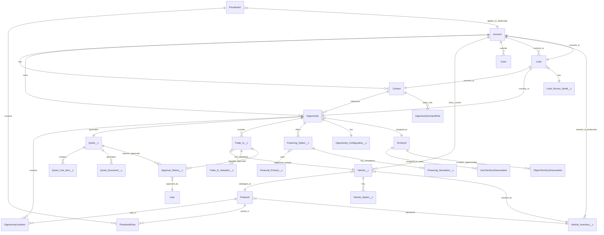

# SALESFORCE BUSINESS ANALYST SPECIFICATIONS

## Automotive Dealership Network - Advanced Pipeline Management

**Project Code:** AUTO-PIPE-2025  
**Version:** 1.0  
**Date:** November 28, 2025  
**Business Analyst:** Senior Salesforce BA Team  
**Salesforce Product:** Sales Cloud Enterprise Edition  
**Organization Type:** New Implementation  

---

# EXECUTIVE SUMMARY

## 1.1 Business Context

A major automotive dealership network is undertaking a comprehensive digital transformation to modernize and automate its sales pipeline management. The network operates multiple dealership locations across various territories, selling both new and used vehicles from multiple brands. The current sales process involves manual lead management, fragmented communication channels, disconnected systems for trade-in valuation, and limited visibility into sales performance across the network.

The organization faces significant challenges:
- **Lead leakage** due to manual routing and delayed response times
- **Inconsistent customer experience** across channels and locations
- **Limited visibility** into real-time pipeline health and forecasting accuracy
- **Manual processes** for quote generation, discount approvals, and trade-in management
- **Disconnected systems** between CRM, DMS (Dealer Management System), and external valuation services
- **Complex product configurations** involving vehicles, financing, insurance, and aftermarket services

This Salesforce implementation will serve as the central hub for all sales operations, integrating lead capture, opportunity management, product configuration, trade-in workflows, document generation, and comprehensive analytics.

## 1.2 Project Objectives

### Primary Objectives

1. **Unified Lead Management:** Capture, qualify, and intelligently distribute leads from multiple channels (web, phone, email, partner portals) with automated routing based on geolocation, seller availability, and behavioral scoring.

2. **Complex Sales Cycle Support:** Enable sales representatives to manage multi-product opportunities including vehicles, extended warranties, aftermarket accessories, financing products, and insurance packages within a single opportunity.

3. **Integrated Trade-In Workflow:** Streamline the trade-in process with automated submission, external API integration for valuation, and multi-step approval workflows.

4. **Personalized Offer Configuration:** Provide tools for configuring customized offers with financing simulations, insurance options, and dynamic pricing calculations.

5. **Automated Document Generation:** Generate adaptive contractual quotes with conditional clauses based on deal type, vehicle age, and customer segment.

6. **Multi-Level Approval Workflows:** Implement hierarchical approval processes for exceptional discounts, clearance sales, and custom offers.

7. **Dynamic Sales Forecasting:** Enable real-time pipeline analysis with automatic adjustments based on actual conversion rates and historical performance.

8. **Territory Management:** Support sophisticated territory assignment with exception handling and dynamic reassignment based on inventory availability.

9. **Consolidated Reporting:** Deliver comprehensive analytics by dealership, brand, vehicle type, customer segment, and lead source.

10. **System Integration:** Establish seamless connectivity with external DMS systems and valuation services.

### Success Metrics

| KPI | Current State | Target State | Measurement Period |
|-----|---------------|--------------|-------------------|
| Lead Response Time | 4-6 hours | < 15 minutes | Daily |
| Lead Conversion Rate | 12% | 22% | Monthly |
| Quote Generation Time | 45 minutes | 5 minutes | Per transaction |
| Forecast Accuracy | 65% | 90% | Quarterly |
| Sales Cycle Duration | 28 days | 18 days | Monthly average |
| Trade-In Processing Time | 5 days | 2 hours | Per transaction |
| Cross-Sell Attachment Rate | 18% | 35% | Monthly |
| User Adoption Rate | N/A | 95% | 90 days post-launch |

## 1.3 Scope and Deliverables

### In Scope

**Phase 1: Foundation (Months 1-3)**
- Lead management with multi-channel capture
- Intelligent lead assignment and routing
- Standard object customization (Lead, Account, Contact, Opportunity)
- Custom objects for vehicles, trade-ins, and financing
- Basic automation and validation rules
- Core reporting and dashboards

**Phase 2: Advanced Features (Months 4-6)**
- Complex opportunity management with product bundling
- Trade-in workflow with external API integration
- Personalized offer configuration tools
- Multi-level approval workflows
- Dynamic quote generation with conditional logic
- Territory management with exceptions
- Lightning Web Components for offer builder

**Phase 3: Integration & Optimization (Months 7-9)**
- DMS integration (inventory, invoicing, delivery)
- Advanced forecasting and analytics
- Document generation and e-signature
- Multilingual support (FR/EN/ES)
- Full audit trail implementation
- Performance optimization and user training

### Out of Scope

- After-sales service management (future phase)
- Parts and accessories inventory management
- Workshop scheduling and management
- Marketing automation and campaign management
- Customer portal development (future phase)
- Mobile application development
- Integration with accounting systems beyond DMS

### Key Deliverables

1. Comprehensive data model with 8 custom objects and enhanced standard objects
2. 25+ automated processes using Flow Builder
3. 40+ validation rules ensuring data quality
4. 15+ Lightning Web Components for custom UI
5. Integration with 2 external systems (DMS + Valuation API)
6. 30+ reports and 8 executive dashboards
7. Complete security model with profiles, permission sets, and sharing rules
8. Training materials and user documentation
9. Data migration from legacy systems
10. Post-launch support plan

## 1.4 Stakeholders

| Role | Name/Department | Responsibilities | Engagement Level |
|------|----------------|------------------|------------------|
| Executive Sponsor | Chief Sales Officer | Strategic direction, budget approval | Monthly steering |
| Business Owner | VP of Sales Operations | Requirements validation, UAT sign-off | Weekly reviews |
| Process Owner | National Sales Manager | Process design, change management | Daily collaboration |
| End Users | Sales Representatives (200+) | System usage, feedback | UAT participation |
| IT Lead | IT Director | Technical architecture, integrations | Weekly technical reviews |
| DMS Administrator | Operations Manager | DMS integration requirements | Bi-weekly coordination |
| Training Lead | Learning & Development | User training, documentation | Phase 2-3 focus |
| Data Steward | Data Governance Team | Data quality, migration validation | Weekly data reviews |

## 1.5 Assumptions and Constraints

### Assumptions

1. Dealership staff have basic computer literacy and can be trained on Salesforce
2. Network connectivity is reliable across all dealership locations
3. External APIs (DMS, valuation service) are available and documented
4. Legacy data can be extracted and is of acceptable quality
5. Business processes can be standardized across dealerships with minor variations
6. Salesforce licenses will be procured for all sales staff and managers
7. Executive sponsorship will remain consistent throughout the project

### Constraints

1. **Timeline:** 9-month implementation deadline (hard constraint for fiscal year alignment)
2. **Budget:** Fixed budget with 10% contingency reserve
3. **Resources:** Limited to 2 full-time Salesforce developers and 1 BA
4. **Integration:** Must work with existing DMS (vendor: AutoSoft) without replacing it
5. **Compliance:** Must maintain GDPR compliance for customer data
6. **Performance:** System must support 500 concurrent users during peak hours
7. **Multilingual:** Must support French, English, and Spanish from day one
8. **Audit:** All opportunity changes must be tracked for 7 years (regulatory requirement)

### Risks

| Risk | Probability | Impact | Mitigation Strategy |
|------|------------|--------|---------------------|
| DMS API limitations | High | High | Early API testing, fallback to batch integration |
| User adoption resistance | Medium | High | Comprehensive training, executive sponsorship |
| Data quality issues | High | Medium | Data cleansing project before migration |
| Integration delays | Medium | High | Parallel development tracks, early integration testing |
| Scope creep | Medium | Medium | Strict change control process, phase 4 parking lot |
| Key resource turnover | Low | High | Knowledge transfer documentation, cross-training |

---

# DATA MODEL SPECIFICATIONS

## 2.1 Entity Relationship Diagram (ERD)



## 2.2 Standard Object Enhancements

### 2.2.1 Lead Object

The Lead object captures all prospective customers from multiple channels before they are qualified and converted to Accounts, Contacts, and Opportunities.

#### Custom Fields

| Field API Name | Label | Type | Length | Required | Unique | Description | Values/Formula |
|----------------|-------|------|--------|----------|--------|-------------|----------------|
| Lead_Source_Channel__c | Lead Source Channel | Picklist | - | Yes | No | Primary channel through which lead was captured | Web Form, Phone Call, Email, Partner Portal, Walk-In, Social Media, Referral |
| Lead_Source_Campaign__c | Source Campaign | Lookup | - | No | No | Marketing campaign that generated this lead | Lookup(Campaign) |
| Vehicle_Interest__c | Vehicle of Interest | Lookup | - | No | No | Specific vehicle the lead inquired about | Lookup(Product2) |
| Vehicle_Type_Interest__c | Vehicle Type Interest | Multi-Select Picklist | - | No | No | Types of vehicles prospect is interested in | New;Used;Certified Pre-Owned |
| Brand_Preference__c | Brand Preference | Multi-Select Picklist | - | No | No | Vehicle brands of interest | Toyota;Honda;Ford;BMW;Mercedes;Audi;Volkswagen;Other |
| Budget_Range__c | Budget Range | Picklist | - | No | No | Customer's stated budget range | Under 20K;20K-30K;30K-40K;40K-50K;50K-75K;75K-100K;100K+ |
| Trade_In_Interest__c | Has Trade-In | Checkbox | - | No | No | Whether prospect has vehicle to trade in | TRUE/FALSE |
| Trade_In_Details__c | Trade-In Details | Long Text Area | 1000 | No | No | Details about trade-in vehicle | Free text |
| Financing_Interest__c | Financing Interest | Picklist | - | No | No | Type of financing interested in | Cash;Dealer Financing;Bank Loan;Lease;Not Sure |
| Preferred_Contact_Method__c | Preferred Contact Method | Picklist | - | Yes | No | How prospect prefers to be contacted | Phone;Email;SMS;WhatsApp |
| Preferred_Contact_Time__c | Preferred Contact Time | Picklist | - | No | No | Best time to contact | Morning (8-12);Afternoon (12-17);Evening (17-20);Anytime |
| Lead_Score__c | Lead Score | Number | 3,0 | No | No | Behavioral scoring of lead quality | Formula: calculated based on engagement |
| Lead_Temperature__c | Lead Temperature | Picklist | - | Yes | No | Urgency/readiness assessment | Hot;Warm;Cold |
| Preferred_Dealership__c | Preferred Dealership | Lookup | - | No | No | Dealership location preferred by lead | Lookup(Account) WHERE Type = 'Dealership' |
| Assignment_Status__c | Assignment Status | Picklist | - | Yes | No | Status of lead assignment | Unassigned;Auto-Assigned;Manually Assigned;Reassigned |
| Assigned_Date__c | Assigned Date | DateTime | - | No | No | When lead was assigned to sales rep | Auto-populated by Flow |
| First_Response_Date__c | First Response Date | DateTime | - | No | No | When sales rep first contacted lead | Manually updated |
| Response_Time_Minutes__c | Response Time (Minutes) | Number | 8,2 | No | No | Time between lead creation and first response | Formula: (First_Response_Date__c - CreatedDate) * 24 * 60 |
| Qualification_Status__c | Qualification Status | Picklist | - | Yes | No | Current qualification stage | New;Contacted;Qualified;Unqualified;Converted |
| Unqualified_Reason__c | Unqualified Reason | Picklist | - | No | No | Why lead was marked unqualified | No Budget;No Interest;Wrong Timing;Duplicate;Competitor;Other |
| Customer_Segment__c | Customer Segment | Picklist | - | No | No | Demographic/psychographic segment | First-Time Buyer;Family;Luxury;Fleet;Commercial;Enthusiast |
| Language_Preference__c | Language Preference | Picklist | - | Yes | No | Preferred communication language | French;English;Spanish |
| GDPR_Consent__c | GDPR Consent | Checkbox | - | Yes | No | Marketing consent obtained | TRUE/FALSE |
| GDPR_Consent_Date__c | GDPR Consent Date | Date | - | No | No | When consent was given | Auto-populated |
| Last_Activity_Date__c | Last Activity Date | Date | - | No | No | Most recent activity on this lead | Roll-up from Tasks/Events |
| Days_Since_Last_Activity__c | Days Since Last Activity | Number | 4,0 | No | No | Days since last touchpoint | Formula: TODAY() - Last_Activity_Date__c |

#### Validation Rules

**VR_Lead_01: Require_Unqualified_Reason**
```
Formula: 
AND(
    ISPICKVAL(Qualification_Status__c, "Unqualified"),
    ISBLANK(TEXT(Unqualified_Reason__c))
)

Error Message: "You must provide a reason when marking a lead as Unqualified."
Error Location: Unqualified_Reason__c
Active: Yes
```

**VR_Lead_02: GDPR_Consent_Required**
```
Formula:
AND(
    ISPICKVAL(Lead_Source_Channel__c, "Web Form"),
    NOT(GDPR_Consent__c),
    OR(
        ISPICKVAL(Language_Preference__c, "French"),
        ISPICKVAL(Language_Preference__c, "Spanish")
    )
)

Error Message: "GDPR consent is required for leads from EU regions captured via web forms."
Error Location: GDPR_Consent__c
Active: Yes
```

**VR_Lead_03: Budget_Required_For_Qualified**
```
Formula:
AND(
    ISPICKVAL(Qualification_Status__c, "Qualified"),
    ISBLANK(TEXT(Budget_Range__c))
)

Error Message: "Budget Range must be specified before qualifying a lead."
Error Location: Budget_Range__c
Active: Yes
```

**VR_Lead_04: Assignment_Before_Contact**
```
Formula:
AND(
    NOT(ISBLANK(First_Response_Date__c)),
    ISPICKVAL(Assignment_Status__c, "Unassigned")
)

Error Message: "Lead must be assigned before recording first response."
Error Location: First_Response_Date__c
Active: Yes
```

#### Page Layouts

**Lead Layout - Sales Representative**

**Section: Lead Information**
- Lead Owner (read-only)
- Lead Status
- Qualification Status
- Lead Temperature
- Lead Score (read-only)
- Assignment Status (read-only)
- Assigned Date (read-only)

**Section: Contact Information**
- Name (First Name, Last Name)
- Company
- Email
- Phone
- Mobile
- Preferred Contact Method
- Preferred Contact Time
- Language Preference

**Section: Vehicle Interest**
- Vehicle of Interest
- Vehicle Type Interest
- Brand Preference
- Budget Range
- Trade-In Interest
- Trade-In Details
- Financing Interest

**Section: Source Information**
- Lead Source
- Lead Source Channel
- Source Campaign
- Preferred Dealership

**Section: Response Tracking**
- First Response Date
- Response Time (Minutes) (read-only)
- Last Activity Date (read-only)
- Days Since Last Activity (read-only)

**Section: Qualification**
- Unqualified Reason
- Customer Segment

**Section: Compliance**
- GDPR Consent
- GDPR Consent Date

**Related Lists:**
- Activity History
- Open Activities
- Campaign History
- Notes & Attachments

---

### 2.2.2 Account Object

The Account object represents both individual customers (Person Accounts) and dealership locations (Business Accounts).

#### Custom Fields

| Field API Name | Label | Type | Length | Required | Unique | Description | Values/Formula |
|----------------|-------|------|--------|----------|--------|-------------|----------------|
| Account_Type_Category__c | Account Type Category | Picklist | - | Yes | No | Categorization of account | Customer - Individual;Customer - Business;Dealership;Partner;Supplier |
| Customer_Segment__c | Customer Segment | Picklist | - | No | No | Customer demographic/behavioral segment | First-Time Buyer;Family;Luxury;Fleet;Commercial;Enthusiast;VIP |
| Customer_Lifetime_Value__c | Customer Lifetime Value | Currency | 16,2 | No | No | Total revenue from this customer | Roll-up from Opportunities |
| Total_Vehicles_Purchased__c | Total Vehicles Purchased | Number | 4,0 | No | No | Count of vehicles purchased | Roll-up from Opportunities |
| Last_Purchase_Date__c | Last Purchase Date | Date | - | No | No | Date of most recent vehicle purchase | Roll-up from Opportunities |
| Preferred_Dealership__c | Preferred Dealership | Lookup | - | No | No | Primary dealership for this customer | Lookup(Account) WHERE Account_Type_Category__c = 'Dealership' |
| Preferred_Sales_Rep__c | Preferred Sales Rep | Lookup | - | No | No | Preferred sales representative | Lookup(User) |
| Credit_Rating__c | Credit Rating | Picklist | - | No | No | Credit worthiness assessment | Excellent;Good;Fair;Poor;Not Assessed |
| Financing_Approved__c | Financing Pre-Approved | Checkbox | - | No | No | Whether customer has financing pre-approval | TRUE/FALSE |
| Max_Approved_Amount__c | Max Approved Amount | Currency | 12,2 | No | No | Maximum financing amount approved | Manual entry |
| Language_Preference__c | Language Preference | Picklist | - | Yes | No | Preferred communication language | French;English;Spanish |
| Marketing_Opt_In__c | Marketing Opt-In | Checkbox | - | Yes | No | Consent to receive marketing | TRUE/FALSE |
| SMS_Opt_In__c | SMS Opt-In | Checkbox | - | No | No | Consent for SMS communications | TRUE/FALSE |
| Dealership_Code__c | Dealership Code | Text | 10 | No | Yes | Unique code for dealership location | Auto-number for dealerships |
| Dealership_Region__c | Dealership Region | Picklist | - | No | No | Geographic region | North;South;East;West;Central |
| Dealership_Brand__c | Dealership Brand | Multi-Select Picklist | - | No | No | Brands sold at this dealership | Toyota;Honda;Ford;BMW;Mercedes;Audi;Volkswagen;Multi-Brand |
| Inventory_Count__c | Inventory Count | Number | 6,0 | No | No | Current vehicle inventory | Roll-up from Vehicle_Inventory__c |
| YTD_Sales__c | YTD Sales | Currency | 16,2 | No | No | Year-to-date sales revenue | Roll-up from Opportunities |
| Monthly_Target__c | Monthly Sales Target | Currency | 14,2 | No | No | Monthly sales goal | Manual entry |
| Target_Achievement_Percent__c | Target Achievement % | Percent | 5,2 | No | No | Current achievement vs target | Formula: (YTD_Sales__c / (Monthly_Target__c * MONTH(TODAY()))) * 100 |

#### Validation Rules

**VR_Account_01: Dealership_Requires_Code**
```
Formula:
AND(
    ISPICKVAL(Account_Type_Category__c, "Dealership"),
    ISBLANK(Dealership_Code__c)
)

Error Message: "Dealership Code is required for dealership accounts."
Error Location: Dealership_Code__c
Active: Yes
```

**VR_Account_02: Customer_Segment_For_Customers**
```
Formula:
AND(
    OR(
        ISPICKVAL(Account_Type_Category__c, "Customer - Individual"),
        ISPICKVAL(Account_Type_Category__c, "Customer - Business")
    ),
    ISBLANK(TEXT(Customer_Segment__c))
)

Error Message: "Customer Segment must be specified for customer accounts."
Error Location: Customer_Segment__c
Active: Yes
```

**VR_Account_03: Max_Approved_Amount_Logic**
```
Formula:
AND(
    Financing_Approved__c,
    OR(
        ISBLANK(Max_Approved_Amount__c),
        Max_Approved_Amount__c <= 0
    )
)

Error Message: "Max Approved Amount must be greater than zero when Financing Pre-Approved is checked."
Error Location: Max_Approved_Amount__c
Active: Yes
```

#### Record Types

**RT_01: Customer_Individual**
- Label: Individual Customer
- Available to: Sales Rep, Sales Manager, System Admin
- Default Page Layout: Customer Individual Layout

**RT_02: Customer_Business**
- Label: Business Customer
- Available to: Fleet Sales Rep, Sales Manager, System Admin
- Default Page Layout: Customer Business Layout

**RT_03: Dealership**
- Label: Dealership Location
- Available to: Operations Manager, System Admin
- Default Page Layout: Dealership Layout

---

### 2.2.3 Contact Object

The Contact object represents individual people associated with Accounts, including primary buyers, co-buyers, and dealership staff.

#### Custom Fields

| Field API Name | Label | Type | Length | Required | Unique | Description | Values/Formula |
|----------------|-------|------|--------|----------|--------|-------------|----------------|
| Contact_Role_Type__c | Contact Role | Picklist | - | Yes | No | Role of this contact | Primary Buyer;Co-Buyer;Decision Influencer;Dealership Staff;Service Contact |
| Preferred_Contact_Method__c | Preferred Contact Method | Picklist | - | Yes | No | How to contact this person | Phone;Email;SMS;WhatsApp |
| Preferred_Contact_Time__c | Preferred Contact Time | Picklist | - | No | No | Best time to contact | Morning (8-12);Afternoon (12-17);Evening (17-20);Anytime |
| Language_Preference__c | Language Preference | Picklist | - | Yes | No | Preferred language | French;English;Spanish |
| Driver_License_Number__c | Driver's License Number | Text | 20 | No | No | License number for test drives | Encrypted field |
| License_Expiry_Date__c | License Expiry Date | Date | - | No | No | License expiration date | Manual entry |
| License_Verified__c | License Verified | Checkbox | - | No | No | Whether license has been verified | TRUE/FALSE |
| Date_of_Birth__c | Date of Birth | Date | - | No | No | Birth date for financing applications | Manual entry |
| Age__c | Age | Number | 3,0 | No | No | Current age | Formula: YEAR(TODAY()) - YEAR(Date_of_Birth__c) |
| Credit_Score__c | Credit Score | Number | 3,0 | No | No | Personal credit score | Manual entry (300-850) |
| Employment_Status__c | Employment Status | Picklist | - | No | No | Current employment | Employed Full-Time;Employed Part-Time;Self-Employed;Retired;Unemployed;Student |
| Annual_Income__c | Annual Income | Currency | 12,2 | No | No | Stated annual income | Manual entry |
| Marketing_Opt_In__c | Marketing Opt-In | Checkbox | - | Yes | No | Consent for marketing | TRUE/FALSE |
| SMS_Opt_In__c | SMS Opt-In | Checkbox | - | No | No | SMS consent | TRUE/FALSE |
| GDPR_Consent__c | GDPR Consent | Checkbox | - | Yes | No | GDPR compliance consent | TRUE/FALSE |
| GDPR_Consent_Date__c | GDPR Consent Date | DateTime | - | No | No | When consent was given | Auto-populated |
| Last_Test_Drive_Date__c | Last Test Drive Date | Date | - | No | No | Most recent test drive | Roll-up from Events |
| Total_Test_Drives__c | Total Test Drives | Number | 3,0 | No | No | Count of test drives taken | Roll-up from Events |
| Communication_Preferences__c | Communication Preferences | Long Text Area | 500 | No | No | Notes on communication preferences | Free text |

#### Validation Rules

**VR_Contact_01: License_Required_For_Test_Drive**
```
Formula:
AND(
    Total_Test_Drives__c > 0,
    OR(
        ISBLANK(Driver_License_Number__c),
        NOT(License_Verified__c)
    )
)

Error Message: "A verified driver's license is required before conducting test drives."
Error Location: Driver_License_Number__c
Active: Yes
```

**VR_Contact_02: Age_Validation**
```
Formula:
AND(
    NOT(ISBLANK(Date_of_Birth__c)),
    Age__c < 18
)

Error Message: "Contact must be at least 18 years old."
Error Location: Date_of_Birth__c
Active: Yes
```

**VR_Contact_03: GDPR_For_EU_Contacts**
```
Formula:
AND(
    OR(
        ISPICKVAL(Language_Preference__c, "French"),
        ISPICKVAL(Language_Preference__c, "Spanish")
    ),
    NOT(GDPR_Consent__c)
)

Error Message: "GDPR consent is required for contacts in EU regions."
Error Location: GDPR_Consent__c
Active: Yes
```

---

### 2.2.4 Opportunity Object

The Opportunity object represents potential vehicle sales, including complex configurations with multiple products, trade-ins, and financing options.

#### Custom Fields

| Field API Name | Label | Type | Length | Required | Unique | Description | Values/Formula |
|----------------|-------|------|--------|----------|--------|-------------|----------------|
| Opportunity_Type__c | Opportunity Type | Picklist | - | Yes | No | Type of sale | New Vehicle;Used Vehicle;Certified Pre-Owned;Fleet Sale;Multi-Vehicle |
| Primary_Vehicle__c | Primary Vehicle | Lookup | - | Yes | No | Main vehicle in this opportunity | Lookup(Product2) |
| Vehicle_Configuration_Complete__c | Vehicle Configuration Complete | Checkbox | - | No | No | Whether vehicle config is finalized | TRUE/FALSE |
| Total_Vehicle_Price__c | Total Vehicle Price | Currency | 14,2 | No | No | Base vehicle price + options | Roll-up from OpportunityLineItems |
| Trade_In_Value__c | Trade-In Value | Currency | 12,2 | No | No | Accepted trade-in value | From Trade_In__c |
| Trade_In_Applied__c | Trade-In Applied | Checkbox | - | No | No | Whether trade-in is part of deal | TRUE/FALSE |
| Net_Vehicle_Price__c | Net Vehicle Price | Currency | 14,2 | No | No | After trade-in applied | Formula: Total_Vehicle_Price__c - Trade_In_Value__c |
| Financing_Required__c | Financing Required | Checkbox | - | No | No | Whether customer needs financing | TRUE/FALSE |
| Financing_Type__c | Financing Type | Picklist | - | No | No | Type of financing | Cash;Dealer Financing;Bank Loan;Lease;External Financing |
| Financing_Term_Months__c | Financing Term (Months) | Number | 3,0 | No | No | Loan duration in months | 12;24;36;48;60;72;84 |
| Interest_Rate__c | Interest Rate % | Percent | 5,2 | No | No | Annual interest rate | Manual entry |
| Down_Payment__c | Down Payment | Currency | 12,2 | No | No | Customer down payment amount | Manual entry |
| Monthly_Payment__c | Monthly Payment | Currency | 10,2 | No | No | Calculated monthly payment | Formula field |
| Insurance_Package__c | Insurance Package | Picklist | - | No | No | Selected insurance option | None;Basic;Standard;Premium;Comprehensive |
| Insurance_Monthly_Cost__c | Insurance Monthly Cost | Currency | 8,2 | No | No | Monthly insurance premium | Auto-populated from Insurance config |
| Extended_Warranty__c | Extended Warranty | Checkbox | - | No | No | Whether extended warranty included | TRUE/FALSE |
| Warranty_Term_Years__c | Warranty Term (Years) | Number | 1,0 | No | No | Warranty duration | 1;2;3;4;5 |
| Warranty_Cost__c | Warranty Cost | Currency | 10,2 | No | No | Extended warranty price | Auto-populated |
| Accessories_Total__c | Accessories Total | Currency | 10,2 | No | No | Total accessories/add-ons | Roll-up from OpportunityLineItems |
| Discount_Amount__c | Discount Amount | Currency | 10,2 | No | No | Total discount applied | Manual entry |
| Discount_Percentage__c | Discount Percentage | Percent | 5,2 | No | No | Discount as percentage of base price | Formula: (Discount_Amount__c / Total_Vehicle_Price__c) * 100 |
| Discount_Approved__c | Discount Approved | Checkbox | - | No | No | Whether discount has been approved | TRUE/FALSE |
| Discount_Approver__c | Discount Approver | Lookup | - | No | No | Who approved the discount | Lookup(User) |
| Margin_Amount__c | Margin Amount | Currency | 12,2 | No | No | Gross profit on deal | Formula: complex calculation |
| Margin_Percentage__c | Margin Percentage | Percent | 5,2 | No | No | Margin as percentage | Formula: (Margin_Amount__c / Amount) * 100 |
| Sales_Stage_Date__c | Current Stage Date | Date | - | No | No | When opportunity entered current stage | Auto-updated by Flow |
| Days_In_Current_Stage__c | Days in Current Stage | Number | 4,0 | No | No | Days in current stage | Formula: TODAY() - Sales_Stage_Date__c |
| Expected_Delivery_Date__c | Expected Delivery Date | Date | - | No | No | Projected vehicle delivery date | Manual entry |
| Actual_Delivery_Date__c | Actual Delivery Date | Date | - | No | No | Actual delivery date | Manual entry |
| Delivery_Status__c | Delivery Status | Picklist | - | No | No | Status of vehicle delivery | Not Scheduled;Scheduled;In Transit;Ready for Pickup;Delivered |
| Customer_Satisfaction_Score__c | Customer Satisfaction Score | Number | 1,0 | No | No | Post-sale satisfaction (1-5) | Manual entry |
| Assigned_Dealership__c | Assigned Dealership | Lookup | - | Yes | No | Dealership handling this opportunity | Lookup(Account) WHERE Type = 'Dealership' |
| Sales_Territory__c | Sales Territory | Lookup | - | No | No | Territory assignment | Lookup(Territory2) |
| Competitive_Situation__c | Competitive Situation | Picklist | - | No | No | Competitor status | No Competition;One Competitor;Multiple Competitors;Lost to Competitor |
| Competitor_Name__c | Competitor Name | Text | 100 | No | No | Name of competing dealership/brand | Manual entry |
| Loss_Reason__c | Loss Reason | Picklist | - | No | No | Why opportunity was lost | Price;Product;Service;Timing;Competitor;No Response;Other |
| Win_Reason__c | Win Reason | Picklist | - | No | No | Why opportunity was won | Price;Product;Service;Relationship;Financing;Trade-In Value;Other |

#### Validation Rules

**VR_Opportunity_01: Financing_Details_Required**
```
Formula:
AND(
    Financing_Required__c,
    OR(
        ISBLANK(TEXT(Financing_Type__c)),
        ISBLANK(Financing_Term_Months__c),
        ISBLANK(Interest_Rate__c)
    )
)

Error Message: "Financing Type, Term, and Interest Rate are required when Financing Required is checked."
Error Location: Financing_Type__c
Active: Yes
```

**VR_Opportunity_02: Discount_Approval_Required**
```
Formula:
AND(
    Discount_Percentage__c > 10,
    NOT(Discount_Approved__c)
)

Error Message: "Discounts greater than 10% require manager approval before closing."
Error Location: Discount_Approved__c
Active: Yes
```

**VR_Opportunity_03: Closed_Won_Requirements**
```
Formula:
AND(
    ISPICKVAL(StageName, "Closed Won"),
    OR(
        NOT(Vehicle_Configuration_Complete__c),
        ISBLANK(Expected_Delivery_Date__c),
        Amount <= 0
    )
)

Error Message: "To close as Won, you must complete vehicle configuration, set delivery date, and have a positive amount."
Error Location: StageName
Active: Yes
```

**VR_Opportunity_04: Loss_Reason_Required**
```
Formula:
AND(
    ISPICKVAL(StageName, "Closed Lost"),
    ISBLANK(TEXT(Loss_Reason__c))
)

Error Message: "Loss Reason is required when closing an opportunity as Lost."
Error Location: Loss_Reason__c
Active: Yes
```

**VR_Opportunity_05: Delivery_Date_Logic**
```
Formula:
AND(
    NOT(ISBLANK(Expected_Delivery_Date__c)),
    Expected_Delivery_Date__c < CloseDate
)

Error Message: "Expected Delivery Date cannot be before the Close Date."
Error Location: Expected_Delivery_Date__c
Active: Yes
```

**VR_Opportunity_06: Trade_In_Value_Logic**
```
Formula:
AND(
    Trade_In_Applied__c,
    OR(
        ISBLANK(Trade_In_Value__c),
        Trade_In_Value__c <= 0
    )
)

Error Message: "Trade-In Value must be greater than zero when Trade-In Applied is checked."
Error Location: Trade_In_Value__c
Active: Yes
```

#### Formula Fields

**Monthly_Payment__c (Currency, 10,2)**
```
Formula:
IF(
    AND(Financing_Required__c, Financing_Term_Months__c > 0, Interest_Rate__c > 0),
    
    /* PMT calculation: P * [r(1+r)^n] / [(1+r)^n - 1] */
    (Net_Vehicle_Price__c - Down_Payment__c) * 
    ((Interest_Rate__c/100/12) * POWER(1 + Interest_Rate__c/100/12, Financing_Term_Months__c)) /
    (POWER(1 + Interest_Rate__c/100/12, Financing_Term_Months__c) - 1),
    
    0
)

Description: Calculates monthly payment based on loan amount, term, and interest rate
```

**Margin_Amount__c (Currency, 12,2)**
```
Formula:
Amount - 
Total_Vehicle_Price__c + 
Trade_In_Value__c - 
Accessories_Total__c - 
Warranty_Cost__c - 
Insurance_Monthly_Cost__c * 12 * 
IF(Financing_Term_Months__c > 0, Financing_Term_Months__c / 12, 0)

Description: Calculates gross margin considering all revenue and cost components
```

#### Page Layouts

**Opportunity Layout - Sales Representative**

**Section: Opportunity Information**
- Opportunity Owner
- Opportunity Name
- Account Name
- Amount
- Close Date
- Stage
- Probability
- Opportunity Type
- Assigned Dealership
- Sales Territory

**Section: Vehicle Details**
- Primary Vehicle
- Vehicle Configuration Complete
- Total Vehicle Price
- Accessories Total

**Section: Trade-In**
- Trade-In Applied
- Trade-In Value
- Net Vehicle Price

**Section: Financing**
- Financing Required
- Financing Type
- Financing Term (Months)
- Interest Rate %
- Down Payment
- Monthly Payment (read-only)

**Section: Additional Products**
- Insurance Package
- Insurance Monthly Cost
- Extended Warranty
- Warranty Term (Years)
- Warranty Cost

**Section: Pricing & Discounts**
- Discount Amount
- Discount Percentage (read-only)
- Discount Approved
- Discount Approver
- Margin Amount (read-only)
- Margin Percentage (read-only)

**Section: Delivery**
- Expected Delivery Date
- Actual Delivery Date
- Delivery Status

**Section: Competition & Outcome**
- Competitive Situation
- Competitor Name
- Win Reason
- Loss Reason
- Customer Satisfaction Score

**Section: Stage Tracking**
- Current Stage Date (read-only)
- Days in Current Stage (read-only)

**Related Lists:**
- Products (OpportunityLineItem)
- Trade-Ins (Trade_In__c)
- Financing Options (Financing_Option__c)
- Quotes (Quote__c)
- Opportunity Contact Roles
- Activity History
- Open Activities
- Approvals
- Notes & Attachments

---

### 2.2.5 Product2 Object

The Product2 object represents vehicles and related products (accessories, warranties, insurance packages) in the product catalog.

#### Custom Fields

| Field API Name | Label | Type | Length | Required | Unique | Description | Values/Formula |
|----------------|-------|------|--------|----------|--------|-------------|----------------|
| Product_Category__c | Product Category | Picklist | - | Yes | No | Type of product | Vehicle;Accessory;Extended Warranty;Insurance Package;Service Plan;Financing Product |
| Vehicle_Type__c | Vehicle Type | Picklist | - | No | No | Type of vehicle | Sedan;SUV;Truck;Van;Coupe;Convertible;Hatchback;Wagon;Electric;Hybrid |
| Vehicle_Condition__c | Vehicle Condition | Picklist | - | No | No | New or used | New;Used;Certified Pre-Owned |
| Make__c | Make | Text | 50 | No | No | Vehicle manufacturer | Toyota, Honda, Ford, etc. |
| Model__c | Model | Text | 50 | No | No | Vehicle model name | Camry, Accord, F-150, etc. |
| Year__c | Model Year | Number | 4,0 | No | No | Vehicle model year | 2020-2026 |
| Trim_Level__c | Trim Level | Text | 50 | No | No | Trim/package level | Base, Sport, Limited, etc. |
| VIN__c | VIN | Text | 17 | No | Yes | Vehicle Identification Number | 17-character VIN |
| Engine_Type__c | Engine Type | Picklist | - | No | No | Engine configuration | 4-Cylinder;6-Cylinder;8-Cylinder;Electric;Hybrid;Plug-In Hybrid;Diesel |
| Transmission__c | Transmission | Picklist | - | No | No | Transmission type | Automatic;Manual;CVT;Dual-Clutch |
| Drivetrain__c | Drivetrain | Picklist | - | No | No | Drive configuration | FWD;RWD;AWD;4WD |
| Exterior_Color__c | Exterior Color | Text | 50 | No | No | Vehicle exterior color | Free text |
| Interior_Color__c | Interior Color | Text | 50 | No | No | Vehicle interior color | Free text |
| Mileage__c | Mileage | Number | 8,0 | No | No | Current odometer reading | For used vehicles |
| Fuel_Type__c | Fuel Type | Picklist | - | No | No | Fuel type | Gasoline;Diesel;Electric;Hybrid;Plug-In Hybrid;Hydrogen |
| MPG_City__c | MPG City | Number | 4,1 | No | No | City fuel economy | EPA rating |
| MPG_Highway__c | MPG Highway | Number | 4,1 | No | No | Highway fuel economy | EPA rating |
| Seating_Capacity__c | Seating Capacity | Number | 2,0 | No | No | Number of seats | 2-8 |
| MSRP__c | MSRP | Currency | 12,2 | No | No | Manufacturer suggested retail price | Base MSRP |
| Invoice_Cost__c | Invoice Cost | Currency | 12,2 | No | No | Dealer cost | Internal use only |
| Base_Margin__c | Base Margin | Currency | 10,2 | No | No | MSRP - Invoice Cost | Formula: MSRP__c - Invoice_Cost__c |
| Margin_Percentage__c | Margin % | Percent | 5,2 | No | No | Margin as percentage | Formula: (Base_Margin__c / MSRP__c) * 100 |
| Stock_Status__c | Stock Status | Picklist | - | No | No | Availability status | In Stock;On Order;In Transit;Sold;Reserved |
| Days_In_Inventory__c | Days in Inventory | Number | 5,0 | No | No | Days since received | Formula: TODAY() - Received_Date__c |
| Received_Date__c | Received Date | Date | - | No | No | When vehicle arrived at dealership | Manual entry |
| Certification_Status__c | Certification Status | Picklist | - | No | No | CPO certification | Not Applicable;Pending;Certified;Failed |
| Certification_Date__c | Certification Date | Date | - | No | No | When CPO certification completed | Manual entry |
| Warranty_Expiry_Date__c | Warranty Expiry Date | Date | - | No | No | Factory warranty end date | Manual entry |
| Service_History_Available__c | Service History Available | Checkbox | - | No | No | Whether service records exist | TRUE/FALSE |
| Accident_History__c | Accident History | Checkbox | - | No | No | Whether vehicle has accident history | TRUE/FALSE |
| Number_Of_Owners__c | Number of Previous Owners | Number | 2,0 | No | No | Owner count for used vehicles | 0-99 |
| Product_Image_URL__c | Product Image URL | URL | 255 | No | No | Link to product image | URL |
| Brochure_URL__c | Brochure URL | URL | 255 | No | No | Link to product brochure | URL |

#### Validation Rules

**VR_Product_01: Vehicle_Fields_Required**
```
Formula:
AND(
    ISPICKVAL(Product_Category__c, "Vehicle"),
    OR(
        ISBLANK(TEXT(Vehicle_Type__c)),
        ISBLANK(Make__c),
        ISBLANK(Model__c),
        ISBLANK(Year__c)
    )
)

Error Message: "Vehicle Type, Make, Model, and Year are required for vehicle products."
Error Location: Vehicle_Type__c
Active: Yes
```

**VR_Product_02: VIN_For_Specific_Vehicles**
```
Formula:
AND(
    ISPICKVAL(Product_Category__c, "Vehicle"),
    OR(
        ISPICKVAL(Stock_Status__c, "In Stock"),
        ISPICKVAL(Stock_Status__c, "Sold"),
        ISPICKVAL(Stock_Status__c, "Reserved")
    ),
    ISBLANK(VIN__c)
)

Error Message: "VIN is required for vehicles that are In Stock, Sold, or Reserved."
Error Location: VIN__c
Active: Yes
```

**VR_Product_03: Mileage_For_Used**
```
Formula:
AND(
    ISPICKVAL(Vehicle_Condition__c, "Used"),
    OR(
        ISBLANK(Mileage__c),
        Mileage__c = 0
    )
)

Error Message: "Mileage must be specified for used vehicles."
Error Location: Mileage__c
Active: Yes
```

**VR_Product_04: Cost_Cannot_Exceed_MSRP**
```
Formula:
AND(
    NOT(ISBLANK(Invoice_Cost__c)),
    NOT(ISBLANK(MSRP__c)),
    Invoice_Cost__c > MSRP__c
)

Error Message: "Invoice Cost cannot exceed MSRP."
Error Location: Invoice_Cost__c
Active: Yes
```

---

## 2.3 Custom Object Specifications

### 2.3.1 Vehicle_Inventory__c

**Object Purpose:** Tracks physical vehicle inventory at each dealership location, separate from the product catalog. Links products to specific dealership stock.

**Object Details:**
- API Name: Vehicle_Inventory__c
- Label: Vehicle Inventory (singular) / Vehicle Inventories (plural)
- Record Name: Auto Number (INV-{00000})
- Deployment Status: Deployed
- Object Features: 
  - Allow Reports: Yes
  - Allow Activities: Yes
  - Track Field History: Yes (Track: Stock_Status__c, Location__c, Asking_Price__c)
  - Allow Sharing: Yes
  - Allow Bulk API Access: Yes
  - Allow Streaming API Access: Yes

#### Field Specifications

| Field API Name | Label | Type | Length/Precision | Required | Unique | External ID | Description | Values/Formula |
|----------------|-------|------|-----------------|----------|--------|-------------|-------------|----------------|
| Name | Inventory Number | Auto Number | - | Yes | Yes | No | Unique inventory identifier | INV-{00000} |
| Product__c | Product | Master-Detail | - | Yes | No | No | Link to product catalog | Master-Detail(Product2) |
| Dealership__c | Dealership | Master-Detail | - | Yes | No | No | Dealership location | Master-Detail(Account) WHERE Type = 'Dealership' |
| VIN__c | VIN | Text | 17 | No | Yes | Yes | Vehicle identification number | 17-character VIN |
| Stock_Number__c | Stock Number | Text | 20 | Yes | No | No | Dealership stock number | Dealer-specific format |
| Stock_Status__c | Stock Status | Picklist | - | Yes | No | No | Current inventory status | Available;Reserved;Sold;In Transit;On Hold;Service;Damaged |
| Location__c | Location | Picklist | - | Yes | No | No | Physical location | Showroom;Lot A;Lot B;Service;Off-Site;In Transit |
| Received_Date__c | Received Date | Date | - | Yes | No | No | When vehicle arrived | Manual entry |
| Days_In_Stock__c | Days in Stock | Number | 5,0 | No | No | No | Days since received | Formula: TODAY() - Received_Date__c |
| Aging_Category__c | Aging Category | Formula (Text) | - | No | No | No | Inventory aging bucket | Formula: IF(Days_In_Stock__c < 30, "0-30 Days", IF(Days_In_Stock__c < 60, "31-60 Days", IF(Days_In_Stock__c < 90, "61-90 Days", "90+ Days"))) |
| Cost__c | Cost | Currency | 12,2 | Yes | No | No | Acquisition cost | Manual entry |
| Asking_Price__c | Asking Price | Currency | 12,2 | Yes | No | No | Current selling price | Manual entry |
| Floor_Plan_Interest__c | Floor Plan Interest | Currency | 8,2 | No | No | No | Accumulated floor plan cost | Auto-calculated |
| Total_Cost__c | Total Cost | Currency | 12,2 | No | No | No | Cost + Floor Plan Interest | Formula: Cost__c + Floor_Plan_Interest__c |
| Potential_Margin__c | Potential Margin | Currency | 10,2 | No | No | No | Asking Price - Total Cost | Formula: Asking_Price__c - Total_Cost__c |
| Margin_Percentage__c | Margin % | Percent | 5,2 | No | No | No | Margin as percentage | Formula: (Potential_Margin__c / Asking_Price__c) * 100 |
| Reserved_For_Opportunity__c | Reserved For | Lookup | - | No | No | No | Opportunity holding this vehicle | Lookup(Opportunity) |
| Reserved_Date__c | Reserved Date | DateTime | - | No | No | No | When vehicle was reserved | Auto-populated by Flow |
| Sold_Date__c | Sold Date | Date | - | No | No | No | When vehicle was sold | Manual entry |
| Sold_Price__c | Sold Price | Currency | 12,2 | No | No | No | Actual selling price | Manual entry |
| Actual_Margin__c | Actual Margin | Currency | 10,2 | No | No | No | Sold Price - Total Cost | Formula: Sold_Price__c - Total_Cost__c |
| Condition_Rating__c | Condition Rating | Picklist | - | No | No | No | Physical condition assessment | Excellent;Good;Fair;Poor |
| Reconditioning_Required__c | Reconditioning Required | Checkbox | - | No | No | No | Whether vehicle needs work | TRUE/FALSE |
| Reconditioning_Cost__c | Reconditioning Cost | Currency | 8,2 | No | No | No | Estimated reconditioning cost | Manual entry |
| Reconditioning_Complete__c | Reconditioning Complete | Checkbox | - | No | No | No | Whether reconditioning is done | TRUE/FALSE |
| Inspection_Date__c | Last Inspection Date | Date | - | No | No | No | Most recent inspection | Manual entry |
| Inspection_Status__c | Inspection Status | Picklist | - | No | No | No | Inspection result | Passed;Failed;Pending;Not Required |
| Notes__c | Notes | Long Text Area | 2000 | No | No | No | Additional notes | Free text |

#### Relationships

**Master-Detail Relationships:**
1. Product__c → Product2 (Master)
   - Relationship Name: Product
   - Child relationship name: Vehicle_Inventories
   - Cascade delete: Yes
   - Roll-up summaries on Product2:
     - COUNT of Vehicle_Inventory__c WHERE Stock_Status__c = 'Available'
     - SUM of Asking_Price__c WHERE Stock_Status__c = 'Available'

2. Dealership__c → Account (Master)
   - Relationship Name: Dealership
   - Child relationship name: Vehicle_Inventories
   - Cascade delete: Yes
   - Roll-up summaries on Account:
     - COUNT of Vehicle_Inventory__c WHERE Stock_Status__c = 'Available'
     - SUM of Cost__c WHERE Stock_Status__c IN ('Available', 'Reserved')

**Lookup Relationships:**
1. Reserved_For_Opportunity__c → Opportunity
   - Relationship Name: Reserved_For_Opportunity
   - Child relationship name: Reserved_Vehicles

#### Validation Rules

**VR_VehicleInventory_01: VIN_Required_For_Specific_Status**
```
Formula:
AND(
    OR(
        ISPICKVAL(Stock_Status__c, "Available"),
        ISPICKVAL(Stock_Status__c, "Reserved"),
        ISPICKVAL(Stock_Status__c, "Sold")
    ),
    ISBLANK(VIN__c)
)

Error Message: "VIN is required when Stock Status is Available, Reserved, or Sold."
Error Location: VIN__c
Active: Yes
```

**VR_VehicleInventory_02: Sold_Fields_Required**
```
Formula:
AND(
    ISPICKVAL(Stock_Status__c, "Sold"),
    OR(
        ISBLANK(Sold_Date__c),
        ISBLANK(Sold_Price__c),
        Sold_Price__c <= 0
    )
)

Error Message: "Sold Date and Sold Price are required when Stock Status is Sold."
Error Location: Sold_Date__c
Active: Yes
```

**VR_VehicleInventory_03: Reserved_Opportunity_Required**
```
Formula:
AND(
    ISPICKVAL(Stock_Status__c, "Reserved"),
    ISBLANK(Reserved_For_Opportunity__c)
)

Error Message: "An Opportunity must be specified when reserving a vehicle."
Error Location: Reserved_For_Opportunity__c
Active: Yes
```

**VR_VehicleInventory_04: Asking_Price_Minimum**
```
Formula:
AND(
    NOT(ISBLANK(Asking_Price__c)),
    Asking_Price__c < Cost__c * 0.8
)

Error Message: "Asking Price cannot be less than 80% of Cost. Manager override required."
Error Location: Asking_Price__c
Active: Yes
```

**VR_VehicleInventory_05: Reconditioning_Logic**
```
Formula:
AND(
    Reconditioning_Required__c,
    Reconditioning_Complete__c,
    OR(
        ISBLANK(Reconditioning_Cost__c),
        Reconditioning_Cost__c = 0
    )
)

Error Message: "Reconditioning Cost must be specified when reconditioning is required and complete."
Error Location: Reconditioning_Cost__c
Active: Yes
```

#### Page Layout

**Vehicle Inventory Layout**

**Section: Inventory Information**
- Inventory Number (read-only)
- Product (required)
- Dealership (required)
- VIN
- Stock Number (required)
- Stock Status (required)
- Location (required)

**Section: Dates & Aging**
- Received Date (required)
- Days in Stock (read-only)
- Aging Category (read-only)
- Reserved Date (read-only)
- Sold Date

**Section: Pricing & Margin**
- Cost (required)
- Asking Price (required)
- Floor Plan Interest (read-only)
- Total Cost (read-only)
- Potential Margin (read-only)
- Margin % (read-only)
- Sold Price
- Actual Margin (read-only)

**Section: Condition & Reconditioning**
- Condition Rating
- Reconditioning Required
- Reconditioning Cost
- Reconditioning Complete
- Inspection Date
- Inspection Status

**Section: Reservation**
- Reserved For Opportunity

**Section: Notes**
- Notes

**Related Lists:**
- Activity History
- Open Activities
- Opportunities (via Reserved_For_Opportunity__c)
- Notes & Attachments
- Field History

---

### 2.3.2 Trade_In__c

**Object Purpose:** Manages customer trade-in vehicles as part of the opportunity process, including submission, valuation, and approval workflows.

**Object Details:**
- API Name: Trade_In__c
- Label: Trade-In (singular) / Trade-Ins (plural)
- Record Name: Auto Number (TI-{00000})
- Deployment Status: Deployed
- Object Features:
  - Allow Reports: Yes
  - Allow Activities: Yes
  - Track Field History: Yes (Track: Status__c, Offered_Value__c, Accepted_Value__c)
  - Allow Sharing: Yes (Controlled by Parent)
  - Allow Bulk API Access: Yes
  - Allow Streaming API Access: Yes

#### Field Specifications

| Field API Name | Label | Type | Length/Precision | Required | Unique | External ID | Description | Values/Formula |
|----------------|-------|------|-----------------|----------|--------|-------------|-------------|----------------|
| Name | Trade-In Number | Auto Number | - | Yes | Yes | No | Unique trade-in identifier | TI-{00000} |
| Opportunity__c | Opportunity | Master-Detail | - | Yes | No | No | Related opportunity | Master-Detail(Opportunity) |
| Status__c | Status | Picklist | - | Yes | No | No | Current trade-in status | Submitted;Valuation Pending;Valued;Offered;Accepted;Rejected;Completed |
| Customer_Account__c | Custom
