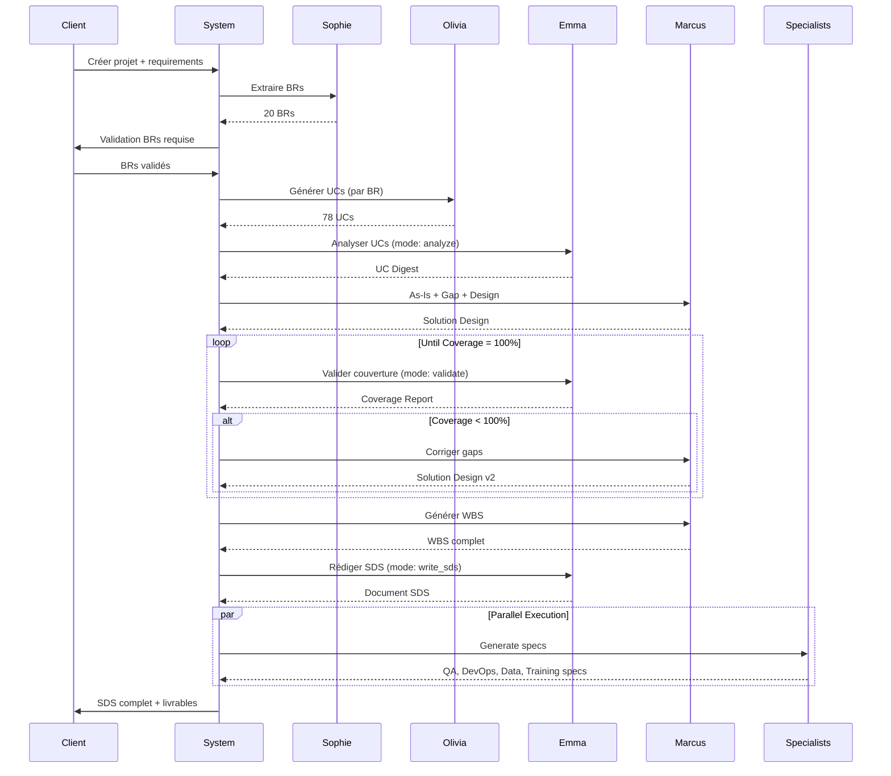
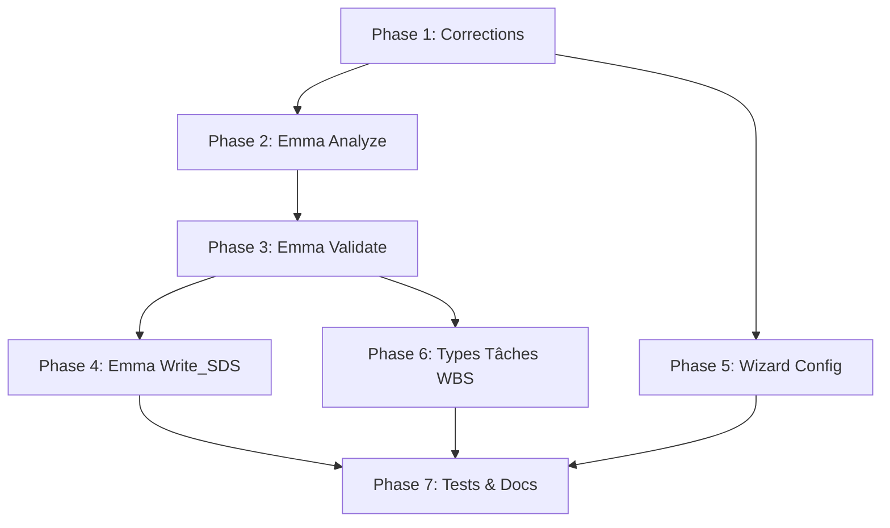

# SPÉCIFICATION DÉTAILLÉE - Digital Humans V2
## Agent Emma, Workflow SDS, Configuration Projet

**Version:** 2.0
**Date:** 2025-12-12
**Auteur:** Sam & Claude
**Statut:** DRAFT - En attente de validation

---

# TABLE DES MATIÈRES

1. [Contexte et Problématique](#1-contexte-et-problématique)
2. [Vue d'ensemble de la Solution](#2-vue-densemble-de-la-solution)
3. [Agent Emma - Spécification Détaillée](#3-agent-emma---spécification-détaillée)
4. [Workflow SDS Corrigé](#4-workflow-sds-corrigé)
5. [Wizard de Configuration Projet](#5-wizard-de-configuration-projet)
6. [Modèle de Données Enrichi](#6-modèle-de-données-enrichi)
7. [Gestion des Credentials](#7-gestion-des-credentials)
8. [Types de Tâches WBS](#8-types-de-tâches-wbs)
9. [Modèle Freemium](#9-modèle-freemium)
10. [Bugs et Corrections Identifiés](#10-bugs-et-corrections-identifiés)
11. [Plan d'Implémentation](#11-plan-dimplémentation)
12. [Annexes](#12-annexes)

---

# 1. CONTEXTE ET PROBLÉMATIQUE

## 1.1 Situation Actuelle

Digital Humans est une plateforme multi-agents IA pour automatiser le développement Salesforce. 
Le système comprend 10 agents spécialisés organisés en deux phases :

### Phase SDS (Solution Design Specification)
- **Sophie (PM)** : Extraction des Business Requirements
- **Olivia (BA)** : Génération des Use Cases
- **Marcus (Architect)** : As-Is Analysis, Gap Analysis, Solution Design, WBS
- **Elena (QA)** : Spécifications de test
- **Jordan (DevOps)** : Spécifications CI/CD
- **Aisha (Data)** : Spécifications migration de données
- **Lucas (Trainer)** : Spécifications formation

### Phase BUILD
- **Diego (Apex Developer)** : Code Apex
- **Zara (LWC Developer)** : Composants Lightning
- **Raj (Admin)** : Configuration déclarative, Flows

## 1.2 Problèmes Identifiés

### P1. Limite de 15 UCs pour Marcus (CRITIQUE)
**Fichier:** `pm_orchestrator_service_v2.py`
**Problème:** Marcus ne reçoit que 15 Use Cases sur le total généré par Olivia.
**Impact:**
- Execution #116 : 15/78 UCs = 19% de couverture
- Projet concession auto : 15/200 UCs = 7.5% de couverture
- Architecture sous-dimensionnée de 3-5x
- WBS incomplet, effort sous-estimé

**Code problématique:**
```python
"use_cases": self._get_use_cases(execution_id, 15),  # LIMITE À 15 !
```

### P2. Pas de validation de couverture
**Problème:** Aucun mécanisme ne vérifie que la solution de Marcus couvre tous les UCs.
**Impact:** Des UCs peuvent être "oubliés" dans l'architecture sans qu'on le sache.

### P3. WBS généré avant validation
**Problème:** Marcus génère le WBS sur une solution potentiellement incomplète.
**Impact:** Si la solution doit être corrigée, le WBS doit être entièrement régénéré.

### P4. Document SDS mécanique
**Problème:** Le SDS actuel est une compilation mécanique des outputs JSON.
**Impact:** Document peu lisible, répétitions, manque de fluidité professionnelle.

### P5. Mapping priorités incorrect
**Fichier:** `pm_orchestrator_service_v2.py`, fonction `_save_extracted_brs`
**Problème:** Le dictionnaire `priority_map` cherche "must", "should" mais Sophie génère "must_have", "should_have".
**Impact:** Toutes les priorités tombent en défaut SHOULD dans la base.

**Code problématique:**
```python
priority_map = {
    "must": BRPriority.MUST,      # Sophie génère "must_have" !
    "should": BRPriority.SHOULD,  # Sophie génère "should_have" !
    "could": BRPriority.COULD,
    "wont": BRPriority.WONT,
}
```

### P6. SDS utilise titre au lieu de description
**Problème:** Le document SDS affiche le titre court des BRs au lieu de la description complète.
**Impact:** Perte d'information dans le SDS généré.

### P7. Éléments de configuration projet manquants
**Problème:** Nombreux champs nécessaires absents du modèle `Project`.
**Impact:** 
- Pas d'infos client pour le SDS
- Pas de configuration SFDX pour le BUILD
- Pas de gestion multi-environnements

### P8. Tâches WBS non-dev bloquent le BUILD
**Problème:** Le BUILD ne distingue pas les tâches de paramétrage des tâches de développement.
**Impact:** Tâches comme "Configuration environnements" assignées à des agents dev qui ne peuvent pas les exécuter.

---

# 2. VUE D'ENSEMBLE DE LA SOLUTION

## 2.1 Nouvel Agent : Emma (Research Analyst)

Un nouvel agent avec 3 modes distincts :

| Mode | Quand | Input | Output |
|------|-------|-------|--------|
| `analyze` | Entre Olivia et Marcus | Tous les UCs | UC Digest compact |
| `validate` | Après Solution Design | UCs + Solution | Coverage Report |
| `write_sds` | Après validation 100% | Tous livrables + Template | Document SDS |

## 2.2 Workflow SDS Corrigé

```
Sophie → Olivia → Emma(analyze) → Marcus(as-is,gap,design) 
                                          ↓
                                   Emma(validate)
                                          ↓
                              Coverage < 100% ? ──→ Marcus corrige
                                          ↓                ↑
                                   Coverage = 100%         │
                                          ↓                │
                                   Marcus(wbs) ────────────┘
                                          ↓
                                   Emma(write_sds)
                                          ↓
                              Elena, Jordan, Aisha, Lucas
```

## 2.3 Wizard Configuration Projet

Formulaire multi-étapes avec validation progressive :
1. Informations de base
2. Type de projet (Greenfield / Existant)
3. Objectif (SDS only / SDS + BUILD)
4. Connexion Salesforce (si requise)
5. Repository Git (si BUILD)
6. Récapitulatif et validation

## 2.4 Modèle Freemium

| Fonctionnalité | Gratuit | Premium |
|----------------|---------|---------|
| Extraction BRs | ✅ | ✅ |
| Génération UCs | ✅ | ✅ |
| Solution Design | ✅ | ✅ |
| Document SDS | ✅ | ✅ |
| BUILD automatique | ❌ | ✅ |
| Déploiement SFDX | ❌ | ✅ |
| Multi-environnements | ❌ | ✅ |

---

# 3. AGENT EMMA - SPÉCIFICATION DÉTAILLÉE

## 3.1 Identité de l'Agent

```python
EMMA_CONFIG = {
    "id": "research_analyst",
    "name": "Emma",
    "full_name": "Emma (Research Analyst)",
    "role": "Research Analyst & Documentation Specialist",
    "goal": "Analyze, validate, and document project specifications",
    "expertise": [
        "Use Case Analysis",
        "Coverage Validation", 
        "Technical Documentation",
        "Requirements Traceability"
    ],
    "modes": ["analyze", "validate", "write_sds"]
}
```

## 3.2 Mode ANALYZE

### 3.2.1 Objectif
Synthétiser TOUS les Use Cases d'Olivia en un digest compact et structuré que Marcus pourra consommer sans dépasser les limites de contexte.

### 3.2.2 Input
```python
{
    "use_cases": List[Dict],       # TOUS les UCs, sans limite
    "business_requirements": List[Dict],  # Les BRs de Sophie
    "project_summary": str          # Résumé du projet
}
```

### 3.2.3 Output : UC Digest
```json
{
    "artifact_id": "UC-DIGEST-001",
    "generated_by": "Emma",
    "generated_at": "2025-12-12T14:00:00Z",
    "statistics": {
        "total_ucs": 200,
        "total_brs": 25,
        "actors": ["Sales Rep", "Manager", "System", "Customer"],
        "automation_types": ["Flow", "Trigger", "Batch", "Scheduled"],
        "complexity_score": "HIGH"
    },
    "by_requirement": {
        "BR-001": {
            "br_id": "BR-001",
            "br_title": "Gestion des leads",
            "br_category": "DATA_MODEL",
            "uc_count": 8,
            "sf_objects": ["Lead", "Account", "Opportunity", "Task"],
            "sf_fields": {
                "Lead": ["Status__c", "Score__c", "Source__c", "Rating__c"],
                "Account": ["Industry", "Annual_Revenue__c"]
            },
            "automations_required": [
                {"type": "Flow", "purpose": "Lead assignment based on territory"},
                {"type": "Trigger", "purpose": "Lead scoring calculation"},
                {"type": "Flow", "purpose": "Lead conversion process"}
            ],
            "ui_components_required": [
                {"type": "LWC", "purpose": "Lead scoring dashboard"},
                {"type": "Quick Action", "purpose": "Convert lead with pre-fill"}
            ],
            "integrations": [],
            "validation_rules": [
                "Lead must have email or phone",
                "Score must be between 0-100"
            ],
            "actors_involved": ["Sales Rep", "Manager"],
            "uc_summaries": [
                {
                    "id": "UC-001-01",
                    "title": "Create new lead from web form",
                    "actor": "System",
                    "complexity": "MEDIUM"
                },
                {
                    "id": "UC-001-02", 
                    "title": "Qualify lead based on criteria",
                    "actor": "Sales Rep",
                    "complexity": "HIGH"
                }
                // ... autres UCs
            ]
        },
        "BR-002": { /* ... */ }
    },
    "cross_cutting_concerns": {
        "shared_objects": ["Account", "Contact", "User"],
        "shared_automations": ["Error logging", "Audit trail"],
        "integration_points": ["ERP System", "Marketing Automation"],
        "security_requirements": ["Field-level encryption for PII", "Role hierarchy"]
    },
    "recommendations": [
        "Consider using Platform Events for real-time integration",
        "Implement generic trigger framework to avoid multiple triggers per object",
        "Use Custom Metadata for configuration instead of Custom Settings"
    ]
}
```

### 3.2.4 Algorithme de Clustering

```python
def analyze_use_cases(use_cases: List[Dict], business_requirements: List[Dict]) -> Dict:
    """
    Phase 1: Regrouper par BR parent
    Phase 2: Pour chaque groupe, extraire:
        - Objets SF uniques
        - Champs par objet
        - Types d'automation
        - Composants UI
        - Règles de validation
    Phase 3: Identifier les éléments transversaux
    Phase 4: Calculer score de complexité
    Phase 5: Générer recommandations
    """
    
    # Grouper par BR
    by_br = {}
    for uc in use_cases:
        br_id = uc.get("parent_ref", "UNASSIGNED")
        if br_id not in by_br:
            by_br[br_id] = {
                "ucs": [],
                "sf_objects": set(),
                "sf_fields": defaultdict(set),
                "automations": [],
                "ui_components": [],
                "actors": set()
            }
        
        by_br[br_id]["ucs"].append(uc)
        by_br[br_id]["sf_objects"].update(uc.get("sf_objects", []))
        by_br[br_id]["actors"].add(uc.get("actor", "Unknown"))
        
        for field in uc.get("sf_fields", []):
            obj, fld = parse_field_reference(field)
            by_br[br_id]["sf_fields"][obj].add(fld)
        
        if uc.get("sf_automation"):
            by_br[br_id]["automations"].append({
                "type": uc["sf_automation"],
                "purpose": uc.get("title", "")
            })
    
    # Identifier éléments transversaux
    all_objects = set()
    for br_data in by_br.values():
        all_objects.update(br_data["sf_objects"])
    
    shared_objects = [obj for obj in all_objects 
                      if sum(1 for br in by_br.values() if obj in br["sf_objects"]) > 1]
    
    return {
        "by_requirement": by_br,
        "cross_cutting_concerns": {
            "shared_objects": shared_objects
        },
        "statistics": {
            "total_ucs": len(use_cases),
            "total_brs": len(by_br)
        }
    }
```

### 3.2.5 Prompt Template (Mode Analyze)

```
You are Emma, a Research Analyst specialized in Salesforce project analysis.

## YOUR TASK
Analyze all Use Cases provided and create a structured digest that captures:
1. Grouping by Business Requirement
2. All Salesforce objects and fields required
3. All automation types needed (Flows, Triggers, Batch jobs)
4. All UI components required
5. Cross-cutting concerns (shared objects, integrations)
6. Complexity assessment and recommendations

## INPUT
Total Use Cases: {uc_count}
Business Requirements: {br_count}

### Use Cases:
{use_cases_json}

### Business Requirements:
{business_requirements_json}

## OUTPUT FORMAT
Respond with a JSON object following this exact structure:
{output_schema}

## CRITICAL RULES
1. EVERY Use Case must be accounted for - do not skip any
2. Extract ALL sf_objects and sf_fields mentioned in each UC
3. Group automations by type (Flow, Trigger, Batch, Scheduled)
4. Identify UI components based on actor type (human actors need UI)
5. Note any validation rules from acceptance criteria
6. Flag any UCs without parent BR reference as "UNASSIGNED"

## QUALITY CHECKLIST
Before responding, verify:
- [ ] All {uc_count} UCs are included in the digest
- [ ] Each BR has its uc_count matching actual UC count
- [ ] No duplicate objects or fields within a BR group
- [ ] Automations are deduped and have clear purposes
- [ ] Recommendations are actionable and specific
```

## 3.3 Mode VALIDATE

### 3.3.1 Objectif
Vérifier que CHAQUE élément de CHAQUE Use Case est couvert par la Solution Design de Marcus.

### 3.3.2 Input
```python
{
    "use_cases": List[Dict],           # TOUS les UCs complets
    "solution_design": Dict,            # Output de Marcus mode "design"
    "gap_analysis": Dict,               # Output de Marcus mode "gap"
    "uc_digest": Dict                   # Output de Emma mode "analyze"
}
```

### 3.3.3 Output : Coverage Report
```json
{
    "artifact_id": "COVERAGE-001",
    "generated_by": "Emma",
    "generated_at": "2025-12-12T15:00:00Z",
    "coverage_score": 94.8,
    "status": "GAPS_DETECTED",
    "summary": {
        "total_ucs": 78,
        "fully_covered": 74,
        "partially_covered": 3,
        "not_covered": 1,
        "total_elements_checked": 542,
        "elements_covered": 514,
        "elements_missing": 28
    },
    "detailed_coverage": {
        "UC-001-01": {
            "uc_id": "UC-001-01",
            "uc_title": "Create Customer Feedback Record",
            "coverage_score": 100,
            "status": "FULLY_COVERED",
            "elements": {
                "objects": {
                    "required": ["Account", "Customer_Feedback__c"],
                    "found": ["Account", "Customer_Feedback__c"],
                    "missing": [],
                    "coverage": 100
                },
                "fields": {
                    "required": ["Rating__c", "Comments__c", "Feedback_Date__c"],
                    "found": ["Rating__c", "Comments__c", "Feedback_Date__c"],
                    "missing": [],
                    "coverage": 100
                },
                "automation": {
                    "required": "Trigger",
                    "found": "TRIG-001: CustomerFeedbackTrigger",
                    "coverage": 100
                },
                "ui_component": {
                    "required": true,
                    "found": "LWC-001: feedbackForm",
                    "coverage": 100
                },
                "acceptance_criteria": [
                    {
                        "criteria": "Rating must be 1-5",
                        "covered_by": "Validation Rule: Rating_Range",
                        "status": "COVERED"
                    },
                    {
                        "criteria": "Feedback linked to Account",
                        "covered_by": "Lookup field: Account__c",
                        "status": "COVERED"
                    }
                ]
            }
        },
        "UC-016-03": {
            "uc_id": "UC-016-03",
            "uc_title": "Export feedback history to CSV",
            "coverage_score": 40,
            "status": "NOT_COVERED",
            "elements": {
                "objects": {
                    "required": ["Customer_Feedback__c"],
                    "found": ["Customer_Feedback__c"],
                    "missing": [],
                    "coverage": 100
                },
                "fields": {
                    "required": ["All feedback fields"],
                    "found": ["All feedback fields"],
                    "missing": [],
                    "coverage": 100
                },
                "automation": {
                    "required": null,
                    "found": null,
                    "coverage": 100
                },
                "ui_component": {
                    "required": true,
                    "found": null,
                    "coverage": 0,
                    "gap": "No export button/component in solution"
                },
                "acceptance_criteria": [
                    {
                        "criteria": "CSV download initiated from Account page",
                        "covered_by": null,
                        "status": "NOT_COVERED",
                        "gap": "No LWC or Quick Action for export"
                    },
                    {
                        "criteria": "All feedback fields included in export",
                        "covered_by": null,
                        "status": "NOT_COVERED",
                        "gap": "No export mapping defined"
                    }
                ]
            }
        }
    },
    "gaps_summary": [
        {
            "gap_id": "GAP-VAL-001",
            "uc_refs": ["UC-016-03"],
            "gap_type": "MISSING_UI_COMPONENT",
            "description": "No export functionality for feedback history",
            "suggested_fix": "Add LWC component 'feedbackExporter' with CSV generation capability",
            "priority": "MEDIUM",
            "effort_estimate": "3 days"
        },
        {
            "gap_id": "GAP-VAL-002",
            "uc_refs": ["UC-019-02"],
            "gap_type": "MISSING_AUTOMATION",
            "description": "No batch job for post-migration average recalculation",
            "suggested_fix": "Add Batch Apex 'RecalculateAveragesBatch' triggered after data import",
            "priority": "HIGH",
            "effort_estimate": "2 days"
        }
    ],
    "orphan_components": [
        {
            "component_id": "LWC-05",
            "component_name": "feedbackChart",
            "component_type": "LWC",
            "reason": "No UC references a dashboard chart for feedback"
        }
    ],
    "traceability_matrix": {
        "UC-001-01": ["OBJ-001", "FIELD-001", "FIELD-002", "TRIG-001", "LWC-001"],
        "UC-001-02": ["OBJ-001", "FLOW-001", "LWC-001"],
        "UC-016-03": []
    },
    "next_action": {
        "action": "RETURN_TO_MARCUS",
        "reason": "Coverage below 100% - 4 gaps detected",
        "gaps_to_fix": ["GAP-VAL-001", "GAP-VAL-002"]
    }
}
```

### 3.3.4 Algorithme de Validation

```python
def validate_coverage(use_cases: List[Dict], solution: Dict) -> Dict:
    """
    Pour chaque UC:
      1. Extraire les éléments requis (objects, fields, automation, ui, acceptance)
      2. Chercher chaque élément dans la solution
      3. Calculer le score de couverture
      4. Identifier les gaps
    """
    
    coverage_results = []
    gaps = []
    
    for uc in use_cases:
        uc_coverage = {
            "uc_id": uc["id"],
            "uc_title": uc["title"],
            "elements": {}
        }
        
        # 1. Vérifier les objets
        required_objects = uc.get("sf_objects", [])
        found_objects = []
        for obj in required_objects:
            if object_exists_in_solution(obj, solution):
                found_objects.append(obj)
        
        uc_coverage["elements"]["objects"] = {
            "required": required_objects,
            "found": found_objects,
            "missing": [o for o in required_objects if o not in found_objects],
            "coverage": len(found_objects) / len(required_objects) * 100 if required_objects else 100
        }
        
        # 2. Vérifier les champs
        required_fields = uc.get("sf_fields", [])
        found_fields = []
        for field in required_fields:
            if field_exists_in_solution(field, solution):
                found_fields.append(field)
        
        uc_coverage["elements"]["fields"] = {
            "required": required_fields,
            "found": found_fields,
            "missing": [f for f in required_fields if f not in found_fields],
            "coverage": len(found_fields) / len(required_fields) * 100 if required_fields else 100
        }
        
        # 3. Vérifier l'automation
        required_automation = uc.get("sf_automation")
        if required_automation:
            found_automation = find_automation_in_solution(required_automation, uc["title"], solution)
            uc_coverage["elements"]["automation"] = {
                "required": required_automation,
                "found": found_automation,
                "coverage": 100 if found_automation else 0
            }
        
        # 4. Vérifier UI (si actor humain)
        if uc.get("actor") not in ["System", "Scheduled Job", "External System"]:
            found_ui = find_ui_component_for_uc(uc, solution)
            uc_coverage["elements"]["ui_component"] = {
                "required": True,
                "found": found_ui,
                "coverage": 100 if found_ui else 0
            }
        
        # 5. Vérifier acceptance criteria
        for criteria in uc.get("acceptance_criteria", []):
            covered_by = find_criteria_implementation(criteria, solution)
            uc_coverage["elements"]["acceptance_criteria"].append({
                "criteria": criteria,
                "covered_by": covered_by,
                "status": "COVERED" if covered_by else "NOT_COVERED"
            })
        
        # Calculer score global du UC
        uc_coverage["coverage_score"] = calculate_uc_coverage_score(uc_coverage["elements"])
        uc_coverage["status"] = get_coverage_status(uc_coverage["coverage_score"])
        
        coverage_results.append(uc_coverage)
        
        # Générer gaps si nécessaire
        if uc_coverage["coverage_score"] < 100:
            gaps.extend(generate_gaps_for_uc(uc, uc_coverage))
    
    return {
        "coverage_score": sum(r["coverage_score"] for r in coverage_results) / len(coverage_results),
        "detailed_coverage": {r["uc_id"]: r for r in coverage_results},
        "gaps_summary": gaps,
        "status": "FULLY_COVERED" if all(r["coverage_score"] == 100 for r in coverage_results) else "GAPS_DETECTED"
    }
```

### 3.3.5 Prompt Template (Mode Validate)

```
You are Emma, a Research Analyst specialized in requirements traceability and coverage validation.

## YOUR TASK
Validate that Marcus's Solution Design covers ALL elements from ALL Use Cases.
For EACH Use Case, verify:
1. All required Salesforce objects exist in the solution
2. All required fields exist on their respective objects
3. Required automations (Flows, Triggers) are defined
4. UI components exist for human actors
5. Each acceptance criteria has a corresponding implementation

## INPUT

### Use Cases to Validate ({uc_count} total):
{use_cases_json}

### Marcus's Solution Design:
{solution_design_json}

### Marcus's Gap Analysis:
{gap_analysis_json}

## OUTPUT FORMAT
Respond with a JSON Coverage Report following this exact structure:
{output_schema}

## VALIDATION RULES

### Object Coverage
- Object is COVERED if it appears in solution.data_model.custom_objects OR solution.data_model.standard_objects
- Standard Salesforce objects (Account, Contact, Lead, Opportunity, Case, User) are always available

### Field Coverage  
- Field is COVERED if it appears on the correct object in the solution
- Check both standard fields and custom fields (ending in __c)

### Automation Coverage
- "Trigger" requirement → Look for matching trigger in solution.automation_design.triggers
- "Flow" requirement → Look for matching flow in solution.automation_design.flows
- Match by purpose/description, not just by name

### UI Coverage
- Required if actor is human (Sales Rep, Manager, Admin, Customer, etc.)
- NOT required if actor is System, Scheduled Job, or External System
- Look in solution.ui_components.lwc_components and solution.ui_components.quick_actions

### Acceptance Criteria Coverage
- Each criteria must map to a specific implementation element
- Validation rules for data constraints
- Automation for process requirements
- UI for user interaction requirements

## CRITICAL RULES
1. Be EXHAUSTIVE - check every single UC, no shortcuts
2. Be PRECISE - don't mark as covered unless there's a clear match
3. GENERATE GAPS - for any missing element, create a gap with suggested fix
4. CALCULATE ACCURATELY - coverage score must reflect actual coverage
5. Include TRACEABILITY MATRIX - map every UC to its implementing components
```

## 3.4 Mode WRITE_SDS

### 3.4.1 Objectif
Rédiger un document SDS professionnel, fluide et complet basé sur un template et tous les livrables des agents.

### 3.4.2 Input
```python
{
    "template": Dict,                   # Structure du template SDS
    "project_info": Dict,               # Infos client, projet
    "business_requirements": List[Dict], # Output Sophie
    "use_cases": List[Dict],            # Output Olivia
    "uc_digest": Dict,                  # Output Emma (analyze)
    "solution_design": Dict,            # Output Marcus (design)
    "gap_analysis": Dict,               # Output Marcus (gap)
    "wbs": Dict,                        # Output Marcus (wbs)
    "coverage_report": Dict,            # Output Emma (validate)
    "qa_specs": Dict,                   # Output Elena (si disponible)
    "devops_specs": Dict,               # Output Jordan (si disponible)
    "data_specs": Dict,                 # Output Aisha (si disponible)
    "training_specs": Dict              # Output Lucas (si disponible)
}
```

### 3.4.3 Template SDS Structure
```json
{
    "template_id": "SDS-TEMPLATE-001",
    "template_name": "Standard SDS Template",
    "language": "fr",
    "sections": [
        {
            "id": "1",
            "title": "Résumé Exécutif",
            "subsections": [
                {"id": "1.1", "title": "Contexte du Projet", "source": "project_info"},
                {"id": "1.2", "title": "Objectifs", "source": "project_info.objectives"},
                {"id": "1.3", "title": "Périmètre", "source": "uc_digest.statistics"},
                {"id": "1.4", "title": "Principales Recommandations", "source": "uc_digest.recommendations"}
            ]
        },
        {
            "id": "2",
            "title": "Contexte Métier",
            "subsections": [
                {"id": "2.1", "title": "Présentation du Client", "source": "project_info.client"},
                {"id": "2.2", "title": "Enjeux Business", "source": "project_info.business_context"},
                {"id": "2.3", "title": "Parties Prenantes", "source": "business_requirements[].stakeholder"},
                {"id": "2.4", "title": "Contraintes et Hypothèses", "source": "project_info.constraints"}
            ]
        },
        {
            "id": "3",
            "title": "Exigences Métier",
            "subsections": [
                {"id": "3.1", "title": "Vue d'Ensemble", "source": "business_requirements", "format": "summary_table"},
                {"id": "3.2", "title": "Exigences Détaillées", "source": "business_requirements", "format": "detailed_cards"}
            ]
        },
        {
            "id": "4",
            "title": "Spécifications Fonctionnelles",
            "subsections": [
                {"id": "4.1", "title": "Vue d'Ensemble des Cas d'Utilisation", "source": "uc_digest", "format": "by_br_summary"},
                {"id": "4.2", "title": "Acteurs du Système", "source": "uc_digest.statistics.actors"},
                {"id": "4.3", "title": "Matrice de Traçabilité", "source": "coverage_report.traceability_matrix"}
            ]
        },
        {
            "id": "5",
            "title": "Architecture Technique",
            "subsections": [
                {"id": "5.1", "title": "Modèle de Données", "source": "solution_design.data_model", "format": "erd_diagram"},
                {"id": "5.2", "title": "Objets Personnalisés", "source": "solution_design.data_model.custom_objects", "format": "object_cards"},
                {"id": "5.3", "title": "Modèle de Sécurité", "source": "solution_design.security_model"},
                {"id": "5.4", "title": "Automatisations", "source": "solution_design.automation_design"},
                {"id": "5.5", "title": "Points d'Intégration", "source": "solution_design.integration_points"},
                {"id": "5.6", "title": "Composants UI", "source": "solution_design.ui_components"}
            ]
        },
        {
            "id": "6",
            "title": "Plan d'Implémentation",
            "subsections": [
                {"id": "6.1", "title": "Phases du Projet", "source": "wbs.phases", "format": "timeline"},
                {"id": "6.2", "title": "Estimation des Efforts", "source": "wbs", "format": "effort_summary"},
                {"id": "6.3", "title": "Dépendances", "source": "wbs.phases[].tasks[].dependencies"},
                {"id": "6.4", "title": "Risques et Mitigations", "source": "solution_design.risks"}
            ]
        },
        {
            "id": "7",
            "title": "Stratégie de Test",
            "subsections": [
                {"id": "7.1", "title": "Approche de Test", "source": "qa_specs.strategy"},
                {"id": "7.2", "title": "Critères d'Acceptation", "source": "use_cases[].acceptance_criteria"},
                {"id": "7.3", "title": "Plan de UAT", "source": "qa_specs.uat_plan"}
            ]
        },
        {
            "id": "8",
            "title": "Déploiement et Opérations",
            "subsections": [
                {"id": "8.1", "title": "Stratégie de Déploiement", "source": "devops_specs.deployment"},
                {"id": "8.2", "title": "Environnements", "source": "devops_specs.environments"},
                {"id": "8.3", "title": "Plan de Rollback", "source": "devops_specs.rollback"}
            ]
        },
        {
            "id": "9",
            "title": "Formation et Adoption",
            "subsections": [
                {"id": "9.1", "title": "Plan de Formation", "source": "training_specs.plan"},
                {"id": "9.2", "title": "Documentation Utilisateur", "source": "training_specs.documentation"},
                {"id": "9.3", "title": "Support Post-Déploiement", "source": "training_specs.support"}
            ]
        },
        {
            "id": "A",
            "title": "Annexes",
            "subsections": [
                {"id": "A.1", "title": "Cas d'Utilisation Détaillés", "source": "use_cases", "format": "full_uc_cards"},
                {"id": "A.2", "title": "WBS Complet", "source": "wbs", "format": "full_wbs_table"},
                {"id": "A.3", "title": "Dictionnaire de Données", "source": "solution_design.data_model", "format": "data_dictionary"},
                {"id": "A.4", "title": "Glossaire", "source": "auto_generated"}
            ]
        }
    ]
}
```

### 3.4.4 Algorithme de Rédaction

```python
def write_sds(template: Dict, sources: Dict) -> str:
    """
    Pour chaque section du template:
      1. Identifier la source de données
      2. Extraire les données pertinentes
      3. Rédiger en prose fluide (pas de copier-coller JSON)
      4. Appliquer le format demandé (table, cards, diagram)
      5. Vérifier la complétude
    """
    
    document = []
    
    for section in template["sections"]:
        section_content = {
            "id": section["id"],
            "title": section["title"],
            "content": []
        }
        
        for subsection in section.get("subsections", []):
            # 1. Extraire les données de la source
            source_path = subsection["source"]
            data = extract_from_path(sources, source_path)
            
            # 2. Appliquer le format
            format_type = subsection.get("format", "prose")
            
            if format_type == "prose":
                content = generate_prose(data, subsection["title"])
            elif format_type == "summary_table":
                content = generate_summary_table(data)
            elif format_type == "detailed_cards":
                content = generate_detailed_cards(data)
            elif format_type == "erd_diagram":
                content = generate_erd_mermaid(data)
            elif format_type == "timeline":
                content = generate_timeline_gantt(data)
            elif format_type == "full_uc_cards":
                content = generate_full_uc_cards(data)
            
            # 3. Vérifier complétude
            if not content or content == "N/A":
                content = f"[Section à compléter - Source: {source_path}]"
            
            section_content["content"].append({
                "id": subsection["id"],
                "title": subsection["title"],
                "body": content
            })
        
        document.append(section_content)
    
    return format_as_markdown(document)
```

### 3.4.5 Prompt Template (Mode Write_SDS)

```
You are Emma, a Documentation Specialist creating a professional Solution Design Specification document.

## YOUR TASK
Write a complete, professional SDS document following the provided template.
For each section, use the corresponding source data to write fluent, well-structured prose.

## WRITING GUIDELINES

### Style
- Professional but accessible language
- Active voice preferred
- Avoid jargon without explanation
- Use concrete examples where helpful

### Structure
- Each section should flow naturally to the next
- Use transitions between ideas
- Tables for comparative or list data
- Diagrams where visual representation adds value

### Content Rules
- DO NOT copy-paste JSON - transform data into readable text
- DO NOT use placeholder text like "[TBD]" - write actual content
- DO include specific numbers, names, and details from the source data
- DO reference related sections where appropriate

## TEMPLATE
{template_json}

## SOURCE DATA

### Project Information:
{project_info_json}

### Business Requirements (Sophie):
{business_requirements_json}

### Use Case Digest (Emma analyze):
{uc_digest_json}

### Solution Design (Marcus):
{solution_design_json}

### WBS (Marcus):
{wbs_json}

### Coverage Report (Emma validate):
{coverage_report_json}

## OUTPUT FORMAT
Generate the complete SDS document in Markdown format.
Include:
- Title page with project name, client, date, version
- Table of contents
- All sections from the template
- Page breaks between major sections (use ---)
- Proper heading hierarchy (# ## ### ####)

## QUALITY CHECKLIST
Before finalizing, verify:
- [ ] All template sections are present
- [ ] All BRs are mentioned in Section 3
- [ ] All UCs are referenced (summary in 4, details in Annex)
- [ ] All solution components are documented in Section 5
- [ ] WBS matches the phases described in Section 6
- [ ] No placeholder text remains
- [ ] Document flows logically from start to end
```

---

# 4. WORKFLOW SDS CORRIGÉ

## 4.1 Vue d'Ensemble

```
┌─────────────────────────────────────────────────────────────────────────────┐
│                           WORKFLOW SDS V2                                   │
├─────────────────────────────────────────────────────────────────────────────┤
│                                                                             │
│  PHASE 1: EXTRACTION (Sophie)                                              │
│  ─────────────────────────────                                              │
│    Input: project.business_requirements (texte libre)                      │
│    Output: 10-30 Business Requirements structurés                          │
│    Stockage: business_requirements table                                   │
│    Pause: Validation client des BRs                                        │
│                                                                             │
│  PHASE 2: ANALYSE FONCTIONNELLE (Olivia)                                   │
│  ────────────────────────────────────────                                   │
│    Input: BRs validés                                                      │
│    Output: 3-5 Use Cases par BR                                            │
│    Stockage: deliverable_items table (type: use_case)                      │
│    Pas de pause                                                            │
│                                                                             │
│  PHASE 3: SYNTHÈSE UC (Emma - mode analyze) [NOUVEAU]                      │
│  ──────────────────────────────────────────────────────                     │
│    Input: TOUS les UCs (sans limite)                                       │
│    Output: UC Digest structuré et compact                                  │
│    Stockage: agent_deliverables (type: uc_digest)                          │
│    Pas de pause                                                            │
│                                                                             │
│  PHASE 4: ARCHITECTURE (Marcus - as_is, gap, design)                       │
│  ─────────────────────────────────────────────────────                      │
│    Input: UC Digest + BRs + Org Metadata (si existant)                     │
│    Output: As-Is, Gap Analysis, Solution Design                            │
│    Stockage: agent_deliverables                                            │
│    Pas de pause                                                            │
│                                                                             │
│  PHASE 5: VALIDATION COUVERTURE (Emma - mode validate) [NOUVEAU]           │
│  ───────────────────────────────────────────────────────────────────        │
│    Input: TOUS les UCs + Solution Design                                   │
│    Output: Coverage Report                                                 │
│    ┌─────────────────────────────────────────────────────────────┐         │
│    │  SI coverage < 100%:                                        │         │
│    │    → Extraire les gaps                                      │         │
│    │    → Renvoyer à Marcus pour correction                      │         │
│    │    → Marcus met à jour Solution Design                      │         │
│    │    → Retour à Phase 5 (validation)                          │         │
│    │    → Max 3 itérations, sinon erreur                         │         │
│    │                                                             │         │
│    │  SI coverage = 100%:                                        │         │
│    │    → Continuer vers Phase 6                                 │         │
│    └─────────────────────────────────────────────────────────────┘         │
│                                                                             │
│  PHASE 6: WBS (Marcus - mode wbs)                                          │
│  ─────────────────────────────────                                          │
│    Input: Solution Design VALIDÉE + Gap Analysis                           │
│    Output: WBS complet avec types de tâches                                │
│    Stockage: agent_deliverables                                            │
│    Pas de pause                                                            │
│                                                                             │
│  PHASE 7: RÉDACTION SDS (Emma - mode write_sds) [NOUVEAU]                  │
│  ──────────────────────────────────────────────────────────                 │
│    Input: Template + Tous les livrables                                    │
│    Output: Document SDS professionnel                                      │
│    Stockage: agent_deliverables + fichier généré                           │
│    Pause optionnelle: Validation client du SDS                             │
│                                                                             │
│  PHASE 8: SPÉCIALISTES (Elena, Jordan, Aisha, Lucas)                       │
│  ──────────────────────────────────────────────────────                     │
│    Input: Solution Design + WBS                                            │
│    Output: QA specs, DevOps specs, Data specs, Training specs              │
│    Stockage: agent_deliverables                                            │
│    Fin de la phase SDS                                                     │
│                                                                             │
└─────────────────────────────────────────────────────────────────────────────┘
```

## 4.2 Diagramme de Séquence



## 4.3 Code d'Orchestration Modifié

```python
# pm_orchestrator_service_v2.py - Modifications requises

async def execute_sds_workflow(self, execution_id: int, project_id: int, ...):
    """
    Workflow SDS V2 avec Emma et boucle de validation
    """
    
    # Phase 1: Sophie - BRs (existant, inchangé)
    # ...
    
    # Phase 2: Olivia - UCs (existant, inchangé)
    # ...
    
    # === PHASE 3: Emma - UC Digest (NOUVEAU) ===
    logger.info("[Phase 3] Emma - Analyzing Use Cases")
    self._update_progress(execution, "research_analyst", "running", 45, "Analyzing all Use Cases...")
    
    # Récupérer TOUS les UCs sans limite
    all_use_cases = self._get_use_cases(execution_id)  # PAS de limite !
    
    emma_analyze_result = await self._run_agent(
        agent_id="research_analyst",
        mode="analyze",
        input_data={
            "use_cases": all_use_cases,
            "business_requirements": business_requirements,
            "project_summary": project.description
        },
        execution_id=execution_id,
        project_id=project_id
    )
    
    uc_digest = emma_analyze_result["output"]["content"]
    self._save_deliverable(execution_id, "research_analyst", "uc_digest", emma_analyze_result["output"])
    
    # === PHASE 4: Marcus - Architecture (MODIFIÉ) ===
    # Utiliser UC Digest au lieu des 15 premiers UCs
    
    # 4.1: As-Is (si org existant)
    if project.project_type != "greenfield":
        asis_result = await self._run_agent(
            agent_id="architect",
            mode="as_is",
            input_data={
                "sfdx_metadata": org_metadata,
                "org_summary": org_summary
            },
            execution_id=execution_id,
            project_id=project_id
        )
    else:
        asis_result = {"output": {"content": {"status": "greenfield", "current_state": "No existing implementation"}}}
    
    # 4.2: Gap Analysis
    gap_result = await self._run_agent(
        agent_id="architect",
        mode="gap",
        input_data={
            "requirements": business_requirements,
            "uc_digest": uc_digest,  # UC Digest au lieu de use_cases limités
            "as_is": asis_result["output"]["content"]
        },
        execution_id=execution_id,
        project_id=project_id
    )
    
    # 4.3: Solution Design
    design_result = await self._run_agent(
        agent_id="architect",
        mode="design",
        input_data={
            "project_summary": project.description,
            "uc_digest": uc_digest,  # UC Digest
            "gaps": gap_result["output"]["content"].get("gaps", []),
            "as_is": asis_result["output"]["content"]
        },
        execution_id=execution_id,
        project_id=project_id
    )
    
    solution_design = design_result["output"]["content"]
    
    # === PHASE 5: Emma - Validation (NOUVEAU) ===
    max_validation_iterations = 3
    validation_iteration = 0
    coverage_score = 0
    
    while coverage_score < 100 and validation_iteration < max_validation_iterations:
        validation_iteration += 1
        logger.info(f"[Phase 5] Emma - Validation iteration {validation_iteration}")
        
        self._update_progress(execution, "research_analyst", "running", 
                            60 + validation_iteration * 5, 
                            f"Validating coverage (iteration {validation_iteration})...")
        
        validate_result = await self._run_agent(
            agent_id="research_analyst",
            mode="validate",
            input_data={
                "use_cases": all_use_cases,
                "solution_design": solution_design,
                "gap_analysis": gap_result["output"]["content"],
                "uc_digest": uc_digest
            },
            execution_id=execution_id,
            project_id=project_id
        )
        
        coverage_report = validate_result["output"]["content"]
        coverage_score = coverage_report.get("coverage_score", 0)
        
        if coverage_score < 100:
            gaps_to_fix = coverage_report.get("gaps_summary", [])
            logger.info(f"[Phase 5] Coverage {coverage_score}% - {len(gaps_to_fix)} gaps to fix")
            
            # Demander à Marcus de corriger
            fix_result = await self._run_agent(
                agent_id="architect",
                mode="fix_gaps",  # Nouveau mode pour Marcus
                input_data={
                    "current_solution": solution_design,
                    "gaps_to_fix": gaps_to_fix,
                    "uc_digest": uc_digest
                },
                execution_id=execution_id,
                project_id=project_id
            )
            
            solution_design = fix_result["output"]["content"]
            self._save_deliverable(execution_id, "architect", f"solution_design_v{validation_iteration + 1}", 
                                  fix_result["output"])
    
    if coverage_score < 100:
        raise Exception(f"Unable to achieve 100% coverage after {max_validation_iterations} iterations. "
                       f"Final coverage: {coverage_score}%")
    
    self._save_deliverable(execution_id, "research_analyst", "coverage_report", validate_result["output"])
    logger.info(f"[Phase 5] ✅ Coverage validated at 100%")
    
    # === PHASE 6: Marcus - WBS (EXISTANT, input modifié) ===
    logger.info("[Phase 6] Marcus - Generating WBS")
    
    wbs_result = await self._run_agent(
        agent_id="architect",
        mode="wbs",
        input_data={
            "gaps": gap_result["output"]["content"],
            "architecture": solution_design,  # Solution VALIDÉE
            "constraints": project.compliance_requirements or "",
            "project_type": project.project_type,  # Pour distinguer les types de tâches
            "has_sfdx_connection": project.sfdx_configured  # Pour inclure ou non les tâches de setup
        },
        execution_id=execution_id,
        project_id=project_id
    )
    
    self._save_deliverable(execution_id, "architect", "wbs", wbs_result["output"])
    
    # === PHASE 7: Emma - Rédaction SDS (NOUVEAU) ===
    logger.info("[Phase 7] Emma - Writing SDS Document")
    self._update_progress(execution, "research_analyst", "running", 85, "Writing SDS document...")
    
    sds_template = self._get_sds_template(project.sds_template_id or "default")
    
    write_sds_result = await self._run_agent(
        agent_id="research_analyst",
        mode="write_sds",
        input_data={
            "template": sds_template,
            "project_info": {
                "name": project.name,
                "client_name": project.client_name,
                "description": project.description,
                "objectives": project.objectives,
                "constraints": project.compliance_requirements
            },
            "business_requirements": business_requirements,
            "use_cases": all_use_cases,
            "uc_digest": uc_digest,
            "solution_design": solution_design,
            "gap_analysis": gap_result["output"]["content"],
            "wbs": wbs_result["output"]["content"],
            "coverage_report": coverage_report
        },
        execution_id=execution_id,
        project_id=project_id
    )
    
    self._save_deliverable(execution_id, "research_analyst", "sds_document", write_sds_result["output"])
    
    # Générer le fichier Word/PDF
    sds_file_path = await self._generate_sds_file(
        write_sds_result["output"]["content"],
        project,
        execution_id
    )
    
    # === PHASE 8: Spécialistes (existant, inchangé) ===
    # Elena, Jordan, Aisha, Lucas
    # ...
```

---

# 5. WIZARD DE CONFIGURATION PROJET

## 5.1 Vue d'Ensemble

Le wizard guide l'utilisateur à travers 6 étapes avec validation à chaque étape.

```
┌─────────────────────────────────────────────────────────────────────────────┐
│                    WIZARD CRÉATION PROJET                                   │
├─────────────────────────────────────────────────────────────────────────────┤
│                                                                             │
│  ┌─────────┐   ┌─────────┐   ┌─────────┐   ┌─────────┐   ┌─────────┐       │
│  │ Step 1  │──▶│ Step 2  │──▶│ Step 3  │──▶│ Step 4  │──▶│ Step 5  │──▶...│
│  │ Basics  │   │  Type   │   │  Goal   │   │  SFDX   │   │   Git   │       │
│  └─────────┘   └─────────┘   └─────────┘   └─────────┘   └─────────┘       │
│       │             │             │             │             │             │
│       ▼             ▼             ▼             ▼             ▼             │
│  [Validate]    [Validate]   [Validate]    [Validate]    [Validate]         │
│                                                                             │
└─────────────────────────────────────────────────────────────────────────────┘
```

## 5.2 Étape 1: Informations de Base

### Champs
| Champ | Type | Requis | Validation |
|-------|------|--------|------------|
| project_name | string | ✅ | Min 3 chars, unique |
| client_name | string | ✅ | Min 2 chars |
| client_contact_name | string | ⚪ | - |
| client_contact_email | email | ⚪ | Format email valide |
| description | text | ✅ | Min 50 chars |
| language | select | ✅ | fr / en |

### UI Mockup
```
┌─────────────────────────────────────────────────────────────────┐
│  Étape 1/6 - Informations de Base                              │
├─────────────────────────────────────────────────────────────────┤
│                                                                 │
│  Nom du Projet *                                                │
│  ┌─────────────────────────────────────────────────────────┐   │
│  │ Gestion Pipeline Concession Auto                        │   │
│  └─────────────────────────────────────────────────────────┘   │
│                                                                 │
│  Nom du Client *                                                │
│  ┌─────────────────────────────────────────────────────────┐   │
│  │ AutoPlus SARL                                           │   │
│  └─────────────────────────────────────────────────────────┘   │
│                                                                 │
│  Contact Principal                                              │
│  ┌──────────────────────────┐ ┌────────────────────────────┐   │
│  │ Jean Dupont              │ │ jean.dupont@autoplus.fr    │   │
│  └──────────────────────────┘ └────────────────────────────┘   │
│                                                                 │
│  Description du Projet *                                        │
│  ┌─────────────────────────────────────────────────────────┐   │
│  │ Mise en place d'un système de gestion de pipeline       │   │
│  │ commercial pour le suivi des prospects, des essais      │   │
│  │ véhicules et des ventes...                              │   │
│  └─────────────────────────────────────────────────────────┘   │
│                                                                 │
│  Langue du Projet *                                             │
│  ○ Français  ● English                                         │
│                                                                 │
│                              [Annuler]  [Suivant →]            │
└─────────────────────────────────────────────────────────────────┘
```

## 5.3 Étape 2: Type de Projet

### Champs
| Champ | Type | Requis | Validation |
|-------|------|--------|------------|
| project_type | radio | ✅ | greenfield / existing |
| sf_edition | select | Si existing | enterprise / unlimited / professional |
| org_id | string | Si existing | Format 15 ou 18 chars |

### UI Mockup
```
┌─────────────────────────────────────────────────────────────────┐
│  Étape 2/6 - Type de Projet                                    │
├─────────────────────────────────────────────────────────────────┤
│                                                                 │
│  Quel type de projet Salesforce ?                              │
│                                                                 │
│  ┌─────────────────────────────────────────────────────────┐   │
│  │ ○ Nouvelle Implémentation (Greenfield)                  │   │
│  │   Pas d'organisation Salesforce existante               │   │
│  │   L'architecte partira d'une page blanche               │   │
│  └─────────────────────────────────────────────────────────┘   │
│                                                                 │
│  ┌─────────────────────────────────────────────────────────┐   │
│  │ ● Évolution d'un Org Existant                           │   │
│  │   Une organisation Salesforce existe déjà               │   │
│  │   L'architecte analysera l'état actuel                  │   │
│  └─────────────────────────────────────────────────────────┘   │
│                                                                 │
│  ═══════════════════════════════════════════════════════════   │
│  Configuration Org Existant                                    │
│                                                                 │
│  Édition Salesforce *                                          │
│  ┌─────────────────────────────────────────────────────────┐   │
│  │ Enterprise Edition                                  ▼   │   │
│  └─────────────────────────────────────────────────────────┘   │
│                                                                 │
│  Org ID (Production)                                           │
│  ┌─────────────────────────────────────────────────────────┐   │
│  │ 00D5g000008XkYz                                         │   │
│  └─────────────────────────────────────────────────────────┘   │
│                                                                 │
│                    [← Retour]  [Annuler]  [Suivant →]          │
└─────────────────────────────────────────────────────────────────┘
```

## 5.4 Étape 3: Objectif du Projet

### Champs
| Champ | Type | Requis | Validation |
|-------|------|--------|------------|
| project_goal | radio | ✅ | sds_only / sds_and_build |

### UI Mockup
```
┌─────────────────────────────────────────────────────────────────┐
│  Étape 3/6 - Objectif du Projet                                │
├─────────────────────────────────────────────────────────────────┤
│                                                                 │
│  Que souhaitez-vous réaliser ?                                 │
│                                                                 │
│  ┌─────────────────────────────────────────────────────────┐   │
│  │ ● SDS Uniquement (Gratuit)                              │   │
│  │                                                         │   │
│  │   ✓ Extraction des Business Requirements               │   │
│  │   ✓ Génération des Use Cases                           │   │
│  │   ✓ Solution Design & Architecture                     │   │
│  │   ✓ Document SDS professionnel (Word/PDF)              │   │
│  │   ✗ Pas de génération de code automatique              │   │
│  │   ✗ Pas de déploiement Salesforce                      │   │
│  │                                                         │   │
│  │   💡 Idéal pour valider une approche avant dev         │   │
│  └─────────────────────────────────────────────────────────┘   │
│                                                                 │
│  ┌─────────────────────────────────────────────────────────┐   │
│  │ ○ SDS + BUILD Automatique (Premium)                     │   │
│  │                                                         │   │
│  │   ✓ Tout le contenu SDS gratuit                        │   │
│  │   ✓ Génération de code Apex, LWC, Flows               │   │
│  │   ✓ Tests automatisés                                  │   │
│  │   ✓ Déploiement SFDX multi-environnements              │   │
│  │   ✓ Versioning Git automatique                         │   │
│  │                                                         │   │
│  │   ⚠️ Requiert connexion Salesforce et Git              │   │
│  └─────────────────────────────────────────────────────────┘   │
│                                                                 │
│                    [← Retour]  [Annuler]  [Suivant →]          │
└─────────────────────────────────────────────────────────────────┘
```

## 5.5 Étape 4: Connexion Salesforce

### Conditions d'affichage
- Affichée si: `project_type == "existing"` OU `project_goal == "sds_and_build"`
- Sinon: Étape sautée automatiquement

### Champs
| Champ | Type | Requis | Validation |
|-------|------|--------|------------|
| sfdx_auth_method | radio | ✅ | jwt / web_login |
| dev_sandbox_url | url | ✅ | Format URL Salesforce |
| dev_sandbox_alias | string | ✅ | Alphanumérique |
| sfdx_username | email | ✅ | Format email |
| sfdx_client_id | string | Si JWT | Min 50 chars |
| sfdx_private_key | file | Si JWT | Format PEM |

### UI Mockup
```
┌─────────────────────────────────────────────────────────────────┐
│  Étape 4/6 - Connexion Salesforce                              │
├─────────────────────────────────────────────────────────────────┤
│                                                                 │
│  Méthode d'authentification                                    │
│  ○ JWT (Recommandé pour CI/CD)  ● Web Login (Plus simple)      │
│                                                                 │
│  ═══════════════════════════════════════════════════════════   │
│  Environnement de Développement                                │
│                                                                 │
│  URL Sandbox Dev *                                              │
│  ┌─────────────────────────────────────────────────────────┐   │
│  │ https://autoplus--dev.sandbox.my.salesforce.com         │   │
│  └─────────────────────────────────────────────────────────┘   │
│                                                                 │
│  Alias *                          Username *                   │
│  ┌─────────────────────┐          ┌────────────────────────┐   │
│  │ autoplus-dev        │          │ admin@autoplus.dev     │   │
│  └─────────────────────┘          └────────────────────────┘   │
│                                                                 │
│  ┌─────────────────────────────────────────────────────────┐   │
│  │  [🔌 Tester la connexion]                               │   │
│  │                                                         │   │
│  │  ✅ Connexion réussie !                                 │   │
│  │  Org: AutoPlus Dev (00D5g000008XkYz)                   │   │
│  │  User: Admin User (admin@autoplus.dev)                 │   │
│  └─────────────────────────────────────────────────────────┘   │
│                                                                 │
│  ═══════════════════════════════════════════════════════════   │
│  Environnements supplémentaires (optionnel)                    │
│                                                                 │
│  [+ Ajouter QA Sandbox]  [+ Ajouter UAT Sandbox]               │
│                                                                 │
│                    [← Retour]  [Annuler]  [Suivant →]          │
└─────────────────────────────────────────────────────────────────┘
```

## 5.6 Étape 5: Repository Git

### Conditions d'affichage
- Affichée si: `project_goal == "sds_and_build"`
- Sinon: Étape sautée automatiquement

### Champs
| Champ | Type | Requis | Validation |
|-------|------|--------|------------|
| git_provider | select | ✅ | github / gitlab / bitbucket |
| git_repo_url | url | ✅ | Format Git URL |
| git_access_token | password | ✅ | Min 20 chars |
| git_default_branch | string | ✅ | Default: main |

### UI Mockup
```
┌─────────────────────────────────────────────────────────────────┐
│  Étape 5/6 - Repository Git                                    │
├─────────────────────────────────────────────────────────────────┤
│                                                                 │
│  Provider Git *                                                 │
│  ● GitHub  ○ GitLab  ○ Bitbucket                               │
│                                                                 │
│  URL du Repository *                                            │
│  ┌─────────────────────────────────────────────────────────┐   │
│  │ https://github.com/autoplus/salesforce-pipeline.git     │   │
│  └─────────────────────────────────────────────────────────┘   │
│                                                                 │
│  Access Token *                                                 │
│  ┌─────────────────────────────────────────────────────────┐   │
│  │ ••••••••••••••••••••••••••••••••••••                   │   │
│  └─────────────────────────────────────────────────────────┘   │
│  💡 Créer un token: github.com/settings/tokens                 │
│                                                                 │
│  Branche par défaut *                                           │
│  ┌─────────────────────────────────────────────────────────┐   │
│  │ main                                                    │   │
│  └─────────────────────────────────────────────────────────┘   │
│                                                                 │
│  ┌─────────────────────────────────────────────────────────┐   │
│  │  [🔌 Tester la connexion]                               │   │
│  │                                                         │   │
│  │  ✅ Repository accessible !                             │   │
│  │  Branches: main, develop                                │   │
│  │  Last commit: 2 days ago                                │   │
│  └─────────────────────────────────────────────────────────┘   │
│                                                                 │
│                    [← Retour]  [Annuler]  [Suivant →]          │
└─────────────────────────────────────────────────────────────────┘
```

## 5.7 Étape 6: Récapitulatif et Business Requirements

### Champs
| Champ | Type | Requis | Validation |
|-------|------|--------|------------|
| business_requirements | textarea | ✅ | Min 100 chars |
| attachments | file[] | ⚪ | PDF, Word, Excel |

### UI Mockup
```
┌─────────────────────────────────────────────────────────────────┐
│  Étape 6/6 - Récapitulatif et Exigences                        │
├─────────────────────────────────────────────────────────────────┤
│                                                                 │
│  📋 RÉCAPITULATIF                                              │
│  ┌─────────────────────────────────────────────────────────┐   │
│  │ Projet: Gestion Pipeline Concession Auto                │   │
│  │ Client: AutoPlus SARL                                   │   │
│  │ Type: Évolution d'un org existant (Enterprise)          │   │
│  │ Objectif: SDS + BUILD                                   │   │
│  │ Sandbox Dev: autoplus-dev ✅                            │   │
│  │ Git: github.com/autoplus/salesforce-pipeline ✅         │   │
│  └─────────────────────────────────────────────────────────┘   │
│                                                                 │
│  ═══════════════════════════════════════════════════════════   │
│  Exigences Métier (Business Requirements) *                    │
│                                                                 │
│  Décrivez vos besoins en langage naturel. Notre IA va les     │
│  analyser et les structurer automatiquement.                   │
│                                                                 │
│  ┌─────────────────────────────────────────────────────────┐   │
│  │ Nous avons besoin d'un système pour gérer notre        │   │
│  │ pipeline commercial dans notre concession automobile.  │   │
│  │                                                         │   │
│  │ Les vendeurs doivent pouvoir :                         │   │
│  │ - Créer des fiches prospect avec leurs préférences     │   │
│  │ - Planifier des essais véhicules                       │   │
│  │ - Suivre l'avancement des négociations                 │   │
│  │ - Générer des devis et bons de commande               │   │
│  │                                                         │   │
│  │ Le responsable commercial doit avoir une vue           │   │
│  │ dashboard avec les KPIs...                             │   │
│  └─────────────────────────────────────────────────────────┘   │
│                                                                 │
│  Documents joints (optionnel)                                  │
│  [📎 Ajouter des fichiers]                                     │
│  • Cahier_des_charges_v1.pdf (2.3 MB)                          │
│  • Process_actuel.xlsx (156 KB)                                │
│                                                                 │
│                    [← Retour]  [Annuler]  [🚀 Créer Projet]    │
└─────────────────────────────────────────────────────────────────┘
```

## 5.8 Logique de Validation par Étape

```python
# Validation rules for each step

STEP_VALIDATIONS = {
    1: {
        "project_name": {
            "required": True,
            "min_length": 3,
            "unique": True  # Check in database
        },
        "client_name": {
            "required": True,
            "min_length": 2
        },
        "description": {
            "required": True,
            "min_length": 50
        },
        "language": {
            "required": True,
            "allowed": ["fr", "en"]
        }
    },
    2: {
        "project_type": {
            "required": True,
            "allowed": ["greenfield", "existing"]
        },
        "sf_edition": {
            "required_if": {"project_type": "existing"},
            "allowed": ["professional", "enterprise", "unlimited"]
        },
        "org_id": {
            "required_if": {"project_type": "existing"},
            "pattern": r"^00D[a-zA-Z0-9]{12,15}$"
        }
    },
    3: {
        "project_goal": {
            "required": True,
            "allowed": ["sds_only", "sds_and_build"]
        }
    },
    4: {
        "skip_if": {
            "project_type": "greenfield",
            "project_goal": "sds_only"
        },
        "sfdx_auth_method": {
            "required": True,
            "allowed": ["jwt", "web_login"]
        },
        "dev_sandbox_url": {
            "required": True,
            "pattern": r"^https://.*\.salesforce\.com$"
        },
        "dev_sandbox_alias": {
            "required": True,
            "pattern": r"^[a-zA-Z0-9_-]+$"
        },
        "sfdx_username": {
            "required": True,
            "format": "email"
        },
        "test_connection": {
            "action": "test_sfdx_connection",
            "required_success": True
        }
    },
    5: {
        "skip_if": {
            "project_goal": "sds_only"
        },
        "git_provider": {
            "required": True,
            "allowed": ["github", "gitlab", "bitbucket"]
        },
        "git_repo_url": {
            "required": True,
            "pattern": r"^https://.*\.git$"
        },
        "git_access_token": {
            "required": True,
            "min_length": 20
        },
        "git_default_branch": {
            "required": True,
            "default": "main"
        },
        "test_connection": {
            "action": "test_git_connection",
            "required_success": True
        }
    },
    6: {
        "business_requirements": {
            "required": True,
            "min_length": 100
        }
    }
}
```

---

# 6. MODÈLE DE DONNÉES ENRICHI

## 6.1 Table Projects - Champs à Ajouter

### Migration SQL

```sql
-- Migration: add_project_configuration_fields
-- Date: 2025-12-12

ALTER TABLE projects ADD COLUMN IF NOT EXISTS client_name VARCHAR(255);
ALTER TABLE projects ADD COLUMN IF NOT EXISTS client_contact_name VARCHAR(255);
ALTER TABLE projects ADD COLUMN IF NOT EXISTS client_contact_email VARCHAR(255);
ALTER TABLE projects ADD COLUMN IF NOT EXISTS client_logo_url TEXT;

ALTER TABLE projects ADD COLUMN IF NOT EXISTS project_type VARCHAR(50) DEFAULT 'greenfield';
-- Values: 'greenfield', 'existing'

ALTER TABLE projects ADD COLUMN IF NOT EXISTS project_goal VARCHAR(50) DEFAULT 'sds_only';
-- Values: 'sds_only', 'sds_and_build'

ALTER TABLE projects ADD COLUMN IF NOT EXISTS sf_edition VARCHAR(50);
-- Values: 'professional', 'enterprise', 'unlimited', 'developer'

ALTER TABLE projects ADD COLUMN IF NOT EXISTS sf_org_id VARCHAR(18);
ALTER TABLE projects ADD COLUMN IF NOT EXISTS sf_instance_url TEXT;

ALTER TABLE projects ADD COLUMN IF NOT EXISTS language VARCHAR(10) DEFAULT 'fr';
-- Values: 'fr', 'en'

ALTER TABLE projects ADD COLUMN IF NOT EXISTS sds_template_id VARCHAR(50) DEFAULT 'default';

-- Timestamps pour wizard
ALTER TABLE projects ADD COLUMN IF NOT EXISTS wizard_completed_at TIMESTAMP;
ALTER TABLE projects ADD COLUMN IF NOT EXISTS wizard_current_step INTEGER DEFAULT 1;

-- Indexes
CREATE INDEX IF NOT EXISTS idx_projects_client_name ON projects(client_name);
CREATE INDEX IF NOT EXISTS idx_projects_project_type ON projects(project_type);
CREATE INDEX IF NOT EXISTS idx_projects_project_goal ON projects(project_goal);
```

## 6.2 Nouvelle Table: project_environments

```sql
-- Table pour gérer les environnements SFDX par projet
CREATE TABLE IF NOT EXISTS project_environments (
    id SERIAL PRIMARY KEY,
    project_id INTEGER NOT NULL REFERENCES projects(id) ON DELETE CASCADE,
    
    -- Identification
    environment_type VARCHAR(50) NOT NULL,
    -- Values: 'dev', 'qa', 'uat', 'staging', 'prod'
    
    alias VARCHAR(100) NOT NULL,
    display_name VARCHAR(255),
    
    -- Connexion Salesforce
    instance_url TEXT NOT NULL,
    org_id VARCHAR(18),
    username VARCHAR(255) NOT NULL,
    
    -- Authentification (chiffré)
    auth_method VARCHAR(50) NOT NULL DEFAULT 'web_login',
    -- Values: 'jwt', 'web_login', 'password'
    
    encrypted_client_id TEXT,
    encrypted_client_secret TEXT,
    encrypted_private_key TEXT,
    encrypted_refresh_token TEXT,
    encrypted_security_token TEXT,
    
    -- État
    connection_status VARCHAR(50) DEFAULT 'not_tested',
    -- Values: 'not_tested', 'connected', 'failed', 'expired'
    
    last_connection_test TIMESTAMP,
    last_connection_error TEXT,
    
    -- Métadonnées
    is_default BOOLEAN DEFAULT FALSE,
    is_active BOOLEAN DEFAULT TRUE,
    created_at TIMESTAMP DEFAULT CURRENT_TIMESTAMP,
    updated_at TIMESTAMP DEFAULT CURRENT_TIMESTAMP,
    
    -- Contraintes
    UNIQUE(project_id, alias),
    UNIQUE(project_id, environment_type, is_default) 
        WHERE is_default = TRUE
);

CREATE INDEX idx_project_environments_project ON project_environments(project_id);
CREATE INDEX idx_project_environments_type ON project_environments(environment_type);
```

## 6.3 Nouvelle Table: project_git_config

```sql
-- Table pour la configuration Git par projet
CREATE TABLE IF NOT EXISTS project_git_config (
    id SERIAL PRIMARY KEY,
    project_id INTEGER NOT NULL REFERENCES projects(id) ON DELETE CASCADE,
    
    -- Provider
    git_provider VARCHAR(50) NOT NULL,
    -- Values: 'github', 'gitlab', 'bitbucket', 'azure_devops'
    
    -- Repository
    repo_url TEXT NOT NULL,
    repo_name VARCHAR(255),
    default_branch VARCHAR(100) DEFAULT 'main',
    
    -- Authentification (chiffré)
    encrypted_access_token TEXT NOT NULL,
    encrypted_ssh_key TEXT,
    
    -- État
    connection_status VARCHAR(50) DEFAULT 'not_tested',
    last_connection_test TIMESTAMP,
    last_connection_error TEXT,
    
    -- Configuration
    auto_commit BOOLEAN DEFAULT TRUE,
    commit_message_template TEXT DEFAULT '[Digital Humans] {action}: {description}',
    branch_strategy VARCHAR(50) DEFAULT 'feature_branch',
    -- Values: 'trunk', 'feature_branch', 'gitflow'
    
    -- Métadonnées
    is_active BOOLEAN DEFAULT TRUE,
    created_at TIMESTAMP DEFAULT CURRENT_TIMESTAMP,
    updated_at TIMESTAMP DEFAULT CURRENT_TIMESTAMP,
    
    UNIQUE(project_id)
);
```

## 6.4 Nouvelle Table: project_sds_templates

```sql
-- Table pour les templates SDS personnalisables
CREATE TABLE IF NOT EXISTS sds_templates (
    id SERIAL PRIMARY KEY,
    template_id VARCHAR(50) UNIQUE NOT NULL,
    
    name VARCHAR(255) NOT NULL,
    description TEXT,
    language VARCHAR(10) DEFAULT 'fr',
    
    -- Structure du template (JSON)
    template_structure JSONB NOT NULL,
    
    -- Styling
    header_logo_url TEXT,
    primary_color VARCHAR(7) DEFAULT '#1F4E79',
    font_family VARCHAR(100) DEFAULT 'Calibri',
    
    -- Métadonnées
    is_default BOOLEAN DEFAULT FALSE,
    is_system BOOLEAN DEFAULT TRUE,  -- false = custom template
    created_by INTEGER REFERENCES users(id),
    created_at TIMESTAMP DEFAULT CURRENT_TIMESTAMP,
    updated_at TIMESTAMP DEFAULT CURRENT_TIMESTAMP
);

-- Template par défaut
INSERT INTO sds_templates (template_id, name, description, language, template_structure, is_default, is_system)
VALUES (
    'default',
    'Standard SDS Template',
    'Template standard pour les documents SDS',
    'fr',
    '{
        "sections": [
            {"id": "1", "title": "Résumé Exécutif", "required": true},
            {"id": "2", "title": "Contexte Métier", "required": true},
            {"id": "3", "title": "Exigences Métier", "required": true},
            {"id": "4", "title": "Spécifications Fonctionnelles", "required": true},
            {"id": "5", "title": "Architecture Technique", "required": true},
            {"id": "6", "title": "Plan d''Implémentation", "required": true},
            {"id": "7", "title": "Stratégie de Test", "required": false},
            {"id": "8", "title": "Déploiement et Opérations", "required": false},
            {"id": "9", "title": "Formation et Adoption", "required": false},
            {"id": "A", "title": "Annexes", "required": true}
        ]
    }'::jsonb,
    TRUE,
    TRUE
) ON CONFLICT (template_id) DO NOTHING;
```

## 6.5 Modèle Python Mis à Jour

```python
# app/models/project.py

from sqlalchemy import Column, Integer, String, Text, Boolean, DateTime, ForeignKey, Enum
from sqlalchemy.orm import relationship
from sqlalchemy.dialects.postgresql import JSONB
import enum

class ProjectType(enum.Enum):
    GREENFIELD = "greenfield"
    EXISTING = "existing"

class ProjectGoal(enum.Enum):
    SDS_ONLY = "sds_only"
    SDS_AND_BUILD = "sds_and_build"

class SalesforceEdition(enum.Enum):
    PROFESSIONAL = "professional"
    ENTERPRISE = "enterprise"
    UNLIMITED = "unlimited"
    DEVELOPER = "developer"

class Project(Base):
    __tablename__ = "projects"
    
    id = Column(Integer, primary_key=True, index=True)
    
    # Existing fields
    name = Column(String(255), nullable=False)
    description = Column(Text)
    business_requirements = Column(Text)
    requirements_text = Column(Text)
    status = Column(String(50), default="DRAFT")
    
    # New: Client information
    client_name = Column(String(255))
    client_contact_name = Column(String(255))
    client_contact_email = Column(String(255))
    client_logo_url = Column(Text)
    
    # New: Project type and goal
    project_type = Column(Enum(ProjectType), default=ProjectType.GREENFIELD)
    project_goal = Column(Enum(ProjectGoal), default=ProjectGoal.SDS_ONLY)
    
    # New: Salesforce org info
    sf_edition = Column(Enum(SalesforceEdition))
    sf_org_id = Column(String(18))
    sf_instance_url = Column(Text)
    
    # New: Language and template
    language = Column(String(10), default="fr")
    sds_template_id = Column(String(50), default="default")
    
    # Wizard state
    wizard_completed_at = Column(DateTime)
    wizard_current_step = Column(Integer, default=1)
    
    # Existing fields
    sfdx_project_path = Column(Text)
    architecture_notes = Column(Text)
    compliance_requirements = Column(Text)
    
    # Relationships
    environments = relationship("ProjectEnvironment", back_populates="project", cascade="all, delete-orphan")
    git_config = relationship("ProjectGitConfig", back_populates="project", uselist=False, cascade="all, delete-orphan")
    executions = relationship("Execution", back_populates="project")
    
    # Computed properties
    @property
    def is_sfdx_configured(self) -> bool:
        """Check if at least one environment is connected"""
        return any(env.connection_status == "connected" for env in self.environments)
    
    @property
    def is_git_configured(self) -> bool:
        """Check if git is configured and connected"""
        return self.git_config is not None and self.git_config.connection_status == "connected"
    
    @property
    def can_start_build(self) -> bool:
        """Check if BUILD phase can be started"""
        if self.project_goal == ProjectGoal.SDS_ONLY:
            return False
        return self.is_sfdx_configured and self.is_git_configured


class ProjectEnvironment(Base):
    __tablename__ = "project_environments"
    
    id = Column(Integer, primary_key=True, index=True)
    project_id = Column(Integer, ForeignKey("projects.id", ondelete="CASCADE"), nullable=False)
    
    environment_type = Column(String(50), nullable=False)  # dev, qa, uat, staging, prod
    alias = Column(String(100), nullable=False)
    display_name = Column(String(255))
    
    instance_url = Column(Text, nullable=False)
    org_id = Column(String(18))
    username = Column(String(255), nullable=False)
    
    auth_method = Column(String(50), default="web_login")
    encrypted_client_id = Column(Text)
    encrypted_client_secret = Column(Text)
    encrypted_private_key = Column(Text)
    encrypted_refresh_token = Column(Text)
    encrypted_security_token = Column(Text)
    
    connection_status = Column(String(50), default="not_tested")
    last_connection_test = Column(DateTime)
    last_connection_error = Column(Text)
    
    is_default = Column(Boolean, default=False)
    is_active = Column(Boolean, default=True)
    
    created_at = Column(DateTime, default=datetime.utcnow)
    updated_at = Column(DateTime, default=datetime.utcnow, onupdate=datetime.utcnow)
    
    project = relationship("Project", back_populates="environments")


class ProjectGitConfig(Base):
    __tablename__ = "project_git_config"
    
    id = Column(Integer, primary_key=True, index=True)
    project_id = Column(Integer, ForeignKey("projects.id", ondelete="CASCADE"), nullable=False, unique=True)
    
    git_provider = Column(String(50), nullable=False)
    repo_url = Column(Text, nullable=False)
    repo_name = Column(String(255))
    default_branch = Column(String(100), default="main")
    
    encrypted_access_token = Column(Text, nullable=False)
    encrypted_ssh_key = Column(Text)
    
    connection_status = Column(String(50), default="not_tested")
    last_connection_test = Column(DateTime)
    last_connection_error = Column(Text)
    
    auto_commit = Column(Boolean, default=True)
    commit_message_template = Column(Text, default="[Digital Humans] {action}: {description}")
    branch_strategy = Column(String(50), default="feature_branch")
    
    is_active = Column(Boolean, default=True)
    created_at = Column(DateTime, default=datetime.utcnow)
    updated_at = Column(DateTime, default=datetime.utcnow, onupdate=datetime.utcnow)
    
    project = relationship("Project", back_populates="git_config")
```

---

# 7. GESTION DES CREDENTIALS

## 7.1 Stratégie de Chiffrement

Utilisation de Fernet (symmetric encryption) avec une clé stockée en variable d'environnement.

```python
# app/utils/encryption.py

from cryptography.fernet import Fernet
from functools import lru_cache
import os
import base64

class CredentialEncryption:
    """
    Gestionnaire de chiffrement pour les credentials sensibles.
    Utilise Fernet (AES-128-CBC) pour le chiffrement symétrique.
    """
    
    def __init__(self):
        self._fernet = None
    
    @property
    def fernet(self) -> Fernet:
        if self._fernet is None:
            key = os.getenv("CREDENTIALS_ENCRYPTION_KEY")
            if not key:
                raise ValueError(
                    "CREDENTIALS_ENCRYPTION_KEY environment variable not set. "
                    "Generate one with: python -c 'from cryptography.fernet import Fernet; print(Fernet.generate_key().decode())'"
                )
            self._fernet = Fernet(key.encode())
        return self._fernet
    
    def encrypt(self, plaintext: str) -> str:
        """Encrypt a string and return base64-encoded ciphertext"""
        if not plaintext:
            return None
        encrypted = self.fernet.encrypt(plaintext.encode())
        return base64.urlsafe_b64encode(encrypted).decode()
    
    def decrypt(self, ciphertext: str) -> str:
        """Decrypt a base64-encoded ciphertext"""
        if not ciphertext:
            return None
        try:
            decoded = base64.urlsafe_b64decode(ciphertext.encode())
            decrypted = self.fernet.decrypt(decoded)
            return decrypted.decode()
        except Exception as e:
            raise ValueError(f"Failed to decrypt credential: {e}")


# Singleton instance
_encryption = None

def get_encryption() -> CredentialEncryption:
    global _encryption
    if _encryption is None:
        _encryption = CredentialEncryption()
    return _encryption


# Convenience functions
def encrypt_credential(plaintext: str) -> str:
    return get_encryption().encrypt(plaintext)

def decrypt_credential(ciphertext: str) -> str:
    return get_encryption().decrypt(ciphertext)
```

## 7.2 Service de Gestion des Environnements

```python
# app/services/environment_service.py

from sqlalchemy.orm import Session
from app.models.project import ProjectEnvironment
from app.utils.encryption import encrypt_credential, decrypt_credential
import subprocess
import json

class EnvironmentService:
    """
    Service pour gérer les environnements SFDX.
    """
    
    def __init__(self, db: Session):
        self.db = db
    
    def create_environment(
        self,
        project_id: int,
        environment_type: str,
        alias: str,
        instance_url: str,
        username: str,
        auth_method: str = "web_login",
        client_id: str = None,
        private_key: str = None,
        refresh_token: str = None,
        security_token: str = None
    ) -> ProjectEnvironment:
        """Create a new environment with encrypted credentials"""
        
        env = ProjectEnvironment(
            project_id=project_id,
            environment_type=environment_type,
            alias=alias,
            instance_url=instance_url,
            username=username,
            auth_method=auth_method,
            encrypted_client_id=encrypt_credential(client_id) if client_id else None,
            encrypted_private_key=encrypt_credential(private_key) if private_key else None,
            encrypted_refresh_token=encrypt_credential(refresh_token) if refresh_token else None,
            encrypted_security_token=encrypt_credential(security_token) if security_token else None,
            connection_status="not_tested"
        )
        
        self.db.add(env)
        self.db.commit()
        self.db.refresh(env)
        
        return env
    
    def test_connection(self, environment_id: int) -> dict:
        """Test SFDX connection to an environment"""
        
        env = self.db.query(ProjectEnvironment).filter(
            ProjectEnvironment.id == environment_id
        ).first()
        
        if not env:
            return {"success": False, "error": "Environment not found"}
        
        try:
            if env.auth_method == "jwt":
                result = self._test_jwt_connection(env)
            else:
                result = self._test_web_connection(env)
            
            env.connection_status = "connected" if result["success"] else "failed"
            env.last_connection_test = datetime.utcnow()
            env.last_connection_error = result.get("error")
            
            if result["success"]:
                env.org_id = result.get("org_id")
            
            self.db.commit()
            
            return result
            
        except Exception as e:
            env.connection_status = "failed"
            env.last_connection_test = datetime.utcnow()
            env.last_connection_error = str(e)
            self.db.commit()
            
            return {"success": False, "error": str(e)}
    
    def _test_jwt_connection(self, env: ProjectEnvironment) -> dict:
        """Test JWT-based SFDX connection"""
        
        client_id = decrypt_credential(env.encrypted_client_id)
        private_key = decrypt_credential(env.encrypted_private_key)
        
        # Write private key to temp file
        import tempfile
        with tempfile.NamedTemporaryFile(mode='w', suffix='.pem', delete=False) as f:
            f.write(private_key)
            key_file = f.name
        
        try:
            # Authenticate
            auth_cmd = [
                "sfdx", "auth:jwt:grant",
                "--client-id", client_id,
                "--jwt-key-file", key_file,
                "--username", env.username,
                "--instance-url", env.instance_url,
                "--alias", env.alias,
                "--json"
            ]
            
            result = subprocess.run(auth_cmd, capture_output=True, text=True, timeout=60)
            auth_result = json.loads(result.stdout)
            
            if auth_result.get("status") != 0:
                return {"success": False, "error": auth_result.get("message", "Auth failed")}
            
            # Get org info
            info_cmd = ["sfdx", "org:display", "-o", env.alias, "--json"]
            result = subprocess.run(info_cmd, capture_output=True, text=True, timeout=30)
            info_result = json.loads(result.stdout)
            
            return {
                "success": True,
                "org_id": info_result.get("result", {}).get("id"),
                "username": info_result.get("result", {}).get("username"),
                "instance_url": info_result.get("result", {}).get("instanceUrl")
            }
            
        finally:
            import os
            os.unlink(key_file)
    
    def _test_web_connection(self, env: ProjectEnvironment) -> dict:
        """Test web login SFDX connection (uses existing auth)"""
        
        try:
            # Try to display org info (assumes already authenticated via web)
            info_cmd = ["sfdx", "org:display", "-o", env.alias, "--json"]
            result = subprocess.run(info_cmd, capture_output=True, text=True, timeout=30)
            
            if result.returncode != 0:
                return {
                    "success": False, 
                    "error": "Not authenticated. Please run: sfdx auth:web:login -a " + env.alias
                }
            
            info_result = json.loads(result.stdout)
            
            return {
                "success": True,
                "org_id": info_result.get("result", {}).get("id"),
                "username": info_result.get("result", {}).get("username"),
                "instance_url": info_result.get("result", {}).get("instanceUrl")
            }
            
        except Exception as e:
            return {"success": False, "error": str(e)}
    
    def get_decrypted_credentials(self, environment_id: int) -> dict:
        """Get decrypted credentials for an environment (use with caution)"""
        
        env = self.db.query(ProjectEnvironment).filter(
            ProjectEnvironment.id == environment_id
        ).first()
        
        if not env:
            return None
        
        return {
            "client_id": decrypt_credential(env.encrypted_client_id),
            "private_key": decrypt_credential(env.encrypted_private_key),
            "refresh_token": decrypt_credential(env.encrypted_refresh_token),
            "security_token": decrypt_credential(env.encrypted_security_token)
        }
```

---

# 8. TYPES DE TÂCHES WBS

## 8.1 Classification des Tâches

Chaque tâche du WBS doit être classifiée pour permettre :
1. L'exécution correcte (agent approprié ou manuel)
2. La validation appropriée
3. Le suivi de progression

```python
class WBSTaskType(enum.Enum):
    # Tâches de setup - Manuelles ou semi-automatiques
    SETUP_ENVIRONMENT = "setup_environment"      # Configuration sandbox, SFDX
    SETUP_REPOSITORY = "setup_repository"        # Configuration Git
    SETUP_PERMISSIONS = "setup_permissions"      # Création users, profiles
    
    # Tâches de développement - Agents techniques
    DEV_DATA_MODEL = "dev_data_model"           # Objets, champs, relations
    DEV_APEX = "dev_apex"                       # Classes Apex, triggers
    DEV_LWC = "dev_lwc"                         # Composants Lightning
    DEV_FLOW = "dev_flow"                       # Flows, Process Builder
    DEV_VALIDATION = "dev_validation"           # Validation rules
    DEV_FORMULA = "dev_formula"                 # Formula fields
    
    # Tâches de configuration - Raj (Admin)
    CONFIG_PROFILES = "config_profiles"         # Profiles, permission sets
    CONFIG_SHARING = "config_sharing"           # Sharing rules, OWD
    CONFIG_LAYOUTS = "config_layouts"           # Page layouts, record types
    CONFIG_APPS = "config_apps"                 # Lightning apps
    CONFIG_REPORTS = "config_reports"           # Reports, dashboards
    
    # Tâches de test - Elena (QA)
    TEST_UNIT = "test_unit"                     # Tests unitaires Apex
    TEST_INTEGRATION = "test_integration"       # Tests d'intégration
    TEST_UAT = "test_uat"                       # Tests utilisateur
    TEST_PERFORMANCE = "test_performance"       # Tests de charge
    
    # Tâches de déploiement - Jordan (DevOps)
    DEPLOY_PREPARE = "deploy_prepare"           # Préparation package
    DEPLOY_EXECUTE = "deploy_execute"           # Déploiement
    DEPLOY_VALIDATE = "deploy_validate"         # Smoke tests post-deploy
    
    # Tâches documentation - Lucas (Trainer) / Manual
    DOC_TECHNICAL = "doc_technical"             # Documentation technique
    DOC_USER = "doc_user"                       # Documentation utilisateur
    DOC_TRAINING = "doc_training"               # Matériel de formation


class WBSTaskExecutor(enum.Enum):
    MANUAL = "manual"                           # Tâche manuelle
    DIEGO = "diego"                             # Apex Developer
    ZARA = "zara"                               # LWC Developer
    RAJ = "raj"                                 # Admin
    ELENA = "elena"                             # QA
    JORDAN = "jordan"                           # DevOps
    LUCAS = "lucas"                             # Trainer
    AISHA = "aisha"                             # Data Migration
```

## 8.2 Mapping Type → Exécuteur → Validation

```python
TASK_TYPE_CONFIG = {
    # SETUP Tasks - Mostly manual, some can be automated
    WBSTaskType.SETUP_ENVIRONMENT: {
        "executor": WBSTaskExecutor.MANUAL,
        "can_automate": False,
        "validation": {
            "method": "sfdx_connection_test",
            "criteria": ["Connection successful", "Org ID retrieved"]
        },
        "prerequisites": ["Salesforce org access", "Admin credentials"],
        "deliverables": ["Connected sandbox", "SFDX alias configured"]
    },
    WBSTaskType.SETUP_REPOSITORY: {
        "executor": WBSTaskExecutor.MANUAL,
        "can_automate": False,
        "validation": {
            "method": "git_connection_test",
            "criteria": ["Repository accessible", "Push permission verified"]
        },
        "prerequisites": ["Git provider account", "Access token"],
        "deliverables": ["Repository URL", "Branch created"]
    },
    WBSTaskType.SETUP_PERMISSIONS: {
        "executor": WBSTaskExecutor.RAJ,
        "can_automate": True,
        "validation": {
            "method": "metadata_deploy",
            "criteria": ["Profiles deployed", "Permission sets deployed"]
        },
        "prerequisites": ["SETUP_ENVIRONMENT completed"],
        "deliverables": ["Profiles", "Permission sets", "Permission set groups"]
    },
    
    # DEV Tasks - Automated by agents
    WBSTaskType.DEV_DATA_MODEL: {
        "executor": WBSTaskExecutor.RAJ,
        "can_automate": True,
        "validation": {
            "method": "sfdx_push_and_describe",
            "criteria": ["Source pushed successfully", "Objects exist in org"]
        },
        "prerequisites": ["SETUP_ENVIRONMENT completed"],
        "deliverables": ["Custom objects", "Custom fields", "Relationships"]
    },
    WBSTaskType.DEV_APEX: {
        "executor": WBSTaskExecutor.DIEGO,
        "can_automate": True,
        "validation": {
            "method": "apex_test_run",
            "criteria": ["Code compiled", "Tests pass with 75%+ coverage"]
        },
        "prerequisites": ["DEV_DATA_MODEL completed"],
        "deliverables": ["Apex classes", "Apex triggers", "Test classes"]
    },
    WBSTaskType.DEV_LWC: {
        "executor": WBSTaskExecutor.ZARA,
        "can_automate": True,
        "validation": {
            "method": "sfdx_push_and_lint",
            "criteria": ["Components deployed", "No ESLint errors"]
        },
        "prerequisites": ["DEV_DATA_MODEL completed", "DEV_APEX completed"],
        "deliverables": ["LWC components", "CSS styles", "Jest tests"]
    },
    WBSTaskType.DEV_FLOW: {
        "executor": WBSTaskExecutor.RAJ,
        "can_automate": True,
        "validation": {
            "method": "flow_deploy_and_activate",
            "criteria": ["Flow deployed", "Flow activated"]
        },
        "prerequisites": ["DEV_DATA_MODEL completed"],
        "deliverables": ["Flow definitions", "Flow versions"]
    },
    
    # CONFIG Tasks
    WBSTaskType.CONFIG_PROFILES: {
        "executor": WBSTaskExecutor.RAJ,
        "can_automate": True,
        "validation": {
            "method": "metadata_deploy",
            "criteria": ["Profiles deployed", "Field permissions set"]
        },
        "prerequisites": ["DEV_DATA_MODEL completed"],
        "deliverables": ["Profile configurations", "Field-level security"]
    },
    WBSTaskType.CONFIG_LAYOUTS: {
        "executor": WBSTaskExecutor.RAJ,
        "can_automate": True,
        "validation": {
            "method": "metadata_deploy",
            "criteria": ["Layouts deployed", "Assigned to profiles"]
        },
        "prerequisites": ["DEV_DATA_MODEL completed", "DEV_LWC completed"],
        "deliverables": ["Page layouts", "Lightning pages", "Record types"]
    },
    
    # TEST Tasks
    WBSTaskType.TEST_UNIT: {
        "executor": WBSTaskExecutor.ELENA,
        "can_automate": True,
        "validation": {
            "method": "apex_test_run",
            "criteria": ["All tests pass", "Coverage >= 75%"]
        },
        "prerequisites": ["DEV_APEX completed"],
        "deliverables": ["Test results", "Coverage report"]
    },
    WBSTaskType.TEST_UAT: {
        "executor": WBSTaskExecutor.MANUAL,
        "can_automate": False,
        "validation": {
            "method": "manual_signoff",
            "criteria": ["Client approval received"]
        },
        "prerequisites": ["All DEV tasks completed", "TEST_UNIT passed"],
        "deliverables": ["UAT report", "Signoff document"]
    },
    
    # DEPLOY Tasks
    WBSTaskType.DEPLOY_PREPARE: {
        "executor": WBSTaskExecutor.JORDAN,
        "can_automate": True,
        "validation": {
            "method": "package_validation",
            "criteria": ["Package.xml valid", "All components included"]
        },
        "prerequisites": ["All tests passed"],
        "deliverables": ["Deployment package", "Manifest file"]
    },
    WBSTaskType.DEPLOY_EXECUTE: {
        "executor": WBSTaskExecutor.JORDAN,
        "can_automate": True,
        "validation": {
            "method": "deployment_status",
            "criteria": ["Deployment successful", "No errors"]
        },
        "prerequisites": ["DEPLOY_PREPARE completed"],
        "deliverables": ["Deployment log", "Component list"]
    },
    
    # DOC Tasks
    WBSTaskType.DOC_USER: {
        "executor": WBSTaskExecutor.LUCAS,
        "can_automate": True,
        "validation": {
            "method": "document_generation",
            "criteria": ["Document generated", "All sections complete"]
        },
        "prerequisites": ["All DEV tasks completed"],
        "deliverables": ["User guide", "Quick reference cards"]
    }
}
```

## 8.3 Structure WBS Enrichie

```json
{
    "artifact_id": "WBS-001",
    "title": "Work Breakdown Structure - Customer Feedback System",
    "total_duration_weeks": 8,
    "total_effort_days": 45,
    "phases": [
        {
            "id": "PHASE-01",
            "name": "Setup & Foundation",
            "duration_weeks": 1,
            "effort_days": 5,
            "objective": "Establish development infrastructure",
            "tasks": [
                {
                    "id": "TASK-001",
                    "name": "Configure Dev Sandbox",
                    "description": "Set up development sandbox and SFDX connection",
                    "task_type": "setup_environment",
                    "executor": "manual",
                    "can_automate": false,
                    "effort_days": 1,
                    "dependencies": [],
                    "prerequisites": [
                        "Salesforce org access",
                        "Admin credentials provided"
                    ],
                    "deliverables": [
                        "Connected sandbox (alias: project-dev)",
                        "SFDX auth configured"
                    ],
                    "validation": {
                        "method": "sfdx_connection_test",
                        "criteria": [
                            "DONE WHEN: sfdx org:display -o project-dev returns org info",
                            "VERIFIED BY: Org ID matches expected value"
                        ],
                        "automated": true
                    },
                    "uc_refs": [],
                    "gap_refs": ["GAP-001-15"]
                },
                {
                    "id": "TASK-002",
                    "name": "Create Custom Objects",
                    "description": "Deploy Customer_Feedback__c object with all fields",
                    "task_type": "dev_data_model",
                    "executor": "raj",
                    "can_automate": true,
                    "effort_days": 2,
                    "dependencies": ["TASK-001"],
                    "prerequisites": [
                        "Dev sandbox connected"
                    ],
                    "deliverables": [
                        "Customer_Feedback__c object",
                        "Rating__c field (Number)",
                        "Comments__c field (Long Text Area)",
                        "Feedback_Date__c field (Date)",
                        "Account__c lookup field"
                    ],
                    "validation": {
                        "method": "sfdx_push_and_describe",
                        "criteria": [
                            "DONE WHEN: sfdx force:source:push succeeds",
                            "VERIFIED BY: sfdx sobject:describe Customer_Feedback__c shows all fields"
                        ],
                        "automated": true
                    },
                    "uc_refs": ["UC-001-01", "UC-001-02", "UC-002-01"],
                    "gap_refs": ["GAP-001-01"]
                }
            ]
        }
    ],
    "summary": {
        "by_executor": {
            "manual": {"count": 3, "effort_days": 4},
            "raj": {"count": 12, "effort_days": 18},
            "diego": {"count": 8, "effort_days": 15},
            "zara": {"count": 5, "effort_days": 8},
            "elena": {"count": 4, "effort_days": 6},
            "jordan": {"count": 3, "effort_days": 4}
        },
        "by_type": {
            "setup": {"count": 3, "effort_days": 4},
            "dev": {"count": 20, "effort_days": 30},
            "test": {"count": 5, "effort_days": 7},
            "deploy": {"count": 3, "effort_days": 4}
        },
        "automatable_tasks": 32,
        "manual_tasks": 3,
        "critical_path": ["TASK-001", "TASK-002", "TASK-010", "TASK-025", "TASK-030"]
    }
}
```

---

# 9. MODÈLE FREEMIUM

## 9.1 Définition des Tiers

```python
class SubscriptionTier(enum.Enum):
    FREE = "free"
    PREMIUM = "premium"
    ENTERPRISE = "enterprise"

TIER_FEATURES = {
    SubscriptionTier.FREE: {
        "name": "Free - SDS Generator",
        "price": 0,
        "features": {
            "br_extraction": True,
            "uc_generation": True,
            "solution_design": True,
            "sds_document": True,
            "export_word": True,
            "export_pdf": True,
            "max_brs_per_project": 30,
            "max_ucs_per_project": 150,
            "max_projects": 3,
            "build_phase": False,
            "sfdx_deployment": False,
            "git_integration": False,
            "multi_environment": False,
            "custom_templates": False,
            "priority_support": False
        },
        "limitations": [
            "SDS document generation only",
            "No code generation",
            "No deployment",
            "Max 3 projects",
            "Max 30 BRs per project"
        ]
    },
    SubscriptionTier.PREMIUM: {
        "name": "Premium - Full Automation",
        "price": 99,  # per month
        "features": {
            "br_extraction": True,
            "uc_generation": True,
            "solution_design": True,
            "sds_document": True,
            "export_word": True,
            "export_pdf": True,
            "max_brs_per_project": 100,
            "max_ucs_per_project": 500,
            "max_projects": 20,
            "build_phase": True,
            "sfdx_deployment": True,
            "git_integration": True,
            "multi_environment": True,
            "custom_templates": False,
            "priority_support": True
        },
        "limitations": [
            "Standard templates only",
            "Max 20 projects",
            "Max 100 BRs per project"
        ]
    },
    SubscriptionTier.ENTERPRISE: {
        "name": "Enterprise - Custom Solution",
        "price": "Contact us",
        "features": {
            "br_extraction": True,
            "uc_generation": True,
            "solution_design": True,
            "sds_document": True,
            "export_word": True,
            "export_pdf": True,
            "max_brs_per_project": "unlimited",
            "max_ucs_per_project": "unlimited",
            "max_projects": "unlimited",
            "build_phase": True,
            "sfdx_deployment": True,
            "git_integration": True,
            "multi_environment": True,
            "custom_templates": True,
            "priority_support": True,
            "dedicated_support": True,
            "custom_agents": True,
            "api_access": True,
            "sso_integration": True
        },
        "limitations": []
    }
}
```

## 9.2 Contrôle d'Accès par Feature

```python
# app/utils/feature_access.py

from functools import wraps
from fastapi import HTTPException

def require_feature(feature_name: str):
    """Decorator to check if user has access to a feature"""
    
    def decorator(func):
        @wraps(func)
        async def wrapper(*args, **kwargs):
            # Get current user from context
            user = kwargs.get('current_user') or args[0] if args else None
            
            if not user:
                raise HTTPException(status_code=401, detail="Not authenticated")
            
            tier = user.subscription_tier or SubscriptionTier.FREE
            tier_features = TIER_FEATURES.get(tier, {}).get("features", {})
            
            if not tier_features.get(feature_name, False):
                raise HTTPException(
                    status_code=403,
                    detail=f"Feature '{feature_name}' requires {get_required_tier(feature_name)} subscription"
                )
            
            return await func(*args, **kwargs)
        
        return wrapper
    return decorator


def check_project_limits(user, project_type: str = None) -> dict:
    """Check if user has reached their limits"""
    
    tier = user.subscription_tier or SubscriptionTier.FREE
    tier_config = TIER_FEATURES.get(tier, TIER_FEATURES[SubscriptionTier.FREE])
    features = tier_config["features"]
    
    # Count existing projects
    current_projects = len(user.projects)
    max_projects = features.get("max_projects", 3)
    
    if isinstance(max_projects, int) and current_projects >= max_projects:
        return {
            "allowed": False,
            "reason": f"Maximum projects reached ({max_projects}). Upgrade to create more.",
            "current": current_projects,
            "limit": max_projects
        }
    
    return {"allowed": True}


def check_br_limit(project, new_br_count: int) -> dict:
    """Check if adding BRs would exceed limit"""
    
    user = project.owner
    tier = user.subscription_tier or SubscriptionTier.FREE
    max_brs = TIER_FEATURES[tier]["features"]["max_brs_per_project"]
    
    if isinstance(max_brs, int):
        current_brs = len(project.business_requirements)
        if current_brs + new_br_count > max_brs:
            return {
                "allowed": False,
                "reason": f"Would exceed BR limit ({max_brs}). Current: {current_brs}, Adding: {new_br_count}",
                "limit": max_brs
            }
    
    return {"allowed": True}
```

## 9.3 UI Indication des Features Verrouillées

```
┌─────────────────────────────────────────────────────────────────┐
│  Étape 3/6 - Objectif du Projet                                │
├─────────────────────────────────────────────────────────────────┤
│                                                                 │
│  ┌─────────────────────────────────────────────────────────┐   │
│  │ ● SDS Uniquement ✓                                      │   │
│  │   ...                                                   │   │
│  └─────────────────────────────────────────────────────────┘   │
│                                                                 │
│  ┌─────────────────────────────────────────────────────────┐   │
│  │ ○ SDS + BUILD Automatique 🔒 Premium                    │   │
│  │                                                         │   │
│  │   ✓ Tout le contenu SDS gratuit                        │   │
│  │   ✓ Génération de code Apex, LWC, Flows               │   │
│  │   ✓ Tests automatisés                                  │   │
│  │   ✓ Déploiement SFDX multi-environnements              │   │
│  │   ✓ Versioning Git automatique                         │   │
│  │                                                         │   │
│  │   [🔓 Passer à Premium - 99€/mois]                     │   │
│  └─────────────────────────────────────────────────────────┘   │
│                                                                 │
└─────────────────────────────────────────────────────────────────┘
```


---

# 10. BUGS ET CORRECTIONS IDENTIFIÉS

## 10.1 Tableau Récapitulatif

| ID | Fichier | Description | Priorité | Effort |
|----|---------|-------------|----------|--------|
| BUG-001 | pm_orchestrator_service_v2.py | Limite 15 UCs pour Marcus | CRITIQUE | 2h |
| BUG-002 | pm_orchestrator_service_v2.py | Mapping priorités incorrect | HAUTE | 30min |
| BUG-003 | document_generator.py | SDS utilise titre au lieu de description | MOYENNE | 30min |
| BUG-004 | pm_orchestrator_service_v2.py | WBS généré avant validation | HAUTE | 4h |
| BUG-005 | wbs generation | Pas de distinction types de tâches | HAUTE | 2h |
| BUG-006 | project model | Champs configuration manquants | HAUTE | 4h |

## 10.2 Détail des Corrections

### BUG-001: Limite 15 UCs pour Marcus

**Fichier:** `backend/app/services/pm_orchestrator_service_v2.py`

**Problème:**
```python
# AVANT - Ligne ~XXX
gap_result = await self._run_agent(
    agent_id="architect",
    mode="gap",
    input_data={
        "requirements": br_result["output"]["content"].get("business_requirements", []),
        "use_cases": self._get_use_cases(execution_id, 15),  # ❌ LIMITE À 15
        "as_is": results["artifacts"].get("AS_IS", {}).get("content", {})
    },
    ...
)
```

**Solution:**
Remplacer par l'appel à Emma (mode analyze) qui génère un UC Digest compact de TOUS les UCs.
Voir Section 3.2 pour l'implémentation complète.

```python
# APRÈS
# Phase 3: Emma génère UC Digest
all_use_cases = self._get_use_cases(execution_id)  # TOUS les UCs
emma_result = await self._run_agent(
    agent_id="research_analyst",
    mode="analyze",
    input_data={"use_cases": all_use_cases, ...}
)
uc_digest = emma_result["output"]["content"]

# Phase 4: Marcus utilise UC Digest
gap_result = await self._run_agent(
    agent_id="architect",
    mode="gap",
    input_data={
        "requirements": business_requirements,
        "uc_digest": uc_digest,  # ✅ UC Digest compact mais complet
        "as_is": as_is_content
    },
    ...
)
```

### BUG-002: Mapping Priorités Incorrect

**Fichier:** `backend/app/services/pm_orchestrator_service_v2.py`

**Fonction:** `_save_extracted_brs`

**Problème:**
```python
# AVANT
priority_map = {
    "must": BRPriority.MUST,      # Sophie génère "must_have" !
    "should": BRPriority.SHOULD,  # Sophie génère "should_have" !
    "could": BRPriority.COULD,
    "wont": BRPriority.WONT,
}
priority_str = br.get("priority", "should").lower()
priority = priority_map.get(priority_str, BRPriority.SHOULD)  # Défaut appliqué !
```

**Solution:**
```python
# APRÈS
priority_map = {
    # Format court
    "must": BRPriority.MUST,
    "should": BRPriority.SHOULD,
    "could": BRPriority.COULD,
    "wont": BRPriority.WONT,
    # Format long (généré par Sophie)
    "must_have": BRPriority.MUST,
    "should_have": BRPriority.SHOULD,
    "could_have": BRPriority.COULD,
    "nice_to_have": BRPriority.COULD,
    "wont_have": BRPriority.WONT,
    "won't_have": BRPriority.WONT,
}
priority_str = br.get("priority", "should").lower().replace("-", "_").replace(" ", "_")
priority = priority_map.get(priority_str, BRPriority.SHOULD)
```

### BUG-003: SDS Utilise Titre au Lieu de Description

**Fichier:** `backend/app/services/document_generator.py` ou template SDS

**Problème:** Le template affiche `br.title` (résumé court) au lieu de `br.description` (détail complet)

**Solution:**
Modifier le template pour utiliser la description complète :
```python
# Dans le template ou générateur
for br in business_requirements:
    # AVANT
    # requirement_text = br.get("title", "")
    
    # APRÈS
    requirement_text = br.get("description", br.get("requirement", br.get("title", "")))
```

### BUG-004: WBS Généré Avant Validation

**Problème:** Marcus génère le WBS sans savoir si sa Solution couvre tous les UCs.

**Solution:** 
Modifier le workflow pour que :
1. Marcus génère uniquement As-Is, Gap, Solution Design
2. Emma valide la couverture
3. Si < 100%, retour à Marcus pour correction
4. Si 100%, Marcus génère le WBS

Voir Section 4.3 pour le code d'orchestration modifié.

### BUG-005: Pas de Distinction Types de Tâches

**Problème:** Le WBS ne distingue pas les tâches manuelles des tâches automatisables.

**Solution:**
Modifier le prompt de Marcus (mode wbs) pour inclure le type de tâche :
```python
# Dans salesforce_solution_architect.py, prompt WBS
"""
For each task, specify:
- task_type: One of [setup_environment, setup_repository, dev_data_model, dev_apex, 
             dev_lwc, dev_flow, config_profiles, test_unit, test_uat, deploy_execute, ...]
- executor: One of [manual, diego, zara, raj, elena, jordan, lucas, aisha]
- can_automate: true/false
- validation: How to verify the task is complete
"""
```

### BUG-006: Champs Configuration Manquants

**Solution:** Voir Section 6 pour le modèle de données complet à implémenter.

---

# 11. PLAN D'IMPLÉMENTATION

## 11.1 Phases de Développement

```
┌─────────────────────────────────────────────────────────────────────────────┐
│                    PLAN D'IMPLÉMENTATION                                    │
├─────────────────────────────────────────────────────────────────────────────┤
│                                                                             │
│  PHASE 1: Corrections Critiques (Sprint 1 - 1 semaine)                     │
│  ══════════════════════════════════════════════════════                     │
│    □ BUG-002: Fix mapping priorités                           [30 min]     │
│    □ BUG-003: Fix SDS titre vs description                    [30 min]     │
│    □ Migration DB: Nouveaux champs project                    [2h]         │
│    □ Tests unitaires pour corrections                         [1h]         │
│                                                                             │
│  PHASE 2: Agent Emma - Mode Analyze (Sprint 2 - 1 semaine)                 │
│  ══════════════════════════════════════════════════════════                 │
│    □ Créer fichier salesforce_research_analyst.py             [4h]         │
│    □ Implémenter mode "analyze"                               [4h]         │
│    □ Créer structure UC Digest                                [2h]         │
│    □ Modifier orchestrator pour appeler Emma                  [2h]         │
│    □ Modifier Marcus pour recevoir UC Digest                  [2h]         │
│    □ Tests d'intégration                                      [2h]         │
│                                                                             │
│  PHASE 3: Agent Emma - Mode Validate (Sprint 3 - 1 semaine)                │
│  ═══════════════════════════════════════════════════════════                │
│    □ Implémenter mode "validate"                              [4h]         │
│    □ Créer structure Coverage Report                          [2h]         │
│    □ Implémenter boucle de validation                         [4h]         │
│    □ Modifier Marcus mode "fix_gaps"                          [2h]         │
│    □ Déplacer WBS après validation                            [2h]         │
│    □ Tests d'intégration                                      [2h]         │
│                                                                             │
│  PHASE 4: Agent Emma - Mode Write_SDS (Sprint 4 - 1 semaine)               │
│  ════════════════════════════════════════════════════════════               │
│    □ Créer système de templates SDS                           [4h]         │
│    □ Implémenter mode "write_sds"                             [6h]         │
│    □ Génération document Word                                 [4h]         │
│    □ Tests et ajustements                                     [2h]         │
│                                                                             │
│  PHASE 5: Wizard Configuration (Sprint 5 - 1 semaine)                      │
│  ═════════════════════════════════════════════════════                      │
│    □ Backend: Endpoints wizard                                [4h]         │
│    □ Backend: Service validation                              [2h]         │
│    □ Backend: Service encryption credentials                  [2h]         │
│    □ Frontend: Composants wizard                              [8h]         │
│    □ Tests E2E                                                [2h]         │
│                                                                             │
│  PHASE 6: Types de Tâches WBS (Sprint 6 - 1 semaine)                       │
│  ════════════════════════════════════════════════════                       │
│    □ Modifier prompt Marcus WBS                               [2h]         │
│    □ Ajouter classification tâches                            [2h]         │
│    □ Modifier incremental_executor                            [4h]         │
│    □ Ajouter validation par type                              [4h]         │
│    □ Tests                                                    [2h]         │
│                                                                             │
│  PHASE 7: Tests Complets & Documentation (Sprint 7 - 1 semaine)            │
│  ═══════════════════════════════════════════════════════════════            │
│    □ Tests E2E workflow complet                               [4h]         │
│    □ Tests de charge (200 UCs)                                [2h]         │
│    □ Documentation technique                                  [4h]         │
│    □ Guide utilisateur                                        [4h]         │
│    □ Corrections bugs identifiés                              [4h]         │
│                                                                             │
└─────────────────────────────────────────────────────────────────────────────┘
```

## 11.2 Dépendances entre Phases



## 11.3 Critères de Succès par Phase

### Phase 1
- [ ] Les priorités des BRs sont correctement mappées (test avec "must_have" → MUST)
- [ ] Le SDS affiche les descriptions complètes des BRs
- [ ] La migration DB s'exécute sans erreur
- [ ] Tests unitaires passent

### Phase 2
- [ ] Emma mode "analyze" génère un UC Digest valide
- [ ] UC Digest contient 100% des UCs (pas de perte)
- [ ] Marcus reçoit et traite le UC Digest
- [ ] Taille du contexte réduite de 80%+

### Phase 3
- [ ] Emma mode "validate" génère un Coverage Report
- [ ] Boucle de correction fonctionne (Marcus fix_gaps)
- [ ] 100% de couverture atteinte après corrections
- [ ] WBS généré seulement après validation

### Phase 4
- [ ] Emma mode "write_sds" génère un document Markdown
- [ ] Conversion Word fonctionne
- [ ] Toutes les sections du template sont remplies
- [ ] Qualité rédactionnelle acceptable

### Phase 5
- [ ] Wizard 6 étapes fonctionne
- [ ] Validation à chaque étape
- [ ] Test connexion SFDX fonctionne
- [ ] Test connexion Git fonctionne
- [ ] Credentials chiffrés en DB

### Phase 6
- [ ] WBS contient type de tâche pour chaque task
- [ ] Distinction manual vs automated
- [ ] BUILD filtre les tâches non-automatisables
- [ ] Validation appropriée par type

### Phase 7
- [ ] Workflow complet SDS avec 200 UCs réussit
- [ ] Performance < 30 min pour SDS complet
- [ ] Documentation complète
- [ ] Aucun bug bloquant

---

# 12. ANNEXES

## 12.1 Glossaire

| Terme | Définition |
|-------|------------|
| BR | Business Requirement - Exigence métier extraite par Sophie |
| UC | Use Case - Cas d'utilisation généré par Olivia |
| UC Digest | Synthèse compacte de tous les UCs pour Marcus |
| Coverage Report | Rapport de validation de couverture UC vs Solution |
| SDS | Solution Design Specification - Document de spécifications |
| WBS | Work Breakdown Structure - Décomposition des tâches |
| Greenfield | Nouveau projet sans Salesforce existant |
| Existing | Évolution d'un org Salesforce existant |

## 12.2 Références Fichiers

| Composant | Fichier |
|-----------|---------|
| Orchestrateur SDS | `backend/app/services/pm_orchestrator_service_v2.py` |
| Agent Emma | `backend/agents/roles/salesforce_research_analyst.py` (à créer) |
| Agent Marcus | `backend/agents/roles/salesforce_solution_architect.py` |
| Agent Sophie | `backend/agents/roles/salesforce_pm.py` |
| Agent Olivia | `backend/agents/roles/salesforce_business_analyst.py` |
| Modèle Project | `backend/app/models/project.py` |
| Générateur SDS | `backend/app/services/document_generator.py` |
| Service Encryption | `backend/app/utils/encryption.py` (à créer) |
| Service Environment | `backend/app/services/environment_service.py` (à créer) |

## 12.3 Diagramme de Composants

```
┌─────────────────────────────────────────────────────────────────────────────┐
│                           DIGITAL HUMANS V2                                 │
├─────────────────────────────────────────────────────────────────────────────┤
│                                                                             │
│  ┌──────────────────────────────────────────────────────────────────────┐  │
│  │                         FRONTEND (React)                             │  │
│  │  ┌─────────────┐  ┌─────────────┐  ┌─────────────┐  ┌─────────────┐ │  │
│  │  │   Wizard    │  │  Dashboard  │  │  Execution  │  │     SDS     │ │  │
│  │  │   Project   │  │   Project   │  │   Monitor   │  │   Viewer    │ │  │
│  │  └─────────────┘  └─────────────┘  └─────────────┘  └─────────────┘ │  │
│  └──────────────────────────────────────────────────────────────────────┘  │
│                                    │                                        │
│                                    ▼                                        │
│  ┌──────────────────────────────────────────────────────────────────────┐  │
│  │                         BACKEND (FastAPI)                            │  │
│  │  ┌─────────────┐  ┌─────────────┐  ┌─────────────┐  ┌─────────────┐ │  │
│  │  │   Project   │  │  Execution  │  │  Document   │  │Environment  │ │  │
│  │  │   Service   │  │   Service   │  │  Generator  │  │  Service    │ │  │
│  │  └─────────────┘  └─────────────┘  └─────────────┘  └─────────────┘ │  │
│  │                           │                                          │  │
│  │  ┌────────────────────────┴───────────────────────────────────────┐ │  │
│  │  │                  PM Orchestrator Service V2                     │ │  │
│  │  │  ┌─────────┐ ┌─────────┐ ┌─────────┐ ┌─────────┐ ┌─────────┐  │ │  │
│  │  │  │ Sophie  │→│ Olivia  │→│  Emma   │→│ Marcus  │→│  Emma   │  │ │  │
│  │  │  │  (PM)   │ │  (BA)   │ │(Analyze)│ │ (Arch)  │ │(Validate│  │ │  │
│  │  │  └─────────┘ └─────────┘ └─────────┘ └─────────┘ └────┬────┘  │ │  │
│  │  │                                                       │       │ │  │
│  │  │                     ┌──────────────────────────────┐  │       │ │  │
│  │  │                     │      Validation Loop         │◀─┘       │ │  │
│  │  │                     │  Coverage < 100% → Fix       │          │ │  │
│  │  │                     └──────────────────────────────┘          │ │  │
│  │  │                                                       │       │ │  │
│  │  │  ┌─────────┐ ┌─────────┐ ┌─────────────────────────┐  │       │ │  │
│  │  │  │ Marcus  │→│  Emma   │→│ Elena, Jordan, Aisha,   │◀─┘       │ │  │
│  │  │  │  (WBS)  │ │(Write)  │ │ Lucas (Specialists)     │          │ │  │
│  │  │  └─────────┘ └─────────┘ └─────────────────────────┘          │ │  │
│  │  └────────────────────────────────────────────────────────────────┘ │  │
│  └──────────────────────────────────────────────────────────────────────┘  │
│                                    │                                        │
│                                    ▼                                        │
│  ┌──────────────────────────────────────────────────────────────────────┐  │
│  │                         DATA LAYER                                   │  │
│  │  ┌─────────────┐  ┌─────────────┐  ┌─────────────┐  ┌─────────────┐ │  │
│  │  │ PostgreSQL  │  │  ChromaDB   │  │    SFDX     │  │     Git     │ │  │
│  │  │  (Projects, │  │   (RAG,     │  │  (Deploy,   │  │  (Version   │ │  │
│  │  │  Executions)│  │  Metadata)  │  │  Retrieve)  │  │  Control)   │ │  │
│  │  └─────────────┘  └─────────────┘  └─────────────┘  └─────────────┘ │  │
│  └──────────────────────────────────────────────────────────────────────┘  │
│                                                                             │
└─────────────────────────────────────────────────────────────────────────────┘
```

## 12.4 Changelog Document

| Version | Date | Auteur | Modifications |
|---------|------|--------|---------------|
| 1.0 | 2025-12-12 | Sam & Claude | Création initiale |

---

# FIN DU DOCUMENT

**Prochaines étapes:**
1. Validation du document par Sam
2. Priorisation des phases
3. Création des tickets JIRA/GitHub Issues
4. Début Phase 1

**Contact:**
- Sam HATIT - Product Owner
- Claude - AI Development Assistant
