# SALESFORCE HIGH-LEVEL DESIGN DOCUMENT

## Automotive Dealership Network - Advanced Pipeline Management

**Project Code:** AUTO-PIPE-2025  
**Version:** 1.0  
**Date:** November 28, 2025  
**Solution Architect:** Senior Salesforce CTA Team  
**Salesforce Product:** Sales Cloud Enterprise Edition  
**Organization Type:** New Implementation  

---

# DOCUMENT CONTROL

| Version | Date | Author | Changes |
|---------|------|--------|---------|
| 1.0 | 2025-11-28 | Solution Architect Team | Initial HLD Release |

**Approval Sign-Off:**

| Role | Name | Signature | Date |
|------|------|-----------|------|
| Chief Sales Officer | [Pending] | _________ | _____ |
| VP Sales Operations | [Pending] | _________ | _____ |
| IT Director | [Pending] | _________ | _____ |
| Solution Architect | [Pending] | _________ | _____ |

---

# TABLE OF CONTENTS

1. [EXECUTIVE SUMMARY](#1-executive-summary)
2. [DATA ARCHITECTURE](#2-data-architecture)
3. [SECURITY ARCHITECTURE](#3-security-architecture)
4. [INTEGRATION ARCHITECTURE](#4-integration-architecture)
5. [AUTOMATION ARCHITECTURE](#5-automation-architecture)
6. [PERFORMANCE & SCALABILITY](#6-performance--scalability)
7. [DEPLOYMENT ARCHITECTURE](#7-deployment-architecture)
8. [RISK ANALYSIS](#8-risk-analysis)
9. [IMPLEMENTATION ROADMAP](#9-implementation-roadmap)
10. [ARCHITECTURE DECISION RECORDS (ADR)](#10-architecture-decision-records-adr)
11. [TECHNICAL SPECIFICATIONS (SPEC)](#11-technical-specifications-spec)
12. [TRACEABILITY MATRIX](#12-traceability-matrix)

---

# 1. EXECUTIVE SUMMARY

## 1.1 Architecture Vision

The Automotive Dealership Network Advanced Pipeline Management solution represents a comprehensive digital transformation initiative designed to modernize and automate the entire sales lifecycle for a multi-location dealership network. This architecture establishes Salesforce Sales Cloud as the central hub for all customer-facing operations, integrating lead management, opportunity tracking, complex product configuration, trade-in workflows, financing simulations, and comprehensive analytics.

### Strategic Alignment

**Business Goals:**
- Reduce lead response time from 4-6 hours to under 15 minutes
- Increase lead conversion rate from 12% to 22%
- Accelerate quote generation from 45 minutes to 5 minutes
- Improve forecast accuracy from 65% to 90%
- Reduce sales cycle duration from 28 days to 18 days
- Streamline trade-in processing from 5 days to 2 hours
- Increase cross-sell attachment rate from 18% to 35%

**Architectural Principles:**

1. **Customer-First Design:** Every architectural decision prioritizes customer experience and sales representative efficiency
2. **API-First Integration:** All external system integrations follow RESTful API standards with proper error handling and retry logic
3. **Security-First Approach:** Defense-in-depth security model with field-level encryption, role-based access, and comprehensive audit trails
4. **Mobile-First UI:** Lightning Web Components optimized for both desktop and mobile experiences
5. **Scalability by Design:** Architecture supports 10x growth in users, data volume, and transaction throughput
6. **Automation-Driven:** Minimize manual processes through intelligent automation while maintaining human oversight for critical decisions
7. **Data Quality Focus:** Validation rules, duplicate management, and data enrichment ensure high-quality data
8. **Compliance-Ready:** GDPR compliance built into data model with consent management and data retention policies

### Technology Modernization Approach

**Phase 1: Foundation (Months 1-3)**
- Establish core data model with standard and custom objects
- Implement basic automation for lead assignment and opportunity management
- Configure security model with profiles, permission sets, and sharing rules
- Deploy initial reports and dashboards

**Phase 2: Advanced Features (Months 4-6)**
- Develop Lightning Web Components for offer configuration
- Implement trade-in workflow with external API integration
- Configure multi-level approval processes
- Deploy territory management with exception handling
- Build advanced forecasting capabilities

**Phase 3: Integration & Optimization (Months 7-9)**
- Complete DMS integration for inventory and invoicing
- Implement document generation with e-signature
- Deploy multilingual support (FR/EN/ES)
- Optimize performance and conduct user training
- Establish post-launch support processes

### Long-Term Scalability Vision

**Year 1-2: Stabilization & Adoption**
- Focus on user adoption and process refinement
- Monitor system performance and optimize bottlenecks
- Collect feedback and implement quick wins
- Establish data governance practices

**Year 3-5: Expansion & Enhancement**
- Expand to additional dealership locations
- Integrate after-sales service management
- Implement customer self-service portal
- Deploy predictive analytics and AI-driven insights
- Consider multi-org strategy if data volume exceeds 50M records

**Scalability Targets:**

| Metric | Year 1 | Year 3 | Year 5 |
|--------|--------|--------|--------|
| Active Users | 250 | 450 | 700 |
| Concurrent Users (Peak) | 200 | 360 | 560 |
| Total Records | 1.5M | 4.2M | 8.1M |
| Data Storage | 10 GB | 25 GB | 45 GB |
| API Calls/Day | 50K | 120K | 250K |
| Opportunities/Year | 100K | 250K | 500K |
| Integrations | 2 | 4 | 6 |

---

## 1.2 Key Architectural Decisions

The following table summarizes the major architectural decisions made for this implementation, with detailed rationale and impact analysis.

| Decision ID | Decision Area | Options Considered | Selected Approach | Rationale | Impact | Risk Mitigation |
|-------------|---------------|-------------------|-------------------|-----------|--------|-----------------|
| **AD-001** | **Org Strategy** | 1. Single Production Org 2. Multi-Org (by region) 3. Multi-Org (by brand) | **Single Production Org** with full sandbox strategy | - Simplified data model and reporting - Easier cross-dealership analytics - Lower licensing costs - Unified customer view - Projected data volume (8M records in 5 years) within single org limits | **Positive:** - Reduced complexity - Lower TCO - Faster implementation  **Negative:** - Single point of failure - Shared governor limits - Complex sharing rules | - Implement robust backup/recovery - Monitor governor limits proactively - Design for horizontal scalability - Plan multi-org migration path if needed |
| **AD-002** | **Integration Middleware** | 1. MuleSoft Anypoint 2. Dell Boomi 3. Custom Apex REST services 4. Salesforce Connect only | **MuleSoft Anypoint Platform** for all external integrations | - Enterprise-grade reliability (99.9% SLA) - Native Salesforce integration - Robust error handling and monitoring - API-led connectivity approach - Reusable integration assets - Strong governance capabilities | **Positive:** - Reliable integrations - Centralized monitoring - Reusable APIs  **Negative:** - Higher licensing cost - Additional platform to manage - Learning curve for team | - Comprehensive training program - Start with 2 integrations, expand gradually - Leverage MuleSoft templates - Establish CoE for integration governance |
| **AD-003** | **Authentication** | 1. Username/Password 2. SAML SSO with Okta 3. OAuth 2.0 4. Multi-factor authentication | **SAML 2.0 SSO with Okta** as Identity Provider | - Enhanced security with centralized identity management - Single sign-on improves user experience - Supports MFA enforcement - Compliance with security policies - Easier user provisioning/deprovisioning | **Positive:** - Better security posture - Improved user experience - Centralized access control  **Negative:** - Dependency on Okta availability - Initial setup complexity - Additional cost | - Implement fallback authentication - Configure high availability for Okta - Establish clear SLAs with Okta - Document emergency access procedures |
| **AD-004** | **Data Model Strategy** | 1. Heavily customized standard objects 2. Custom objects for all entities 3. Hybrid approach | **Hybrid Approach:** Leverage standard objects (Lead, Account, Contact, Opportunity, Product2) with strategic custom objects | - Maximize platform capabilities - Reduce technical debt - Easier upgrades and maintenance - Better AppExchange compatibility - Custom objects for unique business needs (Trade-In, Vehicle Inventory) | **Positive:** - Balanced approach - Leverages platform strengths - Maintainable long-term  **Negative:** - Some limitations of standard objects - Complex relationships | - Document all customizations - Follow Salesforce best practices - Regular architecture reviews - Avoid over-customization |
| **AD-005** | **Lead Assignment** | 1. Manual assignment 2. Lead assignment rules 3. Flow-based assignment 4. Apex-based assignment with ML | **Flow-Based Assignment** with behavioral scoring and territory logic | - Declarative approach (easier maintenance) - Complex logic support (scoring, territory, availability) - Real-time assignment - Audit trail built-in - No code deployment for changes | **Positive:** - Fast implementation - Easy to modify - No code maintenance  **Negative:** - Flow governor limits - Limited ML capabilities | - Monitor flow execution limits - Implement bulkification - Plan Apex fallback for complex scenarios - Consider Einstein Lead Scoring in Phase 2 |
| **AD-006** | **Trade-In Valuation** | 1. Manual valuation only 2. External API integration 3. Internal valuation engine 4. Hybrid approach | **External API Integration** (KBB/Edmunds) with manual override capability | - Accurate market-based valuations - Real-time pricing data - Reduced manual effort - Industry-standard sources - Manual override for exceptions | **Positive:** - Accurate valuations - Time savings - Customer trust  **Negative:** - API dependency - Cost per API call - Potential latency | - Implement caching for common vehicles - Fallback to manual valuation - Monitor API performance - Negotiate volume pricing |
| **AD-007** | **Quote Generation** | 1. Standard Salesforce Quotes 2. CPQ (Salesforce CPQ) 3. Custom LWC with PDF generation 4. Third-party document generation | **Custom LWC for configuration + Conga Composer for PDF generation** | - Standard CPQ too expensive for requirements - Custom LWC provides flexibility - Conga handles complex document templates - Conditional clauses based on deal type - E-signature integration | **Positive:** - Cost-effective - Flexible configuration - Professional documents  **Negative:** - Custom code maintenance - Conga licensing cost | - Comprehensive testing - Document all template logic - Version control for templates - Consider CPQ in future if needs grow |
| **AD-008** | **Approval Workflows** | 1. Standard approval processes 2. Flow-based approvals 3. Custom Apex approvals 4. Third-party approval tool | **Flow-Based Approvals** with dynamic approval routing | - Declarative approach - Complex routing logic (discount tiers, deal size) - Email and mobile notifications - Audit trail - Easy to modify approval criteria | **Positive:** - No code required - Visual process design - Easy modifications  **Negative:** - Limited to 5 approval steps per process - Performance with high volume | - Design efficient approval chains - Monitor approval queue depths - Implement SLA tracking - Escalation for overdue approvals |
| **AD-009** | **Territory Management** | 1. No territory management 2. Standard territory management 3. Enterprise Territory Management 4. Custom territory logic | **Enterprise Territory Management (ETM)** with custom assignment rules | - Supports complex territory hierarchies - Multiple territory types (geographic, brand, customer segment) - Opportunity-based assignment - Territory-based forecasting - Exception handling for inventory-based assignment | **Positive:** - Flexible territory design - Supports growth - Better forecasting  **Negative:** - Complex setup - Requires careful planning - Performance impact with many territories | - Start with simple territory model - Expand gradually - Monitor sharing recalculation performance - Document territory logic clearly |
| **AD-010** | **Reporting & Analytics** | 1. Standard reports/dashboards 2. Einstein Analytics (Tableau CRM) 3. External BI tool (Tableau/Power BI) 4. Hybrid approach | **Hybrid: Standard reports/dashboards + Einstein Analytics for advanced analytics** | - Standard reports for operational needs - Einstein Analytics for executive dashboards - Predictive analytics capabilities - Mobile-optimized dashboards - Cost-effective approach | **Positive:** - Meets all requirements - Scalable analytics - AI-driven insights  **Negative:** - Two platforms to manage - Einstein Analytics learning curve - Additional licensing cost | - Start with standard reports - Phase in Einstein Analytics - Comprehensive training - Establish data governance |
| **AD-011** | **Data Encryption** | 1. No encryption 2. Shield Platform Encryption 3. External encryption 4. Field-level encryption only | **Shield Platform Encryption** for PII and sensitive financial data | - Compliance with GDPR and financial regulations - Encryption at rest - Transparent to users - Key management by Salesforce - Searchable encrypted fields | **Positive:** - Strong security - Compliance ready - Minimal performance impact  **Negative:** - Additional licensing cost - Some feature limitations - Key rotation complexity | - Document encrypted fields - Test all features with encryption - Establish key rotation policy - Train admins on encryption management |
| **AD-012** | **Mobile Strategy** | 1. Salesforce Mobile App only 2. Custom mobile app 3. Mobile-optimized Lightning pages 4. Hybrid approach | **Salesforce Mobile App with custom Lightning Web Components** | - Leverage native Salesforce Mobile App - Custom LWCs for specific workflows - Offline capability for field sales - Push notifications - Lower development cost than custom app | **Positive:** - Fast time to market - Native mobile features - Lower cost  **Negative:** - Limited customization vs custom app - Salesforce Mobile App limitations | - Design mobile-first LWCs - Test extensively on mobile devices - Optimize for offline scenarios - Provide mobile training |

---

## 1.3 Technology Stack Overview

### Salesforce Products & Licenses

**Core Platform:**
- **Sales Cloud Enterprise Edition** (250 licenses Year 1, scaling to 700 by Year 5)
  - Full CRM capabilities
  - Opportunity management with products
  - Forecasting and territory management
  - Mobile app access
  - API access (15,000 calls/24 hours per user)

**Add-On Products:**
- **Shield Platform Encryption** (250 licenses)
  - Encrypt sensitive PII fields (Driver's License, Credit Score, SSN)
  - Encrypt financial data (Credit Card, Bank Account)
  - File attachment encryption
  - Bring Your Own Key (BYOK) capability

- **Einstein Analytics (Tableau CRM)** (25 licenses for managers/executives)
  - Advanced dashboards and visualizations
  - Predictive analytics for lead scoring
  - Sales forecasting with AI
  - Mobile-optimized analytics

- **Salesforce Inbox** (50 licenses for top performers)
  - Email integration with Gmail/Outlook
  - Email tracking and templates
  - Calendar integration
  - Mobile email access

**Integration & Middleware:**
- **MuleSoft Anypoint Platform**
  - API Gateway for all external integrations
  - Process APIs for business logic
  - System APIs for backend systems
  - CloudHub workers (4 workers for production)
  - Anypoint Monitoring for observability

**Document Generation:**
- **Conga Composer** (250 licenses)
  - Dynamic quote generation
  - Contract document creation
  - Conditional clauses and templates
  - Multi-language support (FR/EN/ES)
  - E-signature integration (DocuSign)

**Identity & Access Management:**
- **Okta Identity Cloud**
  - SAML 2.0 SSO integration
  - Multi-factor authentication (MFA)
  - User provisioning/deprovisioning
  - Adaptive authentication policies
  - Integration with Active Directory

### Development & DevOps Tools

**Development Environment:**
- **Visual Studio Code** with Salesforce Extensions
  - Salesforce CLI (SFDX)
  - Lightning Web Components development
  - Apex development and debugging
  - Source-driven development

**Version Control:**
- **Git** (GitHub Enterprise)
  - Source code repository
  - Branch strategy (main, develop, feature branches)
  - Pull request workflow
  - Code review process

**CI/CD Pipeline:**
- **Jenkins** for continuous integration
  - Automated build and deployment
  - Automated testing (unit tests, integration tests)
  - Code quality checks (PMD, ESLint)
  - Deployment to sandboxes and production

**Testing Tools:**
- **Salesforce Test Framework** for Apex unit tests
- **Jest** for Lightning Web Component tests
- **Selenium** for end-to-end UI testing
- **Postman** for API testing
- **JMeter** for performance testing

**Monitoring & Observability:**
- **Salesforce Event Monitoring** for platform monitoring
- **MuleSoft Anypoint Monitoring** for integration monitoring
- **Splunk** for log aggregation and analysis
- **Salesforce Optimizer** for health checks

### External Systems & APIs

**Dealer Management System (DMS):**
- **Vendor:** AutoSoft DMS
- **Integration Type:** REST API via MuleSoft
- **Data Exchanged:** 
  - Vehicle inventory (real-time sync)
  - Customer orders (bidirectional)
  - Invoicing data (from DMS to Salesforce)
  - Delivery status (from DMS to Salesforce)

**Trade-In Valuation Services:**
- **Primary:** Kelley Blue Book (KBB) API
- **Secondary:** Edmunds API (fallback)
- **Integration Type:** REST API via MuleSoft
- **Data Exchanged:**
  - Vehicle details (VIN, make, model, year, mileage)
  - Valuation response (trade-in value, retail value)
  - Market conditions and trends

**Email Service:**
- **SendGrid** for transactional emails
- **Integration Type:** SMTP and REST API
- **Use Cases:**
  - Lead notification emails
  - Quote delivery
  - Appointment reminders
  - Customer communications

**E-Signature:**
- **DocuSign** for electronic signatures
- **Integration Type:** REST API via Conga Composer
- **Use Cases:**
  - Quote acceptance
  - Contract signing
  - Trade-in agreements
  - Financing documents

**Credit Bureau:**
- **Experian** for credit checks (Phase 2)
- **Integration Type:** REST API via MuleSoft
- **Data Exchanged:**
  - Customer information for credit check
  - Credit score and report
  - Financing pre-approval

---

## 1.4 High-Level System Architecture Diagram

The following diagram illustrates the complete system architecture, including all components, integrations, and data flows.

```mermaid
graph TB
    subgraph "End Users - 250 Users Year 1"
        U1[Sales Representatives<br/>150 users<br/>Desktop + Mobile]
        U2[Sales Managers<br/>30 users<br/>Desktop + Tablet]
        U3[Operations Staff<br/>40 users<br/>Desktop]
        U4[Executives<br/>10 users<br/>Desktop + Mobile]
        U5[Finance Team<br/>20 users<br/>Desktop]
    end
    
    subgraph "External Customers"
        C1[Prospective Customers<br/>Web Forms, Phone, Email]
        C2[Existing Customers<br/>Portal Access Phase 2]
    end
    
    subgraph "Identity & Access Management"
        OKTA[Okta Identity Cloud<br/>SAML 2.0 SSO<br/>MFA Enforcement]
    end
    
    subgraph "Salesforce Platform - Sales Cloud Enterprise"
        subgraph "Core Objects"
            LEAD[Lead Management<br/>Multi-channel capture<br/>Intelligent routing]
            ACCOUNT[Account Management<br/>Customer + Dealership<br/>360° view]
            CONTACT[Contact Management<br/>Buyer + Co-buyer<br/>Relationship tracking]
            OPP[Opportunity Management<br/>Complex configuration<br/>Multi-product deals]
            PRODUCT[Product Catalog<br/>Vehicles + Accessories<br/>Pricing management]
        end
        
        subgraph "Custom Objects"
            INVENTORY[Vehicle_Inventory__c<br/>Stock management<br/>Multi-dealership]
            TRADEIN[Trade_In__c<br/>Valuation workflow<br/>Approval process]
            FINANCING[Financing_Option__c<br/>Loan simulation<br/>Multiple scenarios]
            QUOTE[Quote__c<br/>Dynamic generation<br/>Conditional clauses]
        end
        
        subgraph "Automation Layer"
            FLOW[Flow Builder<br/>25+ automated processes<br/>Lead assignment<br/>Approval workflows]
            APEX[Apex Classes<br/>Complex business logic<br/>Bulk operations<br/>API integrations]
            TRIGGER[Apex Triggers<br/>Data validation<br/>Cascading updates<br/>Event publishing]
        end
        
        subgraph "User Interface"
            LWC[Lightning Web Components<br/>Offer configurator<br/>Trade-in wizard<br/>Financing calculator]
            LIGHTNING[Lightning Pages<br/>Custom layouts<br/>Dynamic forms<br/>Mobile-optimized]
        end
        
        subgraph "Security & Compliance"
            SHIELD[Shield Platform Encryption<br/>PII encryption<br/>Financial data protection]
            PROFILES[Profiles & Permission Sets<br/>Role-based access<br/>Field-level security]
            SHARING[Sharing Rules<br/>Territory-based<br/>Dealership-based]
        end
        
        subgraph "Analytics & Reporting"
            REPORTS[Standard Reports<br/>30+ operational reports<br/>Real-time dashboards]
            EINSTEIN[Einstein Analytics<br/>Predictive insights<br/>Executive dashboards<br/>Forecasting]
        end
        
        subgraph "Platform Events"
            PE[Platform Events<br/>Order_Placed__e<br/>Inventory_Updated__e<br/>Trade_In_Valued__e]
        end
    end
    
    subgraph "Integration Layer - MuleSoft Anypoint"
        GATEWAY[API Gateway<br/>Authentication<br/>Rate limiting<br/>Monitoring]
        
        subgraph "Process APIs"
            PROC_ORDER[Order Processing API<br/>Order creation<br/>Status updates]
            PROC_INVENTORY[Inventory Sync API<br/>Real-time sync<br/>Availability check]
            PROC_TRADEIN[Trade-In Valuation API<br/>External valuation<br/>Data enrichment]
        end
        
        subgraph "System APIs"
            SYS_DMS[DMS System API<br/>AutoSoft integration<br/>REST/SOAP adapter]
            SYS_KBB[KBB System API<br/>Valuation service<br/>REST API]
            SYS_CREDIT[Credit Bureau API<br/>Experian integration<br/>Phase 2]
        end
        
        MONITOR[Anypoint Monitoring<br/>Performance metrics<br/>Error tracking<br/>Alerting]
    end
    
    subgraph "External Systems"
        DMS[AutoSoft DMS<br/>Inventory management<br/>Invoicing<br/>Delivery tracking]
        KBB[Kelley Blue Book API<br/>Trade-in valuation<br/>Market pricing]
        EDMUNDS[Edmunds API<br/>Backup valuation<br/>Vehicle specs]
        SENDGRID[SendGrid<br/>Transactional emails<br/>Notifications]
        DOCUSIGN[DocuSign<br/>E-signature<br/>Document workflow]
    end
    
    subgraph "Document Generation"
        CONGA[Conga Composer<br/>Quote generation<br/>Contract creation<br/>Multi-language templates]
    end
    
    subgraph "Data Storage & Backup"
        SFDATA[(Salesforce Database<br/>10GB Year 1<br/>45GB Year 5)]
        BIGOBJECT[(Big Objects<br/>Historical data<br/>Archive storage)]
        BACKUP[(Backup Service<br/>Daily backups<br/>Point-in-time recovery)]
    end
    
    %% User Access Flows
    U1 --> OKTA
    U2 --> OKTA
    U3 --> OKTA
    U4 --> OKTA
    U5 --> OKTA
    C1 -.->|Web-to-Lead| LEAD
    
    OKTA -->|SAML Authentication| LEAD
    OKTA -->|SAML Authentication| ACCOUNT
    
    %% Core Object Relationships
    LEAD -->|Convert| ACCOUNT
    LEAD -->|Convert| CONTACT
    LEAD -->|Convert| OPP
    ACCOUNT -->|Has| CONTACT
    ACCOUNT -->|Owns| OPP
    OPP -->|Contains| PRODUCT
    OPP -->|Includes| TRADEIN
    OPP -->|Offers| FINANCING
    OPP -->|Generates| QUOTE
    PRODUCT -->|Stocked as| INVENTORY
    
    %% Automation Flows
    FLOW -->|Automates| LEAD
    FLOW -->|Automates| OPP
    FLOW -->|Automates| TRADEIN
    APEX -->|Processes| OPP
    APEX -->|Integrates| GATEWAY
    TRIGGER -->|Publishes| PE
    
    %% UI Components
    LWC -->|Renders| OPP
    LWC -->|Configures| QUOTE
    LIGHTNING -->|Displays| ACCOUNT
    
    %% Security
    SHIELD -->|Encrypts| CONTACT
    SHIELD -->|Encrypts| FINANCING
    PROFILES -->|Controls| ACCOUNT
    SHARING -->|Grants| OPP
    
    %% Analytics
    REPORTS -->|Analyzes| OPP
    EINSTEIN -->|Predicts| LEAD
    
    %% Integration Flows
    PE -->|Triggers| GATEWAY
    GATEWAY --> PROC_ORDER
    GATEWAY --> PROC_INVENTORY
    GATEWAY --> PROC_TRADEIN
    
    PROC_ORDER --> SYS_DMS
    PROC_INVENTORY --> SYS_DMS
    PROC_TRADEIN --> SYS_KBB
    PROC_TRADEIN -.->|Fallback| SYS_CREDIT
    
    SYS_DMS <-->|REST API| DMS
    SYS_KBB <-->|REST API| KBB
    SYS_KBB -.->|Fallback| EDMUNDS
    
    GATEWAY --> MONITOR
    
    %% Document Generation
    QUOTE -->|Triggers| CONGA
    CONGA -->|Generates PDF| DOCUSIGN
    CONGA -->|Sends Email| SENDGRID
    
    %% Data Storage
    ACCOUNT --> SFDATA
    OPP --> SFDATA
    INVENTORY --> SFDATA
    TRADEIN --> SFDATA
    SFDATA -.->|Archive| BIGOBJECT
    SFDATA -->|Daily Backup| BACKUP
    
    %% Styling
    classDef userClass fill:#e1f5ff,stroke:#01579b,stroke-width:2px
    classDef salesforceClass fill:#e8f5e9,stroke:#2e7d32,stroke-width:2px
    classDef integrationClass fill:#fff3e0,stroke:#e65100,stroke-width:2px
    classDef externalClass fill:#fce4ec,stroke:#c2185b,stroke-width:2px
    classDef securityClass fill:#f3e5f5,stroke:#6a1b9a,stroke-width:2px
    
    class U1,U2,U3,U4,U5,C1,C2 userClass
    class LEAD,ACCOUNT,CONTACT,OPP,PRODUCT,INVENTORY,TRADEIN,FINANCING,QUOTE,FLOW,APEX,TRIGGER,LWC,LIGHTNING,REPORTS,EINSTEIN,PE salesforceClass
    class GATEWAY,PROC_ORDER,PROC_INVENTORY,PROC_TRADEIN,SYS_DMS,SYS_KBB,SYS_CREDIT,MONITOR integrationClass
    class DMS,KBB,EDMUNDS,SENDGRID,DOCUSIGN,CONGA externalClass
    class OKTA,SHIELD,PROFILES,SHARING securityClass
```

### Architecture Layers Explanation

**1. User Access Layer**
- **Sales Representatives (150):** Primary users creating and managing opportunities, configuring quotes, processing trade-ins
- **Sales Managers (30):** Oversight, approvals, forecasting, team management
- **Operations Staff (40):** Inventory management, order processing, delivery coordination
- **Executives (10):** Strategic dashboards, forecasting, performance analytics
- **Finance Team (20):** Pricing, margin analysis, financing approvals

**2. Identity & Access Management Layer**
- **Okta Identity Cloud:** Centralized authentication and authorization
- **SAML 2.0 SSO:** Single sign-on for seamless user experience
- **MFA Enforcement:** Multi-factor authentication for enhanced security
- **Adaptive Policies:** Risk-based authentication based on location, device, behavior

**3. Salesforce Platform Layer**
- **Core Objects:** Leverage standard Salesforce objects (Lead, Account, Contact, Opportunity, Product2) with strategic customizations
- **Custom Objects:** Purpose-built objects for unique business needs (Vehicle Inventory, Trade-In, Financing Options, Quotes)
- **Automation Layer:** Flow Builder for declarative automation, Apex for complex logic
- **User Interface:** Lightning Web Components for custom experiences, Lightning Pages for layouts
- **Security & Compliance:** Shield encryption, profiles, permission sets, sharing rules
- **Analytics:** Standard reports for operations, Einstein Analytics for predictive insights

**4. Integration Layer (MuleSoft)**
- **API Gateway:** Centralized entry point for all integrations with authentication, rate limiting, monitoring
- **Process APIs:** Business logic layer orchestrating multiple system APIs
- **System APIs:** Direct connections to backend systems (DMS, KBB, Credit Bureau)
- **Anypoint Monitoring:** Real-time monitoring, alerting, performance metrics

**5. External Systems Layer**
- **AutoSoft DMS:** Dealer Management System for inventory, invoicing, delivery
- **KBB/Edmunds:** Trade-in valuation services
- **SendGrid:** Transactional email delivery
- **DocuSign:** Electronic signature for contracts and quotes
- **Conga Composer:** Dynamic document generation

**6. Data Storage Layer**
- **Salesforce Database:** Primary data storage (10GB Year 1, scaling to 45GB Year 5)
- **Big Objects:** Archive storage for historical data (>5 years old)
- **Backup Service:** Daily backups with point-in-time recovery

---

## 1.5 Integration Architecture Overview

### Integration Patterns

The solution employs multiple integration patterns based on the specific use case requirements:

**1. Request-Reply (Synchronous)**
- **Use Case:** Real-time trade-in valuation, inventory availability check
- **Pattern:** Salesforce → MuleSoft → External System → Response
- **SLA:** Response time < 3 seconds
- **Error Handling:** Retry 3 times with exponential backoff, fallback to manual process

**2. Fire-and-Forget (Asynchronous)**
- **Use Case:** Order creation in DMS, email notifications
- **Pattern:** Salesforce → Platform Event → MuleSoft → External System
- **SLA:** Delivery within 5 minutes
- **Error Handling:** Dead letter queue for failed messages, retry logic

**3. Batch Integration**
- **Use Case:** Daily inventory sync, nightly data warehouse updates
- **Pattern:** Scheduled batch job → Bulk API → MuleSoft → External System
- **SLA:** Complete within 2-hour batch window
- **Error Handling:** Partial success handling, error log for manual review

**4. Event-Driven Integration**
- **Use Case:** Real-time inventory updates, order status changes
- **Pattern:** External System → MuleSoft → Platform Event → Salesforce
- **SLA:** Event delivery within 30 seconds
- **Error Handling:** Event replay capability, idempotent processing

### Integration Security

**Authentication Methods:**
- **Salesforce to MuleSoft:** OAuth 2.0 JWT Bearer Flow
- **MuleSoft to External Systems:** API Key + OAuth 2.0 Client Credentials
- **External Systems to MuleSoft:** Mutual TLS (mTLS) for high-security integrations

**Data Security:**
- **Encryption in Transit:** TLS 1.2+ for all API calls
- **Encryption at Rest:** Shield Platform Encryption for sensitive data
- **Data Masking:** PII masked in logs and monitoring tools
- **API Rate Limiting:** Prevent abuse and ensure fair usage

### Integration Monitoring & Alerting

**Key Metrics:**
- **Availability:** 99.9% uptime SLA
- **Response Time:** 95th percentile < 2 seconds
- **Error Rate:** < 0.1% for critical integrations
- **Throughput:** Support 10,000 API calls/hour peak load

**Alerting Thresholds:**
- **Critical:** Integration down for > 5 minutes
- **Warning:** Error rate > 1% for 15 minutes
- **Info:** Response time > 5 seconds for 10 minutes

**Monitoring Tools:**
- **MuleSoft Anypoint Monitoring:** Real-time API performance
- **Splunk:** Log aggregation and analysis
- **Salesforce Event Monitoring:** Platform API usage tracking
- **PagerDuty:** Incident management and on-call rotation

---

# 2. DATA ARCHITECTURE

## 2.1 Conceptual Data Model

The data model is designed to support the complete automotive sales lifecycle, from lead capture through vehicle delivery and post-sale activities. The model leverages Salesforce standard objects where possible, supplemented with custom objects for industry-specific requirements.

### Entity Relationship Diagram (ERD)

```mermaid
erDiagram
    %% Standard Objects
    Account ||--o{ Contact : "has"
    Account ||--o{ Opportunity : "owns"
    Account ||--o{ Lead : "converts_to"
    Account ||--o{ Case : "submits"
    Account }|--|| Territory2 : "assigned_to"
    
    Lead ||--|| Account : "converts_to"
    Lead ||--|| Contact : "converts_to"
    Lead ||--|| Opportunity : "converts_to"
    Lead }|--|| Campaign : "sourced_from"
    
    Contact ||--o{ Opportunity : "influences"
    Contact ||--o{ OpportunityContactRole : "plays_role_in"
    Contact ||--o{ Event : "attends"
    Contact ||--o{ Task : "assigned"
    
    Opportunity ||--o{ OpportunityLineItem : "contains"
    Opportunity ||--|| Pricebook2 : "uses"
    Opportunity }|--|| Territory2 : "assigned_to"
    Opportunity ||--o{ OpportunityTeamMember : "has_team"
    
    Product2 ||--o{ OpportunityLineItem : "sold_in"
    Product2 ||--o{ PricebookEntry : "priced_in"
    Pricebook2 ||--o{ PricebookEntry : "contains"
    
    %% Custom Objects - Core
    Account ||--o{ Vehicle_Inventory__c : "stocks"
    Product2 ||--o{ Vehicle_Inventory__c : "represents"
    
    Opportunity ||--o{ Trade_In__c : "includes"
    Account ||--o{ Trade_In__c : "submits"
    
    Opportunity ||--o{ Financing_Option__c : "offers"
    Financing_Option__c }|--|| Financial_Product__c : "uses"
    
    Opportunity ||--o{ Quote__c : "generates"
    Quote__c ||--o{ Quote_Line_Item__c : "contains"
    Quote__c ||--o{ Quote_Document__c : "produces"
    
    %% Custom Objects - Supporting
    Trade_In__c ||--o{ Trade_In_Valuation__c : "has_valuations"
    Trade_In__c ||--o{ Approval_History__c : "requires_approvals"
    
    Financing_Option__c ||--o{ Financing_Simulation__c : "has_simulations"
    
    Quote__c ||--o{ Approval_History__c : "requires_approvals"
    
    Opportunity ||--o{ Opportunity_Configuration__c : "has_configuration"
    
    Product2 ||--o{ Vehicle_Option__c : "has_options"
    
    Vehicle_Inventory__c }|--|| Opportunity : "reserved_for"
    
    %% Approval and Audit
    Approval_History__c }|--|| User : "approved_by"
    
    %% Territory Management
    Territory2 ||--o{ UserTerritory2Association : "assigned_to_users"
    Territory2 ||--o{ ObjectTerritory2Association : "contains_opportunities"
    
    %% Campaign Management
    Campaign ||--o{ CampaignMember : "includes"
    Lead ||--o{ CampaignMember : "participates_in"
    Contact ||--o{ CampaignMember : "participates_in"
```

### Data Model Principles

**1. Leverage Standard Objects**
- Maximize use of standard Salesforce objects (Lead, Account, Contact, Opportunity, Product2)
- Reduces technical debt and simplifies upgrades
- Better compatibility with AppExchange apps and Salesforce features

**2. Strategic Custom Objects**
- Custom objects only for unique business requirements not supported by standard objects
- Examples: Vehicle_Inventory__c (dealership-specific stock), Trade_In__c (automotive-specific workflow)

**3. Master-Detail vs Lookup Relationships**
- **Master-Detail:** Used when child record has no meaning without parent (e.g., Trade_In__c → Opportunity)
- **Lookup:** Used for flexible relationships that may exist independently (e.g., Opportunity → Territory2)

**4. Roll-Up Summary Fields**
- Leverage master-detail relationships for automatic aggregations
- Examples: Total trade-in value on Opportunity, Inventory count on Account (dealership)

**5. Data Normalization**
- Avoid data duplication where possible
- Use formula fields and roll-up summaries for calculated values
- Maintain single source of truth for each data element

**6. Audit Trail**
- Enable Field History Tracking on critical objects (Opportunity, Trade_In__c, Quote__c)
- Track changes to sensitive fields (Amount, Discount, Trade-In Value)
- Retain history for 7 years (regulatory requirement)

---

## 2.2 Object Inventory & Data Volume Projections

### Standard Objects

| Object | Purpose | Customizations | Year 1 Records | Year 3 Records | Year 5 Records | Growth Rate | Storage (Year 5) |
|--------|---------|----------------|----------------|----------------|----------------|-------------|------------------|
| **Lead** | Prospective customers from all channels | 25 custom fields 4 validation rules 1 record type | 120,000 | 300,000 | 600,000 | 25% YoY | 1.2 GB |
| **Account** | Customers (individuals & businesses) + Dealerships | 20 custom fields 3 validation rules 3 record types | 50,000 | 110,000 | 200,000 | 20% YoY | 400 MB |
| **Contact** | Individual contacts (buyers, co-buyers, dealership staff) | 18 custom fields 3 validation rules | 150,000 | 330,000 | 600,000 | 20% YoY | 1.2 GB |
| **Opportunity** | Sales pipeline (vehicle sales, multi-product deals) | 35 custom fields 6 validation rules 5 formula fields | 100,000 | 250,000 | 500,000 | 25% YoY | 2.5 GB |
| **OpportunityLineItem** | Products within opportunities (vehicles, accessories, warranties) | 5 custom fields | 250,000 | 625,000 | 1,250,000 | 25% YoY | 1.5 GB |
| **Product2** | Product catalog (vehicles, accessories, warranties, insurance) | 30 custom fields 4 validation rules | 15,000 | 20,000 | 25,000 | 8% YoY | 50 MB |
| **PricebookEntry** | Pricing for products across dealerships | 3 custom fields | 75,000 | 100,000 | 125,000 | 8% YoY | 150 MB |
| **Case** | Customer service requests (post-sale support) | 10 custom fields 2 validation rules | 50,000 | 150,000 | 300,000 | 30% YoY | 900 MB |
| **Task** | Activities and follow-ups | 5 custom fields | 500,000 | 1,250,000 | 2,500,000 | 25% YoY | 2.5 GB |
| **Event** | Meetings, test drives, appointments | 5 custom fields | 200,000 | 500,000 | 1,000,000 | 25% YoY | 1.0 GB |
| **Campaign** | Marketing campaigns and lead sources | 8 custom fields | 500 | 1,000 | 1,500 | 20% YoY | 5 MB |
| **CampaignMember** | Lead/Contact participation in campaigns | 3 custom fields | 150,000 | 375,000 | 750,000 | 25% YoY | 375 MB |

**Total Standard Objects Storage (Year 5):** ~12 GB

### Custom Objects

| Object | Purpose | Relationships | Year 1 Records | Year 3 Records | Year 5 Records | Growth Rate | Storage (Year 5) |
|--------|---------|---------------|----------------|----------------|----------------|-------------|------------------|
| **Vehicle_Inventory__c** | Physical vehicle inventory at each dealership | Master-Detail to Product2 Master-Detail to Account Lookup to Opportunity | 25,000 | 40,000 | 60,000 | 15% YoY | 180 MB |
| **Trade_In__c** | Customer trade-in vehicles | Master-Detail to Opportunity Lookup to Account | 40,000 | 100,000 | 200,000 | 25% YoY | 800 MB |
| **Trade_In_Valuation__c** | External valuations for trade-ins | Master-Detail to Trade_In__c | 80,000 | 200,000 | 400,000 | 25% YoY | 400 MB |
| **Financing_Option__c** | Financing scenarios for opportunities | Master-Detail to Opportunity Lookup to Financial_Product__c | 60,000 | 150,000 | 300,000 | 25% YoY | 600 MB |
| **Financing_Simulation__c** | Payment simulations for financing options | Master-Detail to Financing_Option__c | 120,000 | 300,000 | 600,000 | 25% YoY | 600 MB |
| **Financial_Product__c** | Financing products (loans, leases) | Lookup to Account (lender) | 100 | 150 | 200 | 12% YoY | 1 MB |
| **Quote__c** | Generated quotes for opportunities | Master-Detail to Opportunity | 80,000 | 200,000 | 400,000 | 25% YoY | 1.6 GB |
| **Quote_Line_Item__c** | Line items within quotes | Master-Detail to Quote__c | 200,000 | 500,000 | 1,000,000 | 25% YoY | 1.0 GB |
| **Quote_Document__c** | Generated PDF documents | Master-Detail to Quote__c | 80,000 | 200,000 | 400,000 | 25% YoY | 2.0 GB (files) |
| **Approval_History__c** | Approval workflow audit trail | Lookup to Trade_In__c Lookup to Quote__c Lookup to User | 50,000 | 125,000 | 250,000 | 25% YoY | 250 MB |
| **Opportunity_Configuration__c** | Complex opportunity configurations | Master-Detail to Opportunity | 100,000 | 250,000 | 500,000 | 25% YoY | 1.5 GB |
| **Vehicle_Option__c** | Available options for vehicles | Master-Detail to Product2 | 50,000 | 60,000 | 75,000 | 7% YoY | 75 MB |

**Total Custom Objects Storage (Year 5):** ~9 GB (data) + 2 GB (files) = ~11 GB

### Total Data Volume Summary

| Category | Year 1 | Year 3 | Year 5 | Notes |
|----------|--------|--------|--------|-------|
| **Data Storage** | 5 GB | 15 GB | 23 GB | Standard + Custom objects |
| **File Storage** | 3 GB | 10 GB | 20 GB | Attachments, documents, images |
| **Total Storage** | 8 GB | 25 GB | 43 GB | Within Enterprise Edition limits |
| **API Calls/Day** | 50,000 | 120,000 | 250,000 | Within license limits (15K per user/day) |
| **Total Records** | 1.5M | 4.2M | 8.1M | Manageable in single org |

**Storage Capacity Planning:**
- **Enterprise Edition Limit:** 10 GB base + 20 MB per user = 10 GB + (700 users × 20 MB) = 24 GB by Year 5
- **Projected Usage:** 23 GB data + 20 GB files = 43 GB total
- **Additional Storage Required:** 43 GB - 24 GB = 19 GB additional storage to purchase
- **Mitigation Strategy:** Archive old records to Big Objects, implement data retention policies

---

## 2.3 Data Retention & Archiving Strategy

### Retention Policies by Object

| Object Type | Active Period | Archive Period | Deletion Policy | Archive Method | Compliance Requirement |
|-------------|---------------|----------------|-----------------|----------------|------------------------|
| **Lead** | 2 years | 3 years | Delete after 5 years | Export to Big Object | GDPR right to be forgotten |
| **Opportunity (Closed Won)** | 7 years | Indefinite | Never delete | Big Object after 7 years | Financial audit requirement |
| **Opportunity (Closed Lost)** | 3 years | 2 years | Delete after 5 years | Export to Big Object | Business analytics |
| **Trade_In__c** | 5 years | 5 years | Delete after 10 years | Big Object after 5 years | Transaction history |
| **Quote__c** | 7 years | Indefinite | Never delete | Big Object after 7 years | Legal requirement |
| **Quote_Document__c (files)** | 7 years | Indefinite | Never delete | External storage (AWS S3) | Legal requirement |
| **Task/Event** | 2 years | 1 year | Delete after 3 years | Export to Data Warehouse | Operational history |
| **Case** | 5 years | 5 years | Delete after 10 years | Big Object after 5 years | Customer service history |
| **Approval_History__c** | 7 years | Indefinite | Never delete | Big Object after 7 years | Audit trail requirement |
| **Vehicle_Inventory__c (Sold)** | 3 years | 2 years | Delete after 5 years | Export to Data Warehouse | Inventory history |

### Archiving Implementation

**Big Objects for Historical Data:**
- **Lead_Archive__b:** Archived leads older than 2 years
- **Opportunity_Archive__b:** Archived opportunities older than 7 years
- **Trade_In_Archive__b:** Archived trade-ins older than 5 years
- **Activity_Archive__b:** Archived tasks/events older than 2 years

**Big Object Design:**
- Index on key fields (Account__c, CreatedDate__c, Status__c)
- Async SOQL for queries
- Batch Apex for data migration from standard objects to Big Objects

**External Archive (Data Warehouse):**
- **Snowflake Data Warehouse:** Long-term storage for analytics
- **Daily CDC Sync:** Change Data Capture streams to Snowflake
- **Historical Reporting:** Reports on archived data via Snowflake
- **Data Lake:** Raw data storage for advanced analytics and ML

**Archiving Schedule:**
- **Quarterly Archive Job:** Batch Apex job runs quarterly to move old records to Big Objects
- **Annual Review:** Data governance team reviews retention policies annually
- **Compliance Audit:** Annual audit of archived data for compliance

### Data Deletion Process

**GDPR Right to be Forgotten:**
1. Customer submits deletion request via Case
2. Data Privacy team reviews and approves request
3. Automated Flow triggers deletion process:
   - Anonymize personal data (name, email, phone)
   - Delete attachments and files
   - Retain transaction history (anonymized)
   - Log deletion in Audit Trail
4. Confirmation email sent to customer

**Automated Deletion Jobs:**
- **Monthly Deletion Job:** Deletes records past retention period
- **Soft Delete First:** Move to "Deleted" status for 30 days before hard delete
- **Audit Log:** All deletions logged in Approval_History__c
- **Backup Before Deletion:** Full backup taken before mass deletions

---

## 2.4 Data Quality & Governance

### Data Quality Rules

**Lead Data Quality:**
1. **Email Validation:** Must be valid email format and unique per Account
2. **Phone Validation:** Must follow E.164 international format
3. **Required Fields:** Name, Email or Phone, Lead Source Channel, Language Preference
4. **Budget Range:** Required before qualifying lead
5. **GDPR Consent:** Required for EU leads captured via web forms

**Account Data Quality:**
1. **Duplicate Prevention:** Duplicate rules on Name + Phone + Email
2. **Address Validation:** Billing address required for all customer accounts
3. **Dealership Code:** Unique code required for dealership accounts
4. **Customer Segment:** Required for all customer accounts
5. **Credit Rating:** Must be assessed before financing approval

**Opportunity Data Quality:**
1. **Primary Vehicle:** Required for all opportunities
2. **Close Date:** Cannot be in the past
3. **Amount:** Must be greater than zero
4. **Discount Approval:** Required for discounts > 10%
5. **Trade-In Logic:** If trade-in applied, value must be > 0
6. **Financing Details:** If financing required, all financing fields must be populated
7. **Delivery Date:** Cannot be before close date

**Product Data Quality:**
1. **Vehicle Fields:** Make, Model, Year required for vehicle products
2. **VIN:** Required for vehicles in stock, sold, or reserved
3. **Mileage:** Required for used vehicles
4. **Cost vs MSRP:** Invoice cost cannot exceed MSRP
5. **Pricing:** All products must have at least one pricebook entry

### Duplicate Management

**Duplicate Rules:**

| Object | Matching Rule | Action | Scope |
|--------|---------------|--------|-------|
| Lead | Email (exact match) | Block | All leads |
| Lead | Phone (exact match) + Last Name (fuzzy) | Alert | All leads |
| Account (Person) | Email (exact match) | Block | All accounts |
| Account (Person) | First Name + Last Name + Phone (fuzzy) | Alert | All accounts |
| Account (Business) | Name + Billing City (fuzzy) | Alert | All accounts |
| Contact | Email (exact match) | Block | All contacts |
| Contact | First Name + Last Name + Account (fuzzy) | Alert | All contacts |
| Product2 (Vehicle) | VIN (exact match) | Block | All products |

**Duplicate Resolution Process:**
1. **Automated Matching:** Duplicate rules run on record creation/update
2. **Alert to User:** User notified of potential duplicates
3. **Manual Review:** User reviews and decides to merge or create new
4. **Merge Process:** Salesforce standard merge functionality
5. **Audit Trail:** All merges logged in Field History

### Master Data Management (MDM)

**Product Catalog Management:**
- **Owner:** Product Management team
- **Update Frequency:** Weekly for new vehicles, monthly for accessories
- **Data Source:** Manufacturer feeds (automated), manual entry for accessories
- **Approval Process:** New products require Product Manager approval
- **Deactivation:** Products not sold in 2 years automatically deactivated

**Territory Management:**
- **Owner:** Sales Operations team
- **Update Frequency:** Quarterly territory assignments
- **Assignment Rules:** Based on geography, dealership, customer segment
- **Exception Handling:** Manual override for key accounts
- **Audit:** All territory changes logged

**Pricing Management:**
- **Owner:** Finance team
- **Update Frequency:** Monthly price updates, daily for promotions
- **Approval Process:** Pricing changes > 10% require Finance Director approval
- **Pricebook Strategy:** Separate pricebooks per dealership
- **Discount Management:** Discount schedules by customer segment

**User Management:**
- **Owner:** IT team
- **Provisioning:** Automated via Okta integration
- **Deprovisioning:** Automated on termination (disable within 1 hour)
- **Access Review:** Quarterly access review by managers
- **Role Changes:** Require manager approval via Salesforce Flow

### Data Governance Framework

**Data Stewardship:**
- **Chief Data Officer:** Overall data governance accountability
- **Data Stewards:** Assigned per object (Lead, Account, Opportunity, Product)
- **Responsibilities:** Data quality monitoring, policy enforcement, issue resolution

**Data Quality Metrics:**

| Metric | Target | Measurement | Frequency |
|--------|--------|-------------|-----------|
| Lead Email Accuracy | 95% | Valid email format + deliverability | Weekly |
| Account Duplicate Rate | < 2% | Duplicate records / total records | Monthly |
| Opportunity Data Completeness | 98% | Required fields populated | Daily |
| Product Catalog Accuracy | 99% | Correct pricing and specs | Weekly |
| Data Entry Timeliness | 90% | Records created within 24 hours | Daily |

**Data Quality Dashboard:**
- Real-time dashboard showing data quality metrics
- Alerts for metrics below target
- Drill-down to identify specific data issues
- Assigned to Data Stewards for resolution

**Data Governance Policies:**
1. **Data Classification:** Public, Internal, Confidential, Restricted
2. **Access Control:** Role-based access aligned with data classification
3. **Data Retention:** Retention policies by object type (see section 2.3)
4. **Data Privacy:** GDPR compliance with consent management
5. **Data Security:** Encryption for sensitive data (Shield Platform Encryption)
6. **Audit Trail:** Field history tracking for critical objects
7. **Data Backup:** Daily backups with 30-day retention

---

## 2.5 Data Migration Strategy

### Migration Approach

**Phased Migration:**
- **Phase 1 (Month 2):** Master data (Accounts, Contacts, Products)
- **Phase 2 (Month 3):** Historical opportunities (last 2 years)
- **Phase 3 (Month 3):** Activities (Tasks, Events) (last 1 year)
- **Phase 4 (Post Go-Live):** Remaining historical data (older than 2 ye
